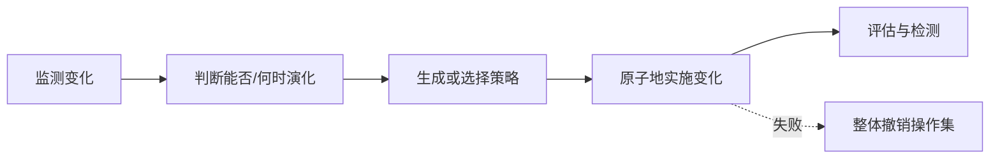

# 动态演化：运行中怎样安全改变架构

> [!summary]- 快速复习卡片（学完再看）
> **核心结论**：动态演化在运行中改变架构，难点是既要完成结构调整，又要维持系统状态、一致性与安全。
> **题干信号 → 第一反应**：不停机热升级、运行中增删组件/连接件、实时重配置 → 动态演化。
> **第一动作**：先识别动态性层级，再区分 DSA（架构级动态）与 DR（结构重配置）。
> **易错边界**：动态重配置主要改组件/连接件配置，不等于一定重新定义新的架构基本构造类型。

## 为什么需要动态演化

例如，在线支付服务正处理请求时要替换风控组件。旧组件可能仍在处理一笔交易，新组件已准备接单；若直接切换，可能出现同一交易重复判断或无人处理。团队必须先确定何时可以切换、失败后怎样撤销。

航空航天、生命维持、金融、交通等系统可能长期运行，停机更新的成本或风险非常高。此时必须让架构在运行过程中适应内部执行变化或外部重配置请求。

## 三个动态性等级

从浅到深：

1. **交互动态性**：结构固定，数据/交互在运行时变化；
2. **结构动态性**：可增删组件和连接件实例，是常见研究与应用层级；
3. **架构动态性**：连基本构造都可重新定义，例如新组件类型，难度最高。

## 动态演化可以改什么

教材归纳四类：属性重新定义、行为变化、拓扑结构改变、架构风格变化。越往后越接近“改变结构本身”，风险通常越高。

## DSA 与 DR 怎么分

- **DSA（Dynamic Software Architecture）**：让运行时架构本身成为可感知、可操作的实体，体系结构信息变化能驱动系统调整，偏向**架构动态性**。
- **DR（Dynamic Reconfiguration）**：从组件、连接件和配置入手，在运行中增删组件、增删连接、修改关系，偏向**结构动态性**。

教材还列出主从、中央控制、客户端/服务器、分布式控制等动态重配置模式；首轮学习先识别它们属于 DR 的实现组织方式，不必把每个状态机细节当独立主线。

### 运行中替换通知服务，失败时怎样处理

教学例子：系统要把旧通知服务换成新版，但不能停机。先记录旧路由和待发送消息的状态，让新版只处理不会真正发给用户的测试消息；检查通过后，再切换新消息的路由，并逐项核对待发送消息由谁处理。若切换中的配置或待处理状态迁移失败，应撤销这组**尚可回退的架构操作**，恢复旧路由，并把未完成消息交回旧服务核对，不能只切回路由却留下半迁移状态。

但如果新版已经把一条通知发给用户，回切路由也无法“收回”这条通知。此时应按消息编号核对实际发送结果，用幂等处理避免重发，并对漏发或重复发送做补发、处置或补偿。教材强调的操作原子性针对演化操作集，不能被理解成外部副作用也能自动撤销；具体切换与核对机制依系统而定。

## 动态演化的安全底线

运行中修改最怕进入“半改状态”：一半组件用了新关系，另一半还按旧关系工作。因此教材特别强调：保存当前架构信息、持续监控需求变化、判断时机和范围，并保证演化操作的**原子性**——操作集若关键步骤失败，应撤销可回退的架构变化，避免不稳定中间状态。已经发生的外部发送等副作用仍须另行核对和处理。

## 考试动作

“不停机 + 运行中改结构”先判动态演化；“增删组件/连接件配置”偏 DR；“运行时架构模型本身可修改并驱动系统”偏 DSA。若选项把动态演化描述成无需一致性/安全控制，直接排除。

## 自测

1. 运行中的系统增删组件和连接件配置，但没有重新定义新的组件类型；这更接近 DSA 还是 DR？失败时为什么不能保留已完成的一半操作？

> [!answer]- 第 1 题答案与解析
> **答案**：更接近 DR（动态重配置）；失败时应整体撤销操作集，避免系统停在新旧结构混杂的不一致状态。
> **解析**：DR 偏结构动态性，直接处理组件、连接件和配置。动态演化必须保存状态、控制时机，并保证操作集原子性。

## 上一站 / 下一站

**上一站**：[[08_静态演化：停机修改怎样控制波及]] 处理停机修改；本篇解决不能停机时的结构变化。

**下一站**：[[10_可持续演化原则：18条原则各自在防什么]]。会改不等于应该随意改，接下来给演化加上成本、风险、结构和质量护栏。

## 证据锚点

- 大纲：[[官方教材/AI教材库/原始文本/系统架构第二版 大纲/p0049-p0060|大纲 PDF 60 页，9.3.3]]
- 主教材：[[官方教材/AI教材库/原始文本/系统架构设计师教程第二版可搜索/p0349-p0360|教程 PDF 357–360 页]]、[[官方教材/AI教材库/原始文本/系统架构设计师教程第二版可搜索/p0361-p0372|教程 PDF 361–363 页]]
