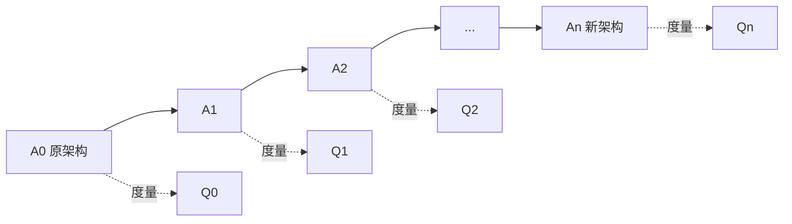

# 演化评估：已知过程与未知过程为什么两种做法

> [!summary]- 快速复习卡片（学完再看）
> **核心结论**：已知演化过程可以沿中间版本逐步度量并定位影响；未知过程只能比较前后版本，再逆向推测发生过哪些演化操作及其驱动原因。
> **题干信号 → 第一反应**：有 `A0→A1→...→An` 历史 → 已知过程；只有演化前/后两个版本 → 未知过程。
> **第一动作**：先判断有没有中间版本和操作记录，再决定评估路线。
> **易错边界**：演化评估不是再做一遍 ATAM；这里关注的是“版本变化及其质量变化之间的关系”。

## 为什么不能只看最终版本“能不能跑”

例如，预约系统从单体拆成多个服务后，预约仍能提交，但一次规则修改从改一个模块变成改四个服务。团队要判断“哪次拆分引起这种变化”；若保留每次中间版本，就能逐步比较，若只剩拆分前后版本，只能从结果反推。

一次结构修改可能让功能正常，却让可维护性、可靠性等质量属性悄悄恶化。演化评估要把**架构内部结构变化**和**外部质量属性变化**联系起来。

## 情况一：演化过程已知

如果保留了原子操作和中间版本，就能顺着过程追：

对每个中间版本做同一质量属性度量，再观察相邻版本的**质量属性距离/变化趋势**，就能找出哪一次原子操作让指标突然改变。这适合影响分析、过程监控和关键变更定位。

> 重要边界：各步质量属性变化**不能简单相加**成首尾变化；距离用于观察差异和风险，不是机械累加分数。

## 情况二：演化过程未知

如果只拿到“旧版本”和“新版本”，中间怎么改的已经丢失，就不能逐步追踪。此时路线反过来：

**前后架构分别度量 → 比较质量变化 → 推测可能的演化操作 → 找驱动原因 → 判断结果是否符合预期。**

例如目标是“通过重构提高可维护性”，结果新版本的复杂度更高、耦合更强，就说明这次演化至少没有达到目标，甚至可能引入新问题。

## 与 ATAM / 一般架构评估的边界

07 章 ATAM/SAAM 等方法主要问：**当前架构方案面对质量属性场景有哪些风险、敏感点和权衡？**

本篇问的是：**同一架构从版本 A 演化到版本 B，变化过程如何影响质量属性？** 对象是版本差异和演化过程，不复制 ATAM 的阶段、效用树等内容。

## 考试动作

题干给出完整中间版本 → 顺着版本度量；题干说“历史过程不可得，只保留前后架构” → 前后比较并逆向推测。若选项说“未知过程也可直接定位每一步原子操作的实际影响”，应警惕。

## 自测

1. 只保留演化前后的两个架构版本，没有中间版本和操作记录。还能直接定位哪一步操作造成质量下降吗？正确评估路线是什么？

> [!answer]- 第 1 题答案与解析
> **答案**：不能直接定位；应分别度量前后架构、比较质量变化，再逆向推测可能操作和驱动原因。
> **解析**：逐步定位依赖中间版本和原子操作记录。过程未知时只能从结果差异反推，不能把质量属性距离机械累加。

## 上一站 / 下一站

**上一站**：[[10_可持续演化原则：18条原则各自在防什么]] 给了判断健康演化的护栏；本篇给出怎样用版本和度量检查实际演化结果。

**下一站**：[[12_大型网站为什么一步步演化到分布式服务]]。接下来用一个大型网站把“瓶颈 → 结构变化 → 新瓶颈 → 再演化”的因果链串起来。

## 证据锚点

- 大纲：[[官方教材/AI教材库/原始文本/系统架构第二版 大纲/p0049-p0060|大纲 PDF 60 页，9.5]]
- 主教材：[[官方教材/AI教材库/原始文本/系统架构设计师教程第二版可搜索/p0361-p0372|教程 PDF 367–370 页，10.5]]
