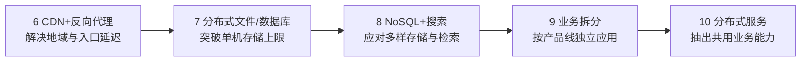

# 大型网站为什么一步步演化到分布式服务

> [!summary]- 快速复习卡片（学完再看）
> **核心结论**：10 个阶段不是技术年表，而是一条“当前瓶颈 → 加一种结构 → 解决问题 → 新瓶颈暴露”的连续因果链。
> **题干信号 → 第一反应**：数据库读压力 → 缓存/读写分离；应用并发瓶颈 → 集群；地域延迟 → CDN/反向代理；业务与数据复杂度爆炸 → 拆分/分布式服务。
> **第一动作**：先找当前瓶颈，再选下一次架构变化。
> **易错边界**：教材阶段用于理解演化因果，不意味着所有网站都必须严格按十步照搬。

## 前五步：先把一台机器上的资源瓶颈逐层拆开

想象一个网上商店刚上线时，网页、商品图片和数据库都在一台服务器。访问量升高后页面变慢，团队先要找清是机器资源、数据库读取，还是应用处理能力卡住；每次结构调整只针对当时的主要瓶颈。下面十个阶段是一条解释性路径，不是网站必须依次采购的技术清单。

- **单体**：最小规模时最省成本；问题是所有资源共同受一台机器上限约束。
- **垂直拆分**：不同服务器按应用、文件、数据库分工；随后数据库容易成为新瓶颈。
- **缓存**：用热点数据减少数据库访问；随后单应用服务器的连接/处理能力暴露。
- **应用集群**：横向增加应用服务器并用负载均衡分发；随后数据库仍承受缓存未命中和全部写入。
- **读写分离**：主库写、从库读，降低数据库读负载；规模继续扩大后，单一中心和数据存储仍会遇到上限。

## 后五步：从“机器扩容”进入“分布式组织”

- **CDN / 反向代理**：共同思想是让数据更早、更近地返回，并减轻后端压力。
- **分布式文件/数据库**：当单机或简单主从无法承载数据规模时才继续拆；教材也提醒分布式数据库不是越早用越好。
- **NoSQL / 搜索引擎**：解决关系数据库不擅长的可伸缩存储和复杂检索问题。
- **业务拆分**：业务复杂度上升后，按产品线把大应用拆成独立应用。
- **分布式服务**：业务拆得越细，共用能力重复、应用到数据库连接爆炸，于是把用户、商品等共用业务抽成独立服务，由应用调用。

## 真正要学的是“没有万能终局”

每一次演化都在解决上一阶段的主要矛盾，但新结构也会增加新的协调、数据一致性、运维和治理成本。所以架构演化不是“技术越多越高级”，而是**问题驱动的结构调整**。

## 考试动作

不要死背序号，先看题干瓶颈：热点读压力 → 缓存；应用处理能力 → 集群；数据库读负载 → 读写分离；跨地域访问慢 → CDN/反向代理；海量存储 → 分布式存储；业务团队和应用耦合过重 → 业务拆分；共用业务重复且数据库连接复杂 → 分布式服务。

## 自测

1. 某网站已经使用缓存和应用集群，但数据库读请求仍成为主要瓶颈。下一次优先考虑什么结构变化？这是否说明所有网站必须照搬十阶段？

> [!answer]- 第 1 题答案与解析
> **答案**：优先考虑数据库读写分离；不说明必须照搬十阶段。
> **解析**：教材案例的主线是“当前瓶颈 → 对应结构变化”，不是技术年表。读压力优先对应读写分离，实际选择仍要由问题驱动。

## 上一站 / 下一站

**上一站**：[[11_演化评估：已知过程与未知过程为什么两种做法]] 教会我们观察版本变化；本篇用大型网站看一条完整的因果演化链。

**下一站**：[[13_架构知识管理：为什么必须记录设计决策]]。系统演化一次并不会结束，长期维护首先要保证后来的人知道“当初为什么这样设计”。

## 证据锚点

- 大纲：[[官方教材/AI教材库/原始文本/系统架构第二版 大纲/p0049-p0060|大纲 PDF 60 页，9.6]]
- 主教材：[[官方教材/AI教材库/原始文本/系统架构设计师教程第二版可搜索/p0361-p0372|教程 PDF 370–372 页]]、[[官方教材/AI教材库/原始文本/系统架构设计师教程第二版可搜索/p0373-p0384|教程 PDF 373–378 页]]
