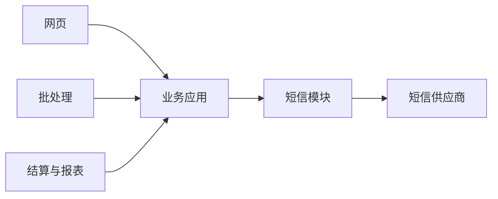
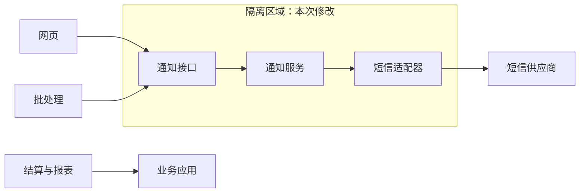

# 架构修改管理：怎样把一次变化限制在可控区域

> [!summary]- 快速复习卡片（学完再看）
> **核心结论**：架构修改管理的核心是明确修改规则、类型、影响范围和副作用，并尽量建立隔离区域，使变化少波及其他部分。
> **题干信号 → 第一反应**：变更范围失控、担心副作用、需要隔离修改 → 架构修改管理。
> **第一动作**：先做影响分析并划定修改边界，再实施变化。
> **易错边界**：这不是完整的软件工程变更审批流程；本章关注架构元素之间的波及控制。

## 为什么“改对功能”还不够

一个模块修改成功，但让十几个依赖模块一起被迫修改，架构仍然可能变坏。架构修改管理关心的是：**这次变化从哪里开始，会扩散到哪里，怎样把影响限制住。**

教材提出一个重要做法：建立**隔离区域（Region of Quiescence）**，使区域中的修改对其他部分影响尽量小甚至没有影响。

## 用短信通知拆服务划出修改边界

下面是用于教学的架构假设，不代表真实系统调查结果。改造前，网页和批处理都直接依赖业务应用中的短信模块；结算和报表也使用同一个业务应用，但不需要发送短信。

目标是把通知职责放到独立服务边界。网页和批处理改用通知接口；通知服务负责原短信模块的供应商调用与重试规则。结算与报表仍留在业务应用中，不进入本次改造区。

图中虚构了清楚的边界，但实际能否少影响区域外，要靠依赖检查和验证来证明，不能只靠画出一个服务框。

| 检查对象 | 修改前 → 目标状态 | 影响判断与验证证据（教学示例） |
| --- | --- | --- |
| 组件 | 业务应用内的短信模块 → 独立通知服务及适配器 | 修改通知实现；检查新服务是否只承担通知职责，结算/报表代码无需随迁 |
| 连接件 | 网页、批处理直接调用业务应用 → 两者调用通知接口 | 逐个查调用点和配置，确认没有遗留直连；分别用网页提交与批处理触发测试 |
| 规则/副作用 | 业务应用内的重试规则 → 通知服务执行原定规则 | 对照次数、间隔、失败返回和重复请求行为；用模拟供应商注入超时，核对重试次数、幂等处理与迁移前约定的失败行为，检查没有新增重复发送 |
| 隔离外元素 | 结算、报表仍调用业务应用 | 回归结算和报表主流程，确认接口和结果未变化；若依赖扫描发现直接调用短信模块的其他消费者，应先加入影响清单再划边界 |
| 退出与回退 | 原路由与新接口并存于迁移期 | 先用模拟供应商验证，再小范围切换；记录恢复旧路由的方法。若通知状态或外部发送已产生不可逆副作用，必须核对待处理状态，不能只切回路由 |

此表的验证结果是**待执行的检查方案**，不是已经测试通过的项目证据。实际项目要填写执行版本、测试数据、结果和缺陷记录，才能据此判断修改是否被限制在预期区域。

## 和“模块独立演化原则”是什么关系

原则回答“希望修改尽量局部”；修改管理回答“实际怎样识别边界、控制影响并验证副作用”。一个是目标护栏，一个是维护动作。

## 与软件工程变更管理的边界

软件工程可能讨论变更申请、审批、配置项、基线等项目流程；本篇不复制这些机制。这里的主对象是**架构结构和依赖关系**，核心动作是影响范围与隔离控制。

## 考试动作

题干强调“把修改影响限制在局部区域”“需要明确修改范围和副作用” → 架构修改管理；若强调“追踪不同架构版本并为演化度量提供依据”，则是下一篇版本管理。

## 自测

1. 题干强调“先明确修改规则、类型、影响范围和副作用，并让变化尽量不影响区域外”。应定位什么管理活动？

> [!answer]- 第 1 题答案与解析
> **答案**：架构修改管理，核心做法是划定隔离区域（Region of Quiescence）。
> **解析**：它关心架构依赖的波及控制，不是完整的项目审批流程；若题干转而强调版本比较和基线，应选版本管理。

2. 把短信模块拆成通知服务后，为什么还要检查网页、批处理、重试规则和结算报表？

> [!answer]- 第 2 题答案与解析
> **答案**：它们可能依赖原短信模块、调用路径或副作用规则；需确认调用者迁移完整，并验证隔离区域外的业务没有被带坏。
> **解析**：隔离区域是通过明确修改规则、类型、影响范围和副作用建立的边界，图上的边界必须由依赖检查和回归证据支持。

## 上一站 / 下一站

**上一站**：[[13_架构知识管理：为什么必须记录设计决策]] 让维护者知道原架构为何如此；本篇控制新的修改如何安全落地。

**下一站**：[[15_架构版本管理：为什么必须保留演化基线]]。修改完成后还必须知道“从哪个版本变到哪个版本”。

## 证据锚点

- 大纲：[[官方教材/AI教材库/原始文本/系统架构第二版 大纲/p0061-p0072|大纲 PDF 61 页，9.7.2]]
- 主教材：[[官方教材/AI教材库/原始文本/系统架构设计师教程第二版可搜索/p0373-p0384|教程 PDF 379 页，10.7.2]]
