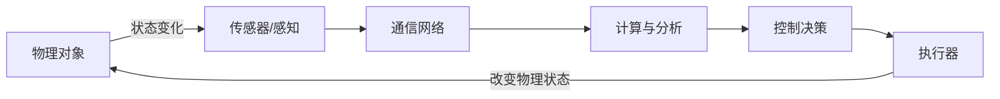
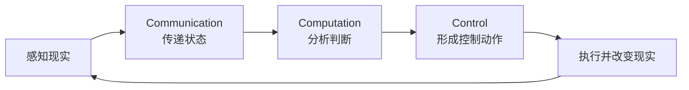

# CPS 闭环：感知、计算、控制、反馈如何连起来

> [!info] 承接
> 上一篇已经知道 CPS 不是“联网设备”的别名。现在把最核心的机制拆开：数据怎样从现实进入数字系统，控制命令又怎样回到现实。

> [!summary]- 快速复习卡片（学完再看）
> - **核心结论：** CPS 是循环，不是单向数据上传：物理对象 → 感知 → 通信 → 计算 → 控制 → 执行 → 物理对象。
> - **题干信号：** 实时、反馈、动态控制、状态不断更新。
> - **第一动作：** 顺着数据流找“去程”，再顺着控制流找“回程”。
> - **易错 1：** 只上传数据到中心，没有控制回路，不是完整 CPS 闭环。
> - **易错 2：** CPS 可以从单元扩展为系统，再扩展为 SoS；层次变大但 3C 融合不变。

## 先看完整闭环

**CPS 的本质动作是：现实产生状态 → 系统感知 → 计算判断 → 控制现实 → 新状态再次被感知。**

这张图要看出两条方向：

- **信息流向数字侧：** 物理对象 → 传感 → 通信 → 计算；
- **控制流返回物理侧：** 决策 → 执行器 → 物理对象。

所以 CPS 不是“把现实复制到屏幕里”，而是**信息世界与物理世界相互作用**。

## 用恒温控制真正走一遍

假设目标温度是 25℃：

1. 温度传感器读到 30℃；
2. 网络把 30℃ 送给控制程序；
3. 程序比较“当前 30℃ > 目标 25℃”；
4. 决策为“启动制冷”；
5. 执行器控制空调；
6. 房间温度下降到 27℃；
7. 传感器再次采集 27℃；
8. 系统继续计算，直到状态进入允许范围。

这里最重要的是第 6→7→8 步：**系统不是算一次就结束，而是拿现实变化后的新状态继续反馈。**

## 教材里的 CPS 层次怎么理解？

教材把 CPS 从小到大组织成不同层次，可以用三层抓住：

| 层次 | 可以怎么理解 | 关键点 |
|---|---|---|
| CPS Unit（单元） | 一个能感知、计算、通信、控制的基本单元 | 具备基本 3C 能力 |
| CPS System（系统） | 多个 CPS 单元通过网络协同 | 不再只控制一个局部对象 |
| SoS（System of Systems，系统之系统） | 多个相对独立的 CPS 系统进一步协作 | 面向更大范围、更复杂目标 |

不要把三层背成三个孤立名词。它们表达的是：

> **规模可以从一个局部控制单元扩展到多个系统协同，但计算、通信、控制融合这一根主线没有变。**

## 3C 在闭环里分别落在哪？

- 通信解决“状态和命令怎样到达”；
- 计算解决“现在发生了什么、应该做什么”；
- 控制解决“怎样让物理对象按目标改变”。

只会其中一个不够，CPS 的价值恰恰来自 3C 深度融合。

## 考试怎么做

题干如果描述“传感器实时采集设备状态，系统分析后自动调整阀门/电机，并根据新状态继续调整”，第一动作不是找“用了什么传感器”，而是先识别：

**这是一个带反馈的计算—通信—控制闭环。**

若选项里出现 CPS，它通常比“单纯物联网采集”“普通数据库系统”更贴近这种描述。

## 收口

现在已经知道 CPS 怎么运行。下一步还差一个现实问题：**什么场景值得建设 CPS，怎样从需求看出它不是普通监控系统？**

## 自测

1. 控制器读到室温 30 ℃，按 25 ℃ 的目标启动空调；随后室温降到 27 ℃。为什么不能在“启动空调”处就说闭环已经完成？下一步应做什么？

> [!answer]- 答案与解析
> **答案：**还要重新感知 27 ℃，与目标比较，再决定是否继续调节。
> **解析：**控制命令只是把决策送入物理世界；读取动作后的实际状态并反馈给计算环节，才能形成持续的感知—计算—控制—反馈闭环。

## 导航

- [章内] 上一站：[[01_CPS是什么：为什么不是设备联网的别名]]
- [章内] 下一站：[[03_CPS建设与应用：什么时候需要信息直接控制物理世界]]
- [索引] 返回：[[未来信息综合技术-章节索引]]
