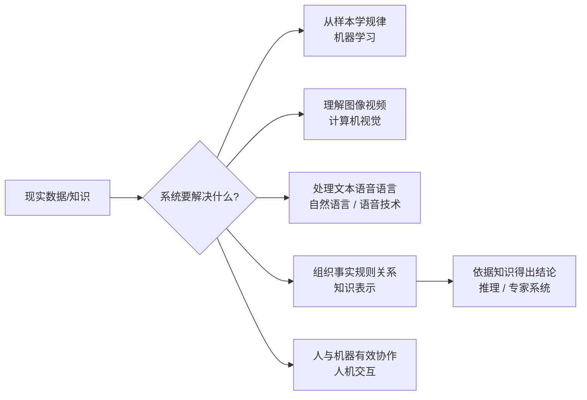

# AI 关键技术：学习、视觉、语言与知识推理如何分工

> [!info] 承接
> 上一篇只建立 AI 的总概念。现在不按术语表背，而是用一个统一问题学习：**题目给出任务后，怎样反推出应该是哪类 AI 技术？**

> [!summary]- 快速复习卡片（学完再看）
> - **核心结论：** 不同 AI 技术解决不同信息形态与智能任务：学习规律、看图、懂语言、表示知识、推理与交互。
> - **题干信号：** 样本训练→机器学习；图像视频→视觉；文本语音语义→语言；事实规则关系→知识表示/推理。
> - **第一动作：** 先看输入是什么、系统要完成什么动作，再匹配技术。
> - **易错 1：** 深度学习是机器学习的重要方法之一，不是与机器学习并列的完全独立领域。
> - **易错 2：** 专家系统的典型核心是知识库 + 推理，而不是“只要有数据库”。

## 先建立一张能力地图

同一条设备故障报告里，摄像头拍到裂纹、工人用语音描述异响、历史记录写着相似故障。系统若要给出维修建议，先得分清“看图”“听懂话”“从样本找规律”和“按已有知识推断原因”分别由什么能力承担；它们不是同一个技术名。

这比背一串“AI 包括 A、B、C……”更稳，因为考试会换场景，但任务类型不会乱。

## 1. 机器学习：从数据里学规律

**机器学习的核心是：不把所有规则都逐条写死，而是让系统从样本或数据中学习模型/规律。**

典型题干：

- 根据历史交易学习欺诈特征；
- 根据设备故障样本预测故障；
- 根据用户行为训练推荐模型。

教材会涉及监督学习、无监督学习等基本形式；本章先抓“是否利用数据学习规律”这个识别动作。

### 深度学习放在哪？

可以先记成：

> **深度学习 ⊂ 机器学习（重要方法路线）。**

深度学习通常利用多层神经网络自动学习更复杂的特征表示，在视觉、语音、语言等任务中常见。考试若把“机器学习”和“深度学习”说成毫无从属关系的两个平行大类，要警惕。

## 2. 计算机视觉：让机器处理视觉信息

题目出现图像、视频、目标、缺陷、车牌、人脸等视觉信息时，优先想到计算机视觉。

例如摄像头拍下工件，系统自动判断“有没有裂纹”，主要任务是**从图像中识别目标或特征**，不是自然语言处理。

## 3. 自然语言与语音：让机器处理人类表达

- **自然语言处理（NLP）**关注文本/语言的理解、分析、生成等；
- 语音相关技术处理声音信号中的人类语音，并可与语言理解继续衔接。

题干出现文本分类、问答、机器翻译、语义理解等，优先沿语言处理思路判断。

## 4. 知识表示与推理：把“知道什么”变成“能推出什么”

机器要做知识型判断，先得有办法表达：

- 有哪些实体；
- 实体之间什么关系；
- 有哪些规则；
- 哪些事实已经成立。

这就是**知识表示**要解决的问题。

有了知识后，再根据规则或关系推出新结论，是**推理**关注的问题。

一个经典专家系统可以粗看成：

> **知识库保存领域知识 + 推理机制根据知识求解问题。**

因此“专家系统 = 普通数据库”是错误的缩减。

## 5. 人机交互：让智能能力真正被人使用

教材也把人机交互放在 AI 关键技术视野里。它关注人怎样向系统表达意图、系统怎样反馈，以及交互怎样更自然有效。

不要把它与“推理算法”混成同一件事：一个解决人与系统怎么协作，一个解决系统内部怎样得到结论。

## 一眼匹配题干

| 题干动作 | 优先想到 |
|---|---|
| 从标注样本预测类别 | 机器学习/监督学习 |
| 从没有标签的数据发现聚类结构 | 机器学习/无监督学习 |
| 识别图像中的对象、缺陷 | 计算机视觉 |
| 理解文本、翻译、问答 | NLP |
| 把事实、概念、关系组织成可计算形式 | 知识表示 |
| 根据知识和规则推出结论 | 推理/专家系统 |
| 改善人与智能系统的输入输出协作 | 人机交互 |

## 收口：为什么下一站是机器人

AI 可以做判断，但“得出应该把物料移到 B 区”还只是信息结果。要让系统真的抓起物料、规划路径、避障并移动，就需要实体世界中的感知、控制与执行——下一站进入机器人。

## 自测

1. 题干要求从设备照片中找出裂纹，再根据维修规则判断是否停机。应分别优先识别哪两类 AI 能力？

> [!answer]- 答案与解析
> **答案：**照片中的裂纹识别对应计算机视觉；依据维修规则作判断对应知识表示与推理（或规则/专家系统）。
> **解析：**先按输入与任务拆分：图像识别解决“看见什么”，规则推理解决“据此怎么办”，不要把两步笼统叫作同一种技术。

## 导航

- [章内] 上一站：[[04_AI概念与发展：最低要识别什么]]
- [章内] 下一站：[[06_机器人闭环：智能如何变成现实动作]]
- [索引] 返回：[[未来信息综合技术-章节索引]]
