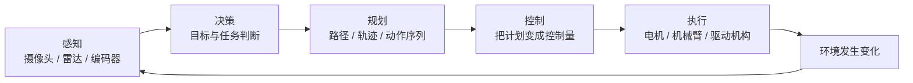

# 机器人闭环：智能如何变成现实动作

> [!info] 承接
> AI 让系统能够学习、识别和推理，但 AI 模型本身不会自动“伸手抓东西”。机器人这一站要解决的是：数字判断怎样通过机械与控制系统变成真实动作。

> [!summary]- 快速复习卡片（学完再看）
> - **核心结论：** 机器人是软硬件结合的实体系统，典型链路可理解为感知 → 决策/规划 → 控制 → 执行 → 再感知。
> - **题干信号：** 传感器、导航、轨迹、控制器、机械臂/驱动器、环境反馈。
> - **第一动作：** 看题目是否需要在物理世界执行动作，而不只是输出一个 AI 结果。
> - **易错 1：** 机器人 ≠ AI 软件；AI 可以是机器人的智能能力之一。
> - **易错 2：** 机械自动化设备也不必然具有高级 AI，但仍可以是机器人系统的一种实现。

## 先回答：机器人和 AI 差在哪？

**AI 重点解决“怎样获得智能判断能力”；机器人重点解决“怎样让一个实体系统感知环境并完成物理动作”。**

二者可以组合，但不是同义词。

例如：

- 一个图片分类模型：是 AI 能力，但没有实体执行机构，不是机器人；
- 一个按固定轨迹焊接的工业机器人：是机器人系统，即使它没有复杂的机器学习模型；
- 一个能看懂环境、规划路线、避障并抓取物体的移动机器人：机器人与 AI 能力深度结合。

## 用一条闭环理解机器人

这张图是学习抽象，不要求教材把所有机器人都严格切成五个模块。它的作用是帮你理解：

1. **感知**告诉机器人“现在在哪里、周围是什么”；
2. **决策**决定“现在应该做什么”；
3. **规划**把目标变成可以执行的路线或动作序列；
4. **控制**计算怎样驱动电机/执行机构达到目标；
5. **执行**真正改变机械结构和外部环境；
6. 新状态再次进入感知，形成反馈。

## 为什么机器人天然是“系统问题”

只看机械结构不够，只看算法也不够。机器人往往同时涉及：

- 传感器；
- 计算与软件；
- 通信；
- 控制器；
- 执行器/机械结构；
- 能源；
- 人机交互与安全。

所以题目描述“感知环境、自主规划并执行任务”时，真正考的是多个能力的集成，而不是某一个 AI 算法名。

## 与 CPS 的关系

机器人和 CPS 也会重叠：机器人本身就是典型的信息—物理融合对象，但概念关注点不同。

- CPS 强调**信息计算与物理过程形成控制闭环**这一系统范式；
- 机器人强调**具有实体执行能力的机器系统怎样完成任务**。

考试不要因为看到电机就只想到机器人，也不要因为看到反馈就只想到 CPS，要看题目问的主语和目标。

## 考试动作

场景题出现“视觉识别 → 路径规划 → 驱动机械臂抓取”时：

- 视觉识别可以属于 AI/视觉技术；
- 路径规划、控制和执行把它组织成机器人任务链；
- 整体看，是一个能够感知并作用于现实环境的机器人系统。

## 收口

下一篇不再重复机器人闭环，而是处理教材中特别列出的 **Robot 4.0 核心技术与分类**：哪些词是在描述机器人能力升级，哪些只是分类维度。

## 导航

- [章内] 上一站：[[05_AI关键技术：学习视觉语言与知识推理如何分工]]
- [章内] 下一站：[[07_Robot4.0：核心技术与分类怎么识别]]
- [索引] 返回：[[未来信息综合技术-章节索引]]