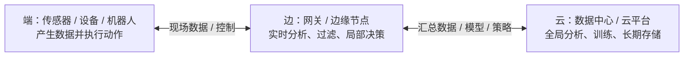

# 边云协同：端、边、云怎样分工

> [!info] 承接
> 上一篇已经知道“所有数据都上云”会带来时延、带宽和自治问题。真正的工程答案不是把云扔掉，而是让不同位置处理自己最擅长的任务。

> [!summary]- 快速复习卡片（学完再看）
> - **核心结论：** 端负责产生数据/执行动作，边负责就近实时处理，云负责全局汇聚、重计算、长期存储和统一能力；三者协同而不是互相替代。
> - **题干信号：** 本地实时 + 云端全局、模型下发、数据汇聚、边云协同。
> - **第一动作：** 按“时间敏感度”和“全局性”给任务分位置。
> - **易错 1：** 边缘计算不是“完全离线、完全不需要云”。
> - **易错 2：** 云擅长全局资源和集中能力，不表示每个实时动作都必须去云端决策。

## 先给一张总图

最容易记的分工是：

- **端：离现实最近，负责“感知和执行”；**
- **边：离现场近，负责“来得及”；**
- **云：资源集中，负责“看全局、算得重、存得久”。**

这只是学习模型，不表示所有系统都必须严格三层部署；考试用它来判断职责非常有效。

## 一个机器视觉例子

工厂有 100 路高清摄像头：

### 端

摄像头采集视频，机械设备执行停机/减速动作。

### 边

边缘节点实时做缺陷或危险动作识别，只保留关键片段和结果。一旦发现高危情况，可以在本地快速触发控制。

### 云

云端汇总不同工厂的长期数据，做跨区域统计、复杂模型训练、版本管理，再把新模型或策略下发边缘。

于是形成循环：

> **端产生现实数据 → 边实时处理 → 云全局学习 → 新模型/策略下发 → 边继续执行。**

## 教材里的“边云协同”怎么抓？

教材从多个方面描述边与云的协同，例如资源、应用、服务、智能和数据等。无需把它们背成互不相干的五项，可以统一理解为：

| 协同对象 | 直观理解 |
|---|---|
| 资源协同 | 算力、存储等按任务在边和云之间配合 |
| 应用协同 | 应用的不同部分可运行在不同位置 |
| 服务协同 | 云和边缘共同向业务提供完整服务 |
| 智能协同 | 云侧训练/全局优化，边侧推理/实时决策 |
| 数据协同 | 边侧过滤汇总，云侧沉淀和全局分析 |

考试看到“云训练模型、边缘实时推理”，它正是很典型的**智能协同**。

## 安全为什么教材也要讲？

边缘节点靠近现场、数量多、分布广，安全边界比单一中心更复杂：

- 节点可能暴露在不完全可信环境；
- 数据在端、边、云之间流转；
- 身份、访问控制、数据保护、软件更新都要覆盖更多节点。

因此“边缘更靠近数据，所以天然绝对安全”是错误的。**本地处理可以减少部分原始数据外传，但分布式节点也带来新的攻击面和管理问题。**

## 边缘与云的边界怎么考

| 任务 | 更偏向边缘 | 更偏向云 |
|---|---:|---:|
| 毫秒级设备控制 | ✓ |  |
| 现场视频即时识别 | ✓ |  |
| 多区域历史数据汇总 |  | ✓ |
| 大规模模型训练 |  | ✓ |
| 长期集中归档 |  | ✓ |
| 云训练后把模型下发现场推理 | **边云协同** | **边云协同** |

> [!warning] 关键边界
> **边缘计算不是“不要云”，而是把适合现场的任务下沉，再与云的全局能力协同。**

## 收口：为什么下一站是数字孪生

端、边、云解决了“数据和计算放哪里”。接下来换一个问题：如果我们希望在数字空间里持续掌握一台真实设备的当前状态，并先仿真“如果调整参数会怎样”，再反馈到现实，该用什么思想？下一站是数字孪生。

## 自测

1. 智能产线既要现场采集并立即停机避险，又要汇总多厂区数据训练长期模型。端、边、云各自优先承担什么？

> [!answer]- 答案与解析
> **答案：**端负责现场感知与执行；边负责邻近现场的实时处理和控制；云负责跨厂区汇总、长期存储与模型训练等全局任务。
> **解析：**按时延和作用范围分工：紧迫动作靠近现场，全局分析用云的集中资源；边云协同不是边缘替代云。

## 导航

- [章内] 上一站：[[08_边缘计算：为什么不能所有数据都送云端]]
- [章内] 下一站：[[10_数字孪生：为什么不是普通数字模型]]
- [索引] 返回：[[未来信息综合技术-章节索引]]
