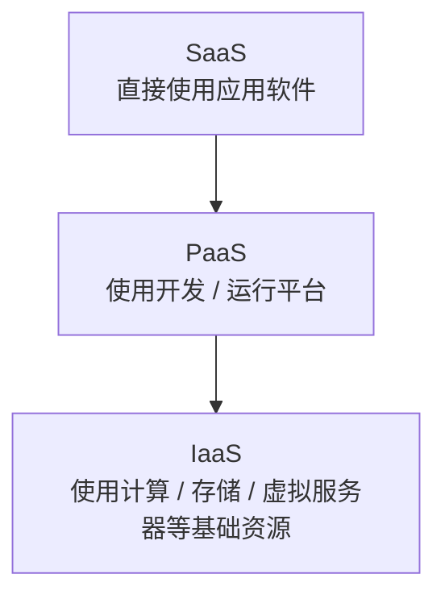

# 云计算：未来系统为什么需要弹性资源池

> [!info] 承接
> 数字孪生、AI 和边缘系统都需要算力、存储和服务能力。边缘解决局部实时性，云计算则把大量资源集中、虚拟化并通过网络按需提供，承担更偏全局的能力层。

> [!summary]- 快速复习卡片（学完再看）
> - **核心结论：** 云计算把计算、存储、平台或应用能力通过网络按需提供；SaaS→PaaS→IaaS 越往下用户控制越多、灵活性越强，但使用方便性通常反向变化。
> - **题干信号：** 按需、动态配置、资源池、互联网访问、SaaS/PaaS/IaaS、公有/私有/社区/混合云。
> - **第一动作：** 先判断“提供给用户的是应用、开发平台，还是基础计算/存储资源”。
> - **易错 1：** SaaS 提供应用，PaaS 提供开发/运行平台，IaaS 提供更底层基础资源。
> - **易错 2：** 云计算能力 ≠ 云原生架构设计方法；后者另有主事实源。

## 云计算解决的根问题是什么？

传统方式下，一个业务要上线，常常要自己采购服务器、存储、网络，安装环境，再长期维护容量。

云计算换了一种思路：

> **把大量计算、存储、网络、平台或应用能力组织成可通过网络访问的服务，根据需要进行部署、配置和使用。**

教材引用的云计算定义同时强调**平台**和**应用**两个方面，并指出云平台可以动态部署、配置、重新配置和取消服务。

所以本章把云看作未来智能系统的“全局资源与服务能力层”，而不是把它理解成“互联网上的一台服务器”。

## 三种服务方式是最重要的判断题

### SaaS：软件即服务

服务商直接把应用提供给用户，用户主要关心“怎样使用/配置应用”。

例如题目说“通过浏览器直接订购并使用一套在线业务软件”，优先判断 SaaS。

### PaaS：平台即服务

服务商提供开发、运行环境和平台能力，用户在平台上开发、部署自己的应用。

题目强调“开发环境、运行平台、Web API、应用部署平台”，优先判断 PaaS。

### IaaS：基础设施即服务

服务商把计算、存储、网络、虚拟服务器等更底层资源作为服务提供。

题目强调“虚拟机、CPU、存储资源、基础计算资源”，优先判断 IaaS。

## 控制力与方便性为什么相反？

教材明确给出一个非常适合做选择题的关系：

- **灵活性/可控制粒度：** SaaS → PaaS → IaaS 逐渐增强；
- **方便性：** IaaS → PaaS → SaaS 逐渐增强。

为什么？

因为越靠 IaaS，你拿到的东西越底层，自己能控制的越多，但也要自己做更多工作；越靠 SaaS，服务商已经把大部分技术细节做好，你直接使用最方便，但可控制的底层资源更少。

> [!tip] 一句话
> **越底层越自由、越费事；越上层越省事、越受封装。**

## 四种部署模式只抓边界

教材按 NIST 口径介绍：

- **公有云：** 面向公众提供的云基础设施；
- **私有云：** 面向单个组织专用；
- **社区云：** 面向具有共同关注点的一组组织/社区；
- **混合云：** 由两种或多种不同云形态组合协同。

最容易出的边界是“私有云 ≠ 本地普通服务器”“混合云 ≠ 只有公有云”。部署模式回答**谁能使用、资源边界怎样组织**，服务方式回答**提供哪一层能力**，两种分类轴不要混。

## 本章与云原生的边界

后续架构与案例部分还可能专门讨论容器、微服务、Serverless、服务网格、云原生架构等。

本章只负责：

**云是什么 → 提供什么层级的服务 → 怎样识别部署模式 → 为什么能给未来系统提供全局资源。**

不在这里重写微服务或云原生架构方法。

## 与边缘计算再对一次

- **边缘：** 处理靠近现场、实时、局部任务；
- **云：** 更适合集中资源、长期存储、全局分析、复杂训练和统一管理；
- **真实系统：** 常常边云协同，而不是二选一。

## 收口

云解决了“算力、存储、平台和应用能力怎样按需提供”，但未来系统还面对另一个难题：数据本身规模巨大、来源多样、产生快，而且必须从中提取价值。下一篇进入大数据。

## 导航

- [章内] 上一站：[[11_数字孪生关键技术：怎样监测预测仿真并优化现实对象]]
- [章内] 下一站：[[13_大数据：为什么需要与云协同支撑全局智能]]
- [索引] 返回：[[未来信息综合技术-章节索引]]