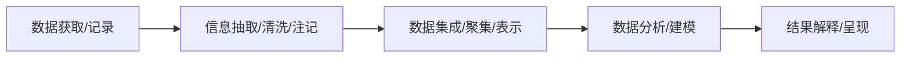
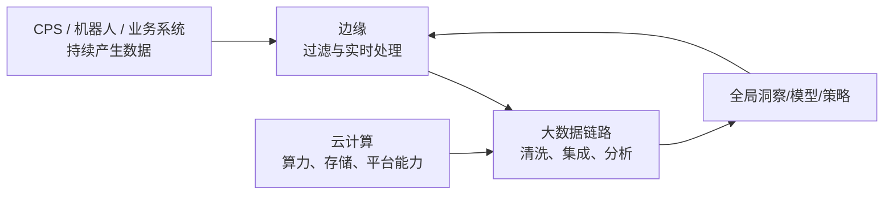

# 大数据：为什么需要与云协同支撑全局智能

> [!info] 承接
> 云计算提供可集中使用的计算与存储资源，但“有资源”并不等于“知道怎样处理海量复杂数据”。最后一站看大数据：数据为什么变成新的系统问题，以及它怎样与云能力配合。

> [!summary]- 快速复习卡片（学完再看）
> - **核心结论：** 大数据的难点不只是“多”，还包括规模、速度、多样性以及从数据中获得价值；处理要经历获取、清洗、集成、分析/建模、解释等链路。
> - **题干信号：** Volume、Velocity、Variety、Value；异构、实时流、清洗、集成、分析、可视化。
> - **第一动作：** 先看传统工具为什么难处理，再判断问题落在数据链哪一段。
> - **易错 1：** “数据量大”只是一个维度，大数据不等于单纯文件很大。
> - **易错 2：** 云计算提供资源/服务能力，大数据关注数据处理与价值，两者相关但不是同义词。

## 为什么“大量数据”会变成一个新问题？

例如，连锁门店每天同时上传销售记录、摄像头事件和顾客反馈：格式不同，到达时间不同，管理者还要及时发现异常。把这些材料简单堆进一台机器，并不能自动得到可用判断。

如果只是把 1GB 文件变成 100GB，而处理方法、格式、速度要求完全不变，那只是规模变大。

大数据更麻烦的是：

- 数据持续增长；
- 格式越来越多；
- 数据产生和处理速度要求越来越高；
- 最终还要从复杂数据里得到可用价值。

## 传统数据处理为什么开始扛不住

传统系统常从“应用直接访问数据库”开始。用户和数据量持续增长后，单个数据库先出现负载、响应时间和容量压力。

继续补丁式扩展虽然能缓解一时问题，但会不断增加复杂度：

- 在应用与数据库之间加队列，只是削峰；后台处理跟不上时，数据库仍会重新成为瓶颈；
- 做分区、复制和重分区后，应用还要知道数据在哪个分区、怎样迁移和访问，运维与开发耦合越来越重；
- 传统批处理运行时间很长时，新数据已经持续进入，结果容易出现“算完就已经过时”的问题；
- 节点故障和人为错误会随着分布式规模扩大而变成常态，单靠备份或继续堆硬件不能解决全部问题。

因此大数据架构并不是因为“文件突然变大”才出现，而是因为**传统数据处理方式在规模、实时性、复杂性和错误恢复上同时遇到瓶颈**。

> [!tip]
> 题干如果描述“数据库持续过载 → 加队列/分区仍越来越复杂 → 批处理结果滞后”，先判断它在问**传统数据处理系统为什么需要演进到大数据架构**，而不是让你背某个具体产品。

教材引用多个定义，其中 IBM 的典型概括可以压成 **3V + Value**：

| V | 含义 | 零基础理解 |
|---|---|---|
| Volume | 大规模 | 数据非常多 |
| Velocity | 高速度 | 产生快、流动快、处理也要快 |
| Variety | 多样化 | 表格、日志、文本、图像、视频等类型多 |
| Value | 价值 | 最终目标不是堆数据，而是提取有用信息和知识 |

教材也提到可变性、复杂性等扩展维度。考试若出现不同“V”扩展不要慌，先抓最经典主轴，再看题干具体定义。

## 大数据不是“存起来就结束”

教材给出的大数据分析过程可以整理成五阶段：

### 1. 获取/记录

先决定哪些数据值得保留，怎样采集实时流，怎样记录数据来源。

### 2. 抽取/清洗

现实数据会有错误、噪声、缺失、格式复杂。先把可以用于分析的信息抽出来，并处理质量问题。

### 3. 集成/聚集/表示

不同系统的数据必须建立关联。只把异构数据全扔进存储，并不会自动产生价值。

### 4. 分析/建模

利用查询、统计、挖掘、机器学习等方法寻找模式、关系和预测结果。

### 5. 解释/呈现

结果必须能被人理解和验证；可视化、数据出处和分析过程解释都很重要。

> [!warning] 高频认知坑
> **“先分析，再清洗”通常不合理。** 数据质量和结构没处理好，后续模型只会把问题放大。

## 云计算和大数据为什么总在一起出现？

二者解决的问题不同：

- **云计算：** “计算、存储、平台等资源怎样按需组织和提供？”
- **大数据：** “海量、多样、高速的数据怎样获取、治理、分析并产生价值？”

但它们天然互补：

所以本章把云和大数据放在最后，正好作为前面技术的全局基础设施层：**云提供资源，大数据把数据变成洞察，AI 再可利用这些数据与模型增强智能能力。**

## 与后续大数据架构/案例的边界

本篇只负责大纲中的“技术概述”层：

**定义/特征 → 数据处理链 → 与云和前面技术的关系 → 题目识别。**

不在这里展开 Hadoop 组件、复杂大数据平台选型、数据湖架构、流批一体等案例分析级内容。架构层继续由独立主事实源承担。

### 架构进阶

学完本篇的传统数据处理瓶颈、4V 与处理链后，进入 [[06_架构设计理论与实践/08_大数据架构/大数据架构索引|大数据架构]]。下一层先区分“数据特征”和“处理系统架构特征”，再学习 Lambda、Kappa、Kappa+ / 混合分析系统及设计选择。

## 考试动作

看到大数据题干时先定位是哪一类问题：

1. **规模/速度/多样/价值**——特征判断；
2. **脏数据、错误数据**——清洗；
3. **多个来源无法关联**——集成；
4. **从数据发现模式**——分析/建模；
5. **让决策者理解结果**——解释/可视化。

比单背“4V”更稳。

## 全章收口

现在把 13 个 Atom 合起来：

**CPS** 让信息系统进入物理控制闭环；**AI** 提供学习、识别、推理和决策；**机器人** 把决策转成现实动作；**边缘计算** 把实时任务放到现场附近并与云协同；**数字孪生** 建立持续的虚实映射与仿真反馈；**云计算和大数据** 提供全局资源和数据价值能力。

这些技术不是六条互不相干的名词，而是在新一代智能系统中彼此协作。

第 10 章到这里解决的是“系统能获得哪些新技术能力”。下一章开始补真实工程中的规则边界：技术落地时怎样统一规则，成果又怎样确定保护、归属和使用边界。

## 自测

1. 多地设备数据已汇入云资源池，但字段格式不一、存在缺失值。团队准备立即用这些数据训练全局模型。按大数据处理链，第一步应先补什么？云计算在这里主要解决的又是什么？

> [!answer]- 答案与解析
> **答案：**先做数据清洗、转换和整合等预处理，再进入分析建模；云计算主要提供可按需扩展的算力、存储与平台资源。
> **解析：**资源充足不代表数据可用。大数据链条要把多源数据处理成可分析的数据，云提供承载这些处理的资源，两者职责不同但可协同。

## 导航

- [章内] 上一站：[[12_云计算：未来系统为什么需要弹性资源池]]
- [跨章] 下一站：[[01_为什么未来技术落地还需要标准和权利边界]]
- [索引] 返回：[[未来信息综合技术-章节索引]]
