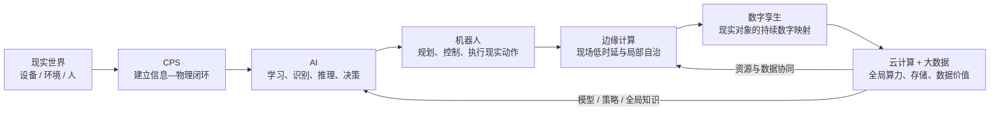

# 未来信息综合技术-学习路线

> [!info] 这一章不要按 6 个名词背
> 主线只有一个问题：**新一代信息系统怎样从“处理信息”继续走到“感知现实、智能判断、作用现实，并利用边云与数据能力持续优化”？**

## 一条主线走完全章

这张图不是说真实系统只能按固定顺序实现，而是给学习建立因果链：

1. **CPS：** 先回答数字系统怎样进入物理过程；
2. **AI：** 再回答系统怎样获得更复杂的智能判断；
3. **机器人：** 再回答智能判断怎样转成物理动作；
4. **边缘计算：** 再解决现场任务为什么不能全绕到云端；
5. **数字孪生：** 再解决怎样把现实对象持续映射到数字空间中做仿真与优化；
6. **云 + 大数据：** 最后补上跨区域、长期、全局的资源与数据能力。

## 建议学习顺序

### 第一段：先把“虚实闭环”立起来

1. [[01_CPS是什么：为什么不是设备联网的别名]]
2. [[02_CPS闭环：感知计算控制反馈如何连起来]]
3. [[03_CPS建设与应用：什么时候需要信息直接控制物理世界]]

学完必须能回答：**CPS 与 IoT 最稳的区分抓手是什么？**

### 第二段：补上“智能”和“实体动作”

4. [[04_AI概念与发展：最低要识别什么]]
5. [[05_AI关键技术：学习视觉语言与知识推理如何分工]]
6. [[06_机器人闭环：智能如何变成现实动作]]
7. [[07_Robot4.0：核心技术与分类怎么识别]]

学完必须能回答：**AI 软件为什么不自动等于机器人？**

### 第三段：解决“计算到底放哪里”

8. [[08_边缘计算：为什么不能所有数据都送云端]]
9. [[09_边云协同：端边云怎样分工]]

学完必须能回答：**边缘计算为什么不是“不要云”？**

### 第四段：建立“现实对象的数字对应体”

10. [[10_数字孪生：为什么不是普通数字模型]]
11. [[11_数字孪生关键技术：怎样监测预测仿真并优化现实对象]]

学完必须能回答：**普通 3D/CAD 模型与数字孪生最关键的差别是什么？**

### 第五段：把全局基础设施补齐

12. [[12_云计算：未来系统为什么需要弹性资源池]]
13. [[13_大数据：为什么需要与云协同支撑全局智能]]

学完必须能回答：**云计算与大数据各自解决什么问题，为什么又经常配合？**

## 五组最重要的易混边界

| 易混对象 | 一句话切开 |
|---|---|
| CPS vs IoT | IoT 更强调连接 / 感知 / 数据交换；CPS 更强调计算—通信—控制进入物理闭环 |
| AI vs 机器人 | AI 提供智能能力；机器人还要在实体世界感知、规划、控制和执行 |
| 边缘 vs 云 | 边缘优先局部实时，云优先全局资源；常见答案是协同而非互斥 |
| 数字模型 vs 数字孪生 | 孪生强调与现实对象持续数据关联、仿真分析及反馈价值 |
| 云计算 vs 大数据 | 云解决资源 / 服务供给，大数据解决复杂数据处理与价值提取 |

## 15 分钟章级复习法

- 3 分钟：只看 13 篇折叠快速复习卡；
- 4 分钟：默画 CPS、机器人、端—边—云、数字孪生四条链；
- 4 分钟：口述五组易混边界；
- 4 分钟：从题干信号反推技术：实时闭环 / 样本学习 / 实体动作 / 现场低时延 / 虚实同步 / 按需资源 / 4V 数据。

## 章节边界

本章只到综合知识层的：**是什么 → 为什么 → 核心机制 → 易混边界 → 考试识别**。

- 不重写 IoT 层次架构；
- 不重写网络协议 / 5G；
- 不重写 SOA、微服务、云原生架构方法；
- 不展开 Hadoop 等大数据平台案例级细节。

下一大章若尚未建设，只保留语义方向，不提前制造死链接。