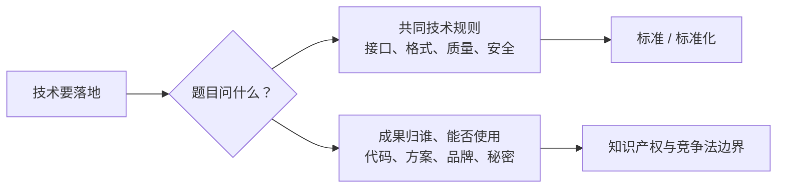

# 为什么未来技术落地还需要标准和权利边界

> [!info] 承接
> 上一站 [[13_大数据：为什么需要与云协同支撑全局智能]] 已经把 CPS、AI、机器人、边缘计算、数字孪生、云和大数据连成一条技术链。但“系统做得到”只回答了**能力**，还没有回答“大家按什么共同规则做”和“别人的成果能不能直接拿来用”。

> [!summary]- 快速复习卡片（学完再看）
> - **核心结论：** 标准化解决共同技术规则，知识产权解决成果保护、归属和使用边界。
> - **题干信号：** 接口兼容、统一格式、必须遵循；代码归属、专利、品牌、商业秘密。
> - **第一动作：** 先判断题目问“共同规则”还是“权利边界”。
> - **陷阱：** 技术可实现 ≠ 可无条件使用；安全标准 ≠ 知识产权。

## 先看一个工程场景

甲公司做一套边缘 AI 平台：

- 设备接口如果每家都自定义，系统很难互操作；
- 数据文件格式如果不统一，上下游很难交换；
- 团队看到别家公司一段代码，也不能因为“网上能下载”就默认可随意复制；
- 自己研发的新技术方案、品牌名称、未公开算法参数，也可能对应不同法律保护方式。

这里其实有两类问题：

## 大白话直接答案

**标准化**关注“大家怎样按统一规则协作”。

**知识产权**关注“智力成果受到什么保护，谁享有权利，别人使用到什么程度需要许可”。

它们会在同一个软件项目里同时出现，但不是同一件事。

## 为什么这一章放在未来技术后面很自然

越是复杂系统，参与者越多、接口越多、复用越多：

- 没有标准，首先出现的是兼容、互操作和质量问题；
- 没有权利边界意识，随后出现的是复制、授权、归属和侵权问题。

所以本章不是突然从“技术”跳到“法律”，而是在补齐真实工程的**规则层**。

## 易混边界

- **安全标准**属于标准化对象；具体加密、访问控制机制仍由信息安全章节负责。
- **软件开发规范**可以是标准约束；需求、设计、测试怎么做仍由软件工程章节负责。
- **合同**可能影响权利归属；合同管理本身不在本章展开。

## 考试动作

看到题干先问：

1. 是不是在问“统一技术要求/规范/代号/机构”？→ 标准化。
2. 是不是在问“作品、代码、技术方案、品牌、秘密信息的权利”？→ 知识产权。
3. 若两者都出现，分成两个判断链，不要混成一个概念。

## 导航

- [跨章] 上一站：[[13_大数据：为什么需要与云协同支撑全局智能]]
- [章内] 下一站：[[02_标准与标准化：为什么不是同一个概念]]
- [索引] 返回：[[标准化与知识产权-章节索引]]
