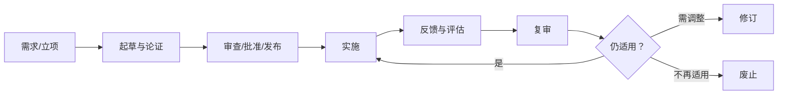

# 标准与标准化：为什么不是同一个概念

> [!summary]- 快速复习卡片（学完再看）
> - **核心结论：** 标准是“统一的技术要求”，标准化是围绕标准制定、实施、监督和持续更新的一整套活动。
> - **题干信号：** 技术要求、制定、实施、反馈、复审、修订、废止。
> - **第一动作：** 问“是什么规则”看标准；问“怎样形成并维护规则”看标准化。
> - **陷阱：** 标准发布后不是永远不变；标准化也不等于只写一份文档。

## 一个最小例子

假设公司规定 API 错误码必须统一：

- “错误码字段叫什么、格式是什么”——这是**标准/规范内容**；
- “谁提出、怎样评审、什么时候发布、上线后怎么收反馈、何时修订”——这是**标准化过程**。

## 正式口径

现行《标准化法》把“标准”定义为有关领域**需要统一的技术要求**；把标准化工作的任务概括为：

> 制定标准 → 组织实施标准 → 对标准制定和实施进行监督。

考试大纲还明确要求“标准的生命周期”。

## 生命周期不要背成孤立名词

从当前法律机制可以形成一条稳定理解链：

现行《标准化法》要求建立实施信息反馈和评估机制，并据此复审；法条还规定复审周期**一般不超过 5 年**。这个数字是“当前法律补充”，不是本章需要机械背诵的唯一重点。

## 为什么标准必须有生命周期

技术会变、风险会变、业务会变。如果标准永远不复审：

- 旧接口可能阻碍新系统；
- 旧安全要求可能已经不足；
- 重复、交叉、互相冲突的标准会越来越多。

所以“标准化意识”不只是“遵守标准”，还包括知道标准需要被实施、反馈、复审和更新。

## 易混边界

- **制度/流程**不一定都是“标准”；题目应出现需要统一的技术要求或规范化要求。
- **版本升级**不是随意改标准；正式标准的修订、废止有相应程序。
- **推荐性**不等于“没有价值”；只是法律强制程度不同，下一篇再区分。

## 考试动作

看到“生命周期”题，别只找“发布”：

> **制定 → 实施 → 反馈/评估 → 复审 → 继续/修订/废止。**

## 自测

1. 团队已经发布了统一的 API 错误码规则，后来收集实施问题、评估并决定修订。哪部分是“标准”，哪些动作属于“标准化”？为什么发布后还不能停？

> [!answer]- 第 1 题答案与解析
> **答案**：错误码的统一技术要求是标准；收集反馈、评估、复审和修订属于标准化活动。
> **解析**：标准是规则内容，标准化还包含制定、实施、监督和更新；技术与使用条件会变化，发布不是生命周期终点。

## 导航

- [章内] 上一站：[[01_为什么未来技术落地还需要标准和权利边界]]
- [章内] 下一站：[[03_标准层级与性质：国家行业地方企业标准怎么区分]]
- [索引] 返回：[[标准化与知识产权-章节索引]]
