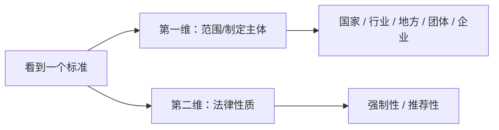

# 标准层级与性质：国家行业地方企业标准怎么区分

> [!summary]- 快速复习卡片（学完再看）
> - **核心结论：** “层级/来源”和“强制/推荐性质”是两条维度，不能混为一谈。
> - **题干信号：** 国家、行业、地方、企业；强制执行、自愿采用。
> - **第一动作：** 先看是谁/在哪个范围制定，再看是否强制。
> - **陷阱：** 现行法下行业标准、地方标准是推荐性标准；企业标准也不等于“低于国标”。

## 先把两个维度拆开

很多人会把“国家标准 = 强制”“行业标准 = 推荐”背成一条，其实应该先分两步：

## 当前中国标准体系怎么认

现行《标准化法》列出：

- 国家标准；
- 行业标准；
- 地方标准；
- 团体标准；
- 企业标准。

其中：

- **国家标准**分为强制性和推荐性；
- **行业标准、地方标准**为推荐性；
- 强制性标准必须执行，国家鼓励采用推荐性标准。

> [!warning] 旧资料风险
> 旧版实施条例或旧辅导材料可能出现“行业标准也分强制/推荐”等历史表述。答“当前法律状态”时以现行《标准化法》为准。

## 大纲为什么还列“国际标准、美国标准、国家军用标准”

考试大纲的分类视角不只限于现行中国民用标准法定层级，还要求识别：

- 国际标准；
- 美国标准；
- 国家军用标准；
- 国家、行业、地方、企业等国内层次。

这里的重点是**题目识别**，不是把全球标准体系背成百科。

- 国际标准：看到 ISO、IEC 等国际标准组织语境，先定位“国际标准”。
- 美国标准：是国外国家/市场标准体系语境，不存在一个前缀可以代表全部美国标准。
- 国家军用标准：属于军用标准体系，现行《标准化法》也明确军用标准的制定、实施和监督办法另行规定。

## 企业标准是不是想怎么写都行

不是。

现行《标准化法》明确：推荐性国家标准、行业标准、地方标准、团体标准、企业标准的技术要求**不得低于强制性国家标准的相关技术要求**。

所以题干说“企业自己制定，所以可以违反强制性国家标准”是明显错误。

## 考试动作

按下面顺序：

1. 看范围/主体：国际？国家？行业？地方？企业？
2. 再看性质：强制还是推荐？
3. 若出现冲突：先检查是否触碰强制性国家标准底线。

## 导航

- [章内] 上一站：[[02_标准与标准化：为什么不是同一个概念]]
- [章内] 下一站：[[04_标准编号：看到GB和GBT先判断什么]]
- [索引] 返回：[[标准化与知识产权-章节索引]]
