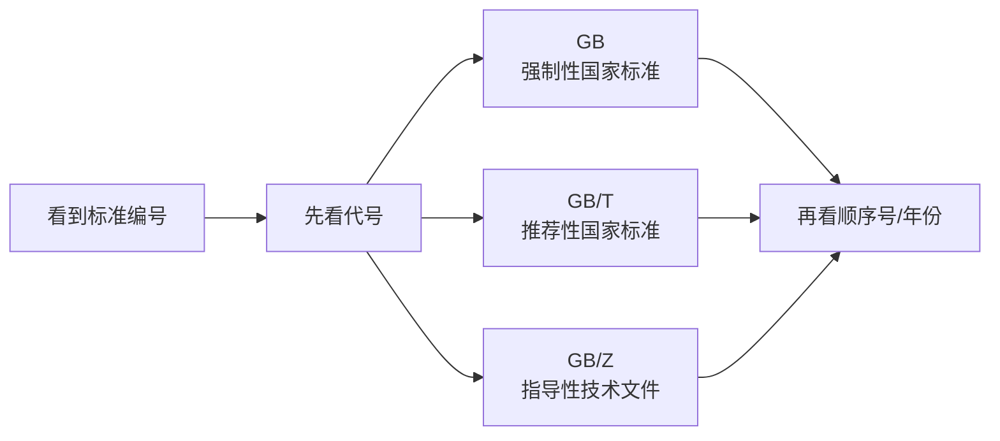

# 标准编号：看到GB和GBT先判断什么

> [!summary]- 快速复习卡片（学完再看）
> - **核心结论：** `GB` 是强制性国家标准，`GB/T` 是推荐性国家标准，`GB/Z` 是国家标准化指导性技术文件。
> - **题干信号：** 标准号前缀、斜杠 T、发布年份。
> - **第一动作：** 先看前缀判断“标准类型/性质”，再看顺序号和年份。
> - **陷阱：** `GB/T` 里的 `/T` 不能忽略；不要把所有国外/军用标准都套一个未经证据确认的编号规则。

## 为什么先看前缀

标准号经常长得像：

`GB/T 12345—20XX`

零基础容易一看到数字就开始背年份，其实第一步应该看最左边。

现行《国家标准管理办法》明确：

| 代号 | 当前含义 |
|---|---|
| `GB` | 强制性国家标准 |
| `GB/T` | 推荐性国家标准 |
| `GB/Z` | 国家标准化指导性技术文件 |

国家标准编号通常由：

> **代号 + 发布顺序号 + 发布年份号**

组成。

## 一个考试例子

如果两个选项分别写：

- `GB 12345—20XX`
- `GB/T 12345—20XX`

不要因为数字一样就认为性质一样。`/T` 已经改变了你对其性质的第一判断。

## 那行业、军用、美国标准怎么办

本章只把**证据已经稳定锁定**的代号写成必认结论。

- 行业标准有各自主管领域代号，题目给出时按具体证据判断；
- 大纲要求识别国家军用标准类别，但不要把网上零散记忆当成“所有军标编号规则”；
- 美国标准体系由多个组织和标准开发者参与，ANSI 本身承担美国自愿标准体系协调管理角色，并不是“所有美国标准都由 ANSI 自己编写”。

## 易混边界

- “推荐性”不等于“可违反强制要求”。
- 标准的年份是版本信息，不等于保护期限。
- 标准编号识别和法律权利期限是两个知识域，别把所有数字混在一起背。

## 考试动作

> **编号题：先前缀 → 再性质/类别 → 最后才看年份和具体标准名称。**

## 导航

- [章内] 上一站：[[03_标准层级与性质：国家行业地方企业标准怎么区分]]
- [章内] 下一站：[[05_标准化机构与软件标准：谁制定标准又约束什么]]
- [索引] 返回：[[标准化与知识产权-章节索引]]
