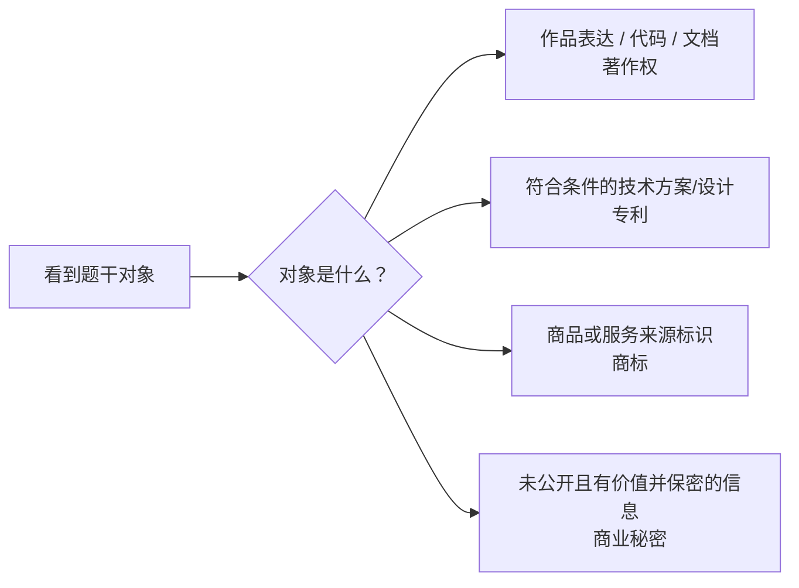

# 知识产权总框架：为什么不是一种权利

> [!summary]- 快速复习卡片（学完再看）
> - **核心结论：** 知识产权是一个权利集合；软考最先分“作品表达、技术方案、商业标识、秘密信息”。
> - **题干信号：** 代码/文档、发明申请、品牌标志、未公开技术/经营信息。
> - **第一动作：** 先认保护对象，再选权利类型。
> - **陷阱：** 同一个软件产品可能同时涉及多类权利；“有软件著作权”不代表技术方案也自动被专利保护。

## 先别问“保护多久”，先问“保护什么”

同一款软件产品可能同时包含：

- 源代码和说明文档；
- 某种新的技术方案；
- 产品名称和 Logo；
- 未公开的参数、客户名单或工艺信息。

它们不是靠同一种权利统一保护。

## 四类核心对象

### 著作权
核心看**作品表达**。软件领域最典型是程序和相关文档。

### 专利
核心看法律要求下可授予专利的**发明创造**，尤其题干出现新的技术方案、申请、授权。

### 商标
核心看**识别商品或服务来源的标识**。

### 商业秘密
核心看**不为公众所知悉 + 有商业价值 + 采取相应保密措施**的信息。

## 为什么同一个产品会有多种权利

比如一个智能门锁：

- App 源代码：可能涉及软件著作权；
- 某种新的低功耗开锁技术方案：可能走专利判断；
- 产品品牌：商标；
- 未公开风控参数：商业秘密。

所以“产品属于哪种知识产权”往往不是好问题，应该问“题干正在指产品的哪一个对象”。

## 易混边界

- 买到软件复制品 ≠ 买到软件著作权。
- 软件功能相同 ≠ 当然侵犯代码著作权。
- 品牌名称 ≠ 专利。
- 公司内部资料 ≠ 自动构成商业秘密。

## 考试动作

> **第一问永远是：题干对象是什么？**

先分流，再去背各自的归属、期限、申请/登记和使用边界。

## 导航

- [章内] 上一站：[[05_标准化机构与软件标准：谁制定标准又约束什么]]
- [章内] 下一站：[[07_著作权到底保护作品的什么]]
- [索引] 返回：[[标准化与知识产权-章节索引]]
