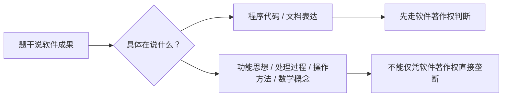

# 软件著作权：保护代码还是保护功能思想

> [!summary]- 快速复习卡片（学完再看）
> - **核心结论：** 软件著作权保护计算机程序及有关文档的表达，不延及开发软件所用的思想、处理过程、操作方法或数学概念。
> - **题干信号：** 源程序、目标程序、文档、功能、算法思想、登记。
> - **第一动作：** 先分“程序/文档表达”还是“思想/方法/功能层”。
> - **陷阱：** 登记不是权利产生前提；有软件著作权不意味着别人永远不能独立实现相同功能。

## 软件到底包括什么

《计算机软件保护条例》把软件定义为：

- 计算机程序；
- 有关文档。

同一程序的源程序和目标程序属于同一作品。

所以题目说“软件著作权只保护源代码，不保护文档”，不对。

## 最重要的边界：表达 vs 思想/方法

条例明确：

> 软件著作权保护不延及开发软件所用的思想、处理过程、操作方法或者数学概念等。

把它翻成考试语言：

这就是为什么“别人实现相同功能”不等于“别人一定复制了你的软件”。

## 软件著作权什么时候产生

现行条例规定：

> **自软件开发完成之日起产生。**

登记可以办理，登记证明是登记事项的初步证明，但不是“登记后才产生著作权”。

所以：

- `开发完成` → 权利产生；
- `登记` → 证据/管理层面的作用；
- 两者不能倒过来。

## 场景判断

甲独立写了一套库存系统；乙没有看甲代码，只根据相同业务需求重新开发了一套功能相近系统。

仅凭“功能相同”不能推出“复制了代码表达”。题目若再提供代码高度相同、文档复制等证据，才进入更直接的著作权侵权判断。

## 考试动作

看到软件著作权：

1. 先认程序/文档；
2. 再排除思想、过程、方法、数学概念；
3. 看到“登记才产生”直接警惕；
4. 若题目问“技术方案能否被排他保护”，转到专利篇。

## 自测

1. 甲的软件已经开发完成但尚未登记；乙没有接触甲的代码，独立做出相同功能。能否说“甲还没有软件著作权，乙又必然侵权”？

> [!answer]- 第 1 题答案与解析
> **答案**：两句都不能成立。软件著作权自开发完成产生，登记不是产生前提；仅有功能相同也不能推出复制了程序或文档表达。
> **解析**：题干要分别判断权利产生时点和保护对象，不能把登记当授权，也不能把功能思想等同于受保护代码。

## 导航

- [章内] 上一站：[[07_著作权到底保护作品的什么]]
- [章内] 下一站：[[09_软件著作权归属：谁开发就一定归谁吗]]
- [索引] 返回：[[标准化与知识产权-章节索引]]
