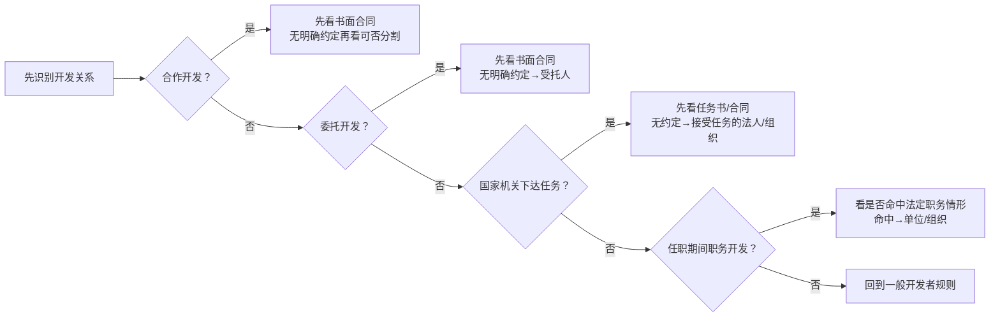

# 软件著作权归属：谁开发就一定归谁吗

> [!summary]- 快速复习卡片（学完再看）
> - **核心结论：** 默认看开发者，但合作、委托、国家任务和职务开发必须继续看合同/任务书与法定条件。
> - **题干信号：** 合作、委托、公司员工、本职工作、单位资金设备、国家机关下达任务。
> - **第一动作：** 先识别开发关系，再找书面合同/任务书，再套对应默认规则。
> - **陷阱：** “谁敲代码就永远归谁”错误；“谁付钱委托就当然归谁”也错误。

## 默认规则只是起点

条例规定软件著作权原则上属于软件开发者，但随后马上给出特殊开发关系。

所以归属题不能只问“谁写的”，要问“在什么关系下写的”。

## 1. 合作开发

先看合作开发者之间的**书面合同**。

无书面合同或约定不清：

- 软件可分割使用：开发者可对各自开发部分单独享有；
- 软件不可分割：由合作开发者共同享有。

## 2. 委托开发

先看委托人与受托人的**书面合同约定**。

没有书面合同或约定不清：

> 软件著作权由**受托人**享有。

这是非常典型的反直觉点：**付钱的人并不因为付钱就自动拿到著作权。**

## 3. 国家机关下达任务

先看项目任务书或合同；未明确规定时，软件著作权由**接受任务的法人或者其他组织**享有。

## 4. 职务开发

任职期间开发的软件，如果属于：

- 针对本职工作中明确指定的开发目标；
- 从事本职工作可预见或自然产生的结果；
- 主要使用单位资金、专用设备、未公开专门信息等物质技术条件，并由单位承担责任；

则软件著作权由单位/组织享有。

## 考试动作

归属题固定三步：

> **关系类型 → 是否有明确约定 → 没约定时用法定默认规则。**

不要先凭“谁写、谁出钱、谁是老板”猜答案。

## 导航

- [章内] 上一站：[[08_软件著作权：保护代码还是保护功能思想]]
- [章内] 下一站：[[10_著作权期限与使用限制：50年到底从哪里算]]
- [索引] 返回：[[标准化与知识产权-章节索引]]
