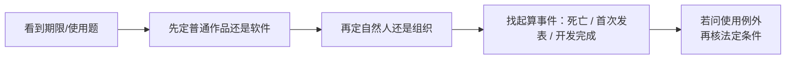

# 著作权期限与使用限制：50年到底从哪里算

> [!summary]- 快速复习卡片（学完再看）
> - **核心结论：** “50 年”必须先问对象是谁、从什么事件起算；不同权利/主体不能共用一条口诀。
> - **题干信号：** 自然人、法人、首次发表、开发完成、死亡、合理使用。
> - **第一动作：** 先定“普通作品还是软件 + 自然人还是组织”，再算期限。
> - **陷阱：** 不是所有著作权都 50 年；署名权、修改权、保护作品完整权的保护期不受限制。

## 为什么“50 年”最容易背错

因为题目可能同时考：

- 普通自然人作品；
- 法人/非法人组织作品；
- 自然人的软件；
- 法人/其他组织的软件；
- 人身权。

这些起算点并不完全一样。

## 软件著作权的考试主线

《计算机软件保护条例》现行规则：

### 自然人软件
保护期为自然人终生及其死亡后 50 年，截止到死亡后第 50 年的 12 月 31 日。

合作开发软件则看最后死亡的自然人。

### 法人或者其他组织的软件
保护期为 50 年，截止到软件**首次发表后第 50 年的 12 月 31 日**；但软件自开发完成之日起 50 年内未发表的，条例不再保护。

## 普通作品还要注意人身权

现行《著作权法》明确：

- 署名权；
- 修改权；
- 保护作品完整权；

其保护期不受限制。

因此“著作权的保护期都是 50 年”是错误表述。

## 合理使用不是“网上找到就能用”

《著作权法》规定了一组法定情形，在满足条件时可以不经许可、不支付报酬，但仍要遵守例如注明作者/作品名称、不影响正常使用、不不合理损害合法权益等边界。

考试常见信号包括：

- 个人学习、研究、欣赏；
- 为评论说明问题作适当引用；
- 特定教学科研使用等。

不要把“非营利”“学习用途”单独当成万能免责牌。

## 考试动作

## 导航

- [章内] 上一站：[[09_软件著作权归属：谁开发就一定归谁吗]]
- [章内] 下一站：[[11_专利权：为什么有软件著作权还可能需要专利]]
- [索引] 返回：[[标准化与知识产权-章节索引]]
