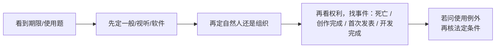

# 著作权期限与使用限制：50年到底从哪里算

> [!summary]- 快速复习卡片（学完再看）
> - **核心结论：** “50 年”必须先问对象是谁、从什么事件起算；不同权利/主体不能共用一条口诀。
> - **题干信号：** 自然人、法人、首次发表、开发完成、死亡、合理使用。
> - **第一动作：** 先定一般作品、视听作品还是软件，再定自然人/组织与权利类型，最后找起算事件。
> - **陷阱：** 不是所有著作权都 50 年；署名权、修改权、保护作品完整权的保护期不受限制。

## 为什么“50 年”最容易背错

例如，两道题都写“保护期 50 年”：一题的作品由自然人创作，另一题是法人作品。如果没有先认清对象和权利类型，直接从发表日或作者死亡日套一个起点，至少有一题可能算错。

因为题目可能同时考：

- 普通自然人作品；
- 法人/非法人组织作品；
- 自然人的软件；
- 法人/其他组织的软件；
- 人身权。

这些起算点并不完全一样。

## 一般作品：先看权利，再找起算事件

按现行《著作权法》第 22～23 条，普通作品不能只背一句“保护 50 年”：

- **自然人作品的发表权和财产权**（如复制、发行权）：保护至作者死亡后第 50 年的 **12 月 31 日**；合作作品以最后死亡的作者为准。这里的起算线索是**死亡**，不是首次发表。
- **法人或非法人组织作品，以及著作权（署名权除外）由组织享有的职务作品**：发表权保护至作品**创作完成后**第 50 年的 12 月 31 日；财产权保护至作品**首次发表后**第 50 年的 12 月 31 日。作品自创作完成后 50 年内始终未发表的，法律不再保护。不能把“首次发表”误套到发表权上。

另有一条容易漏掉：**视听作品**也有独立规定。发表权从作品创作完成起算 50 年；财产权从首次发表起算 50 年；创作完成后 50 年内未发表的，不再保护。它的起算规则不要只按“自然人作者还是组织作者”去套。

例如，假设某公司作为作者在 **2000 年完成**一篇作品，并在 **2010 年首次发表**：算发表权期限，取完成年份 $2000+50=2050$，截止 **2050 年 12 月 31 日**；算财产权期限，取首次发表年份 $2010+50=2060$，截止 **2060 年 12 月 31 日**。这只是用于练习起算点的虚构情境，不是说已发表后还能再行使一次“首次发表”权。

## 软件著作权的考试主线

《计算机软件保护条例》现行规则：

### 自然人软件
保护期为自然人终生及其死亡后 50 年，截止到死亡后第 50 年的 12 月 31 日。

合作开发软件则看最后死亡的自然人。

### 法人或者其他组织的软件
保护期为 50 年，截止到软件**首次发表后第 50 年的 12 月 31 日**；但软件自开发完成之日起 50 年内未发表的，条例不再保护。

## 普通作品还要注意人身权

现行《著作权法》明确：

- 署名权；
- 修改权；
- 保护作品完整权；

其保护期不受限制。

因此“著作权的保护期都是 50 年”是错误表述。

## 合理使用不是“网上找到就能用”

《著作权法》规定了一组法定情形，在满足条件时可以不经许可、不支付报酬，但仍要遵守例如注明作者/作品名称、不影响正常使用、不不合理损害合法权益等边界。

考试常见信号包括：

- 个人学习、研究、欣赏；
- 为评论说明问题作适当引用；
- 特定教学科研使用等。

不要把“非营利”“学习用途”单独当成万能免责牌。

### 软件还有两条需要单独识别的使用规则

《计算机软件保护条例》第 16 条针对**合法复制品所有人**，允许按使用需要把软件装入计算机、为防止复制品损坏制作一份备份，以及为适应实际应用环境或改进功能/性能作必要修改。备份不得提供给他人，并在失去合法复制品所有权时销毁；除合同另有约定，修改后的软件不得提供给第三方。

条例第 17 条另规定，为学习、研究软件内含的设计思想和原理，可以通过安装、显示、传输或存储等方式使用软件，不经许可、不付报酬。它只针对学习、研究软件的设计思想和原理，不是把软件副本任意传播、转售或用于其他目的的通行许可。答题时要先看清题干满足哪一条的条件，不能把“学习用途”当成所有复制、传播行为的概括免责理由。

## 考试动作

## 自测

1. 假设某法人作为作者，2000 年完成一篇普通文字作品，2010 年首次发表。只按本篇所述普通作品规则，发表权、复制权分别以哪件事为起点，截止到哪年年底？

> [!answer]- 第 1 题答案与解析
> **答案**：发表权从创作完成算，至 $2000+50=2050$ 年 12 月 31 日；复制权属于财产权，从首次发表算，至 $2010+50=2060$ 年 12 月 31 日。
> **解析**：先认“法人普通作品”，再分权能；两个“50 年”不能共用首次发表这一起点。此为虚构算例，不表示已发表后可再次行使首次发表权。

2. 假设一位自然人作者于 2000 年去世；另有某法人软件于 2000 年开发完成、2010 年首次发表。自然人普通作品的复制权和该法人软件的保护期各到哪年年底？自然人作品的署名权也同时终止吗？

> [!answer]- 第 2 题答案与解析
> **答案**：自然人普通作品的复制权至死亡后第 50 年，即 2050 年 12 月 31 日；该法人软件至首次发表后第 50 年，即 2060 年 12 月 31 日；署名权保护期不受限制。
> **解析**：先分普通作品与软件、自然人与法人，再找死亡或首次发表的起算事件；“50 年”不能覆盖所有权能，开发完成在此也不是法人软件已发表后的保护期起点。

3. 合法复制品所有人制作的备份能否发给同事使用？失去合法复制品所有权后，备份应怎样处理？

> [!answer]- 第 3 题答案与解析
> **答案**：不能提供给他人；失去合法复制品所有权时应销毁备份。
> **解析**：这是《计算机软件保护条例》第 16 条对防损备份的明确限制，不能把备份权理解为可额外分发一份副本。

4. 仅以“个人学习”为由，能否把软件副本上传供公众下载？条例第 17 条允许的是什么？

> [!answer]- 第 4 题答案与解析
> **答案**：不能据此推出可以公开传播。第 17 条针对学习、研究软件内含设计思想和原理时，通过安装、显示、传输或存储等方式使用软件。
> **解析**：要按法条限定的目的和行为理解该项规则，不能将其扩张为软件副本的普遍复制、发行许可。

5. 一部视听作品于 2000 年创作完成、2010 年首次发表。它的发表权和财产权分别以什么事件起算，各保护到哪年年底？

> [!answer]- 第 5 题答案与解析
> **答案**：发表权从创作完成起算，至 2050 年 12 月 31 日；财产权从首次发表起算，至 2060 年 12 月 31 日。
> **解析**：《著作权法》第二十三条对视听作品单列期限规则；先区分权利类型，再选创作完成或首次发表作为起算事件。

## 导航

- [章内] 上一站：[[09_软件著作权归属：谁开发就一定归谁吗]]
- [章内] 下一站：[[11_专利权：为什么有软件著作权还可能需要专利]]
- [索引] 返回：[[标准化与知识产权-章节索引]]

## 现行法核验来源

- [《中华人民共和国著作权法》第二十二至二十四条（国家版权局）](https://www.ncac.gov.cn/xxfb/flfg/flfg_532/202103/t20210309_50530.html)：核对普通作品保护期、组织作品及特定职务作品的起算条件、人身权期限和合理使用的一般限制。
- [《计算机软件保护条例》第十四至十七条（国家行政法规库）](https://xzfg.moj.gov.cn/front/law/detail?LawID=581)：核对软件保护期限、合法复制品所有人的使用/备份/必要修改范围，以及学习研究设计思想与原理的特定规则。
