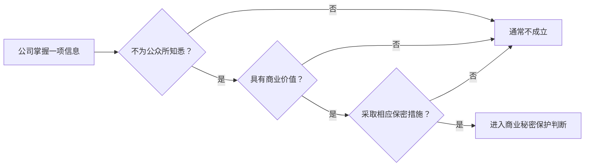

# 商业秘密：公司内部资料为什么不一定都是商业秘密

> [!summary]- 快速复习卡片（学完再看）
> - **核心结论：** 商业秘密必须同时抓“非公开 + 商业价值 + 相应保密措施”。
> - **题干信号：** 未公开算法、客户信息、经营数据、保密协议、访问控制、泄密。
> - **第一动作：** 三条件逐项检查，缺一项就不能只凭“公司内部”下结论。
> - **陷阱：** 2025 修订法中商业秘密条款已是第 10 条，旧资料常引用第 9 条。

## 三个条件缺一不可

现行《反不正当竞争法》定义商业秘密为：

- 不为公众所知悉；
- 具有商业价值；
- 经权利人采取相应保密措施；

的技术信息、经营信息等商业信息。

## 为什么“内部资料”不够

公司电脑里有一份公开产品说明书，即使文件夹叫“内部”，内容本身人人都能公开获得，也不因为存储位置变成商业秘密。

反过来，一套未公开定价模型：

- 外界不知道；
- 能带来竞争价值；
- 公司限制访问、签保密协议、分级管理；

就更符合商业秘密判断。

## 保密措施是什么思路

考试不用背诉讼证据清单，只抓：

> 权利人有没有**真实采取措施**表明并维持保密意图。

例如限制访问范围、保密协议、权限控制、标识/隔离等，都能帮助理解这个条件。

## 版本变化要知道

2023 应试资料按当时法律把商业秘密放在《反不正当竞争法》第 9 条。

2025 修订的新法自 2025-10-15 施行，商业秘密条款位于**第 10 条**，三项核心成立条件仍然保持。

所以考试问“当前条号”时不要沿用旧资料；若旧题引用第 9 条，应识别其历史背景。

## 与信息安全的边界

这里的“加密、访问控制”只作为“是否采取保密措施”的事实。

怎么设计权限模型、怎么加密，回信息安全章节；本篇不重复技术课。

## 考试动作

看到商业秘密题，固定念三遍：

> **秘密性 → 商业价值 → 保密措施。**

## 导航

- [章内] 上一站：[[12_商标权：保护的是产品技术还是商业标识]]
- [章内] 下一站：[[14_知识产权的共同特性：为什么权利不是永久全球通用]]
- [索引] 返回：[[标准化与知识产权-章节索引]]
