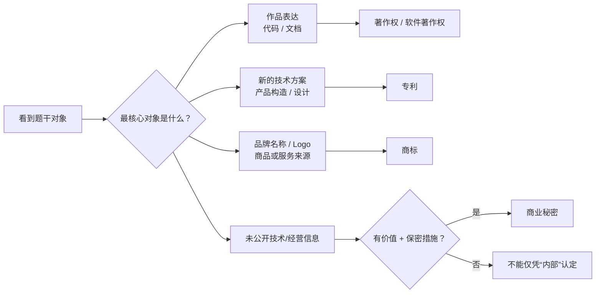

# 综合判断：看到代码技术方案品牌和秘密信息先选哪类权利

> [!summary]- 快速复习卡片（学完再看）
> - **核心结论：** 表达/代码文档→著作权；符合条件的技术方案/设计→专利；来源标识→商标；秘密且有价值并采取保密措施的信息→商业秘密。
> - **题干信号：** 复制代码、申请授权、品牌 Logo、未公开+保密措施。
> - **第一动作：** **先认对象，再认权利。**
> - **陷阱：** 同一个软件产品可能并存多种保护；不要看到“软件”二字就全部选软件著作权。

## 一张图做第一轮分流

## 第二轮再问细节

### 走到著作权
问：

- 是具体表达还是思想/方法？
- 谁是权利人？
- 是否合作/委托/职务开发？
- 问的是什么权能、期限或合理使用？

### 走到专利
问：

- 是什么发明创造？
- 是否需要申请/授权？
- 谁有申请权、谁先申请？
- 当前期限是多少？

### 走到商标
问：

- 是否用于识别商品/服务来源？
- 是否注册、是否相同或近似导致混淆？
- 有效期/续展是否命中？

### 走到商业秘密
逐项检查：

> **不公开 + 商业价值 + 保密措施。**

## 一个综合场景

某公司开发智能诊断平台：

1. 员工写的源代码被竞争对手直接复制 → 先走软件著作权，再看职务开发归属；
2. 一种新的设备诊断技术方案 → 先问是否进入专利法保护和申请授权；
3. 产品名“X智诊”用于市场识别 → 商标；
4. 未公开模型参数和客户运营策略 → 只有满足秘密性、商业价值、保密措施才走商业秘密。

同一个产品出现四种权利，并不矛盾，因为**保护对象不同**。

## 最后再回标准化

如果题目问的不是“谁拥有成果”，而是：

- API 必须按某格式；
- 文档必须符合某规范；
- 产品必须符合某强制标准；

那应回到本章前半段的**标准化**，不要硬套知识产权。

## 全章收口

本章真正要形成的考试链是：

> **规则题先分标准化/知识产权 → 知识产权先认保护对象 → 再判归属/申请或登记/期限/使用边界 → 数字题先确认法律版本。**

到这里，“技术能不能做”之外的规则边界已经补齐。

## 下一站

下一大章进入**应用数学**：从“技术活动受哪些共同规则和权利边界约束”，转向“怎样用概率统计、图论、运筹和建模做定量分析、优化与决策”。

本轮启动时应用数学章节尚不存在，因此这里只做语义指向，不制造死 Wikilink。

## 导航

- [章内] 上一站：[[14_知识产权的共同特性：为什么权利不是永久全球通用]]
- [跨章] 下一站：应用数学（语义指向；当前不创建 Wikilink）
- [索引] 返回：[[标准化与知识产权-章节索引]]
