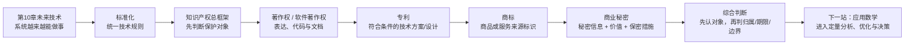

# 标准化与知识产权-学习路线

> [!info] 从上一章怎么过来
> 第 10 章最后学到云计算和大数据，已经知道 CPS、AI、机器人、边缘计算、数字孪生、云与大数据怎样让系统“更能做事”。但进入真实工程后还有两个不能跳过的问题：**大家按什么共同规则做？技术成果归谁、别人能不能使用？** 前者进入标准化，后者进入知识产权。

> [!tip] 复习入口
> 学完整章后，用 [[标准化与知识产权-考前速记]] 做对象分流和易混边界回忆；法律数字遇到版本差异时回到本章审核记录核对，不凭旧口诀硬背。

## 第一段：先学“规则为什么存在”

1. [[01_为什么未来技术落地还需要标准和权利边界]]
2. [[02_标准与标准化：为什么不是同一个概念]]
3. [[03_标准层级与性质：国家行业地方企业标准怎么区分]]
4. [[04_标准编号：看到GB和GBT先判断什么]]
5. [[05_标准化机构与软件标准：谁制定标准又约束什么]]

这一段先建立：**标准不是法律权利，标准化也不是只制定国家标准。**

## 第二段：先认清知识产权不是一种权利

6. [[06_知识产权总框架：为什么不是一种权利]]
7. [[07_著作权到底保护作品的什么]]
8. [[08_软件著作权：保护代码还是保护功能思想]]
9. [[09_软件著作权归属：谁开发就一定归谁吗]]
10. [[10_著作权期限与使用限制：50年到底从哪里算]]

顺序故意先讲“保护什么”，再讲“归谁”和“多久”。这样不会一上来只背数字，却连题目问的是代码表达还是技术方案都分不清。

## 第三段：把另外三类权利补齐

11. [[11_专利权：为什么有软件著作权还可能需要专利]]
12. [[12_商标权：保护的是产品技术还是商业标识]]
13. [[13_商业秘密：公司内部资料为什么不一定都是商业秘密]]
14. [[14_知识产权的共同特性：为什么权利不是永久全球通用]]

## 第四段：形成考试第一动作

15. [[15_综合判断：看到代码技术方案品牌和秘密信息先选哪类权利]]

最终只记一条主线：

> **先判断题干对象 → 再判断权利类型 → 再看归属/申请或登记/保护期限/使用边界。**

不要反过来先搜脑中的“10 年、20 年、50 年”。版本敏感数字必须先确认法律语境。

## 下一站

本章已经解决“共同规则怎么统一、不同智力成果怎样确定保护与使用边界”。下一章开始处理另一类架构师综合能力：**面对概率、图、资源优化和现实决策问题，怎样把问题抽象成数学模型并计算。**

→ [[应用数学-章节索引]]
