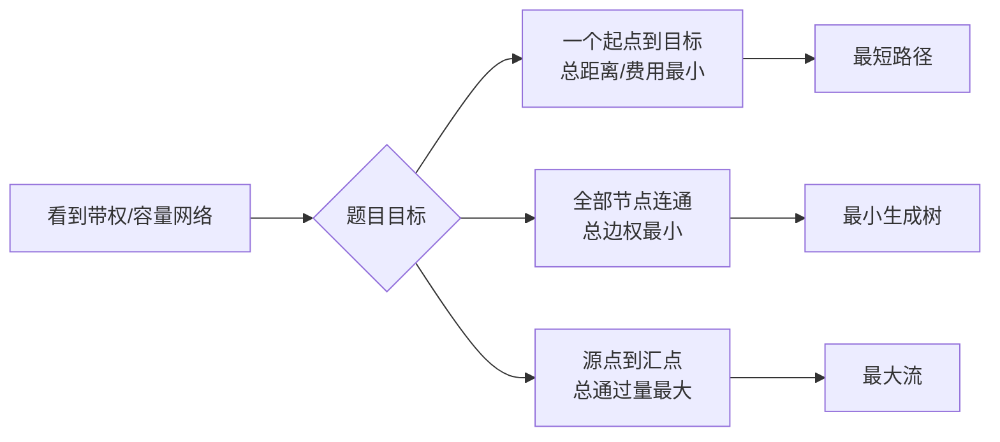

# 最短路径、最小生成树与最大流的题型识别

> [!info] 承接
> 概率统计处理不确定性。接下来题目换成“节点 + 边 + 权值/容量”。这时最重要的不是先背算法，而是先判断题目到底在问哪一种图问题。

> [!summary]- 快速复习卡片（20～40 秒）
> - **A 到 B 最省：** 最短路径。
> - **所有点都连起来且总成本最小：** 最小生成树。
> - **源点到汇点最多能通过多少：** 最大流。
> - **陷阱：** 最小生成树不是“任意两点都最短”；最大流也不是找一条容量最大的单一路径。

## 三句话分清

| 问题 | 题干常见信号 | 输出 |
|---|---|---|
| 最短路径 | 从 A 到 B、最短距离、最低运输费用 | 一条或若干条最短路线 + 距离 |
| 最小生成树 | 铺线、连通全部站点、总建设成本最小 | `n-1` 条边组成的树 |
| 最大流 | 管道/带宽/运输容量、源点、汇点 | 整个网络可承载的最大总流量 |

## 为什么不能混

假设一张城市网络图：

- 要从机房 A 到机房 D 走最低时延链路，是**最短路径**；
- 要用最少总光纤成本让 A/B/C/D 全部互通，是**最小生成树**；
- 要计算入口到出口最多能输送多少 Gbps，是**最大流**。

三道题可以用同一张图，但优化目标不同，所以算法也不同。

## 考试动作

先不要算，先把题干目标改写成一句话：

1. “一个点到另一个点最省？”→最短路径。
2. “全部节点连通，总成本最小？”→最小生成树。
3. “源到汇最多通过多少？”→最大流。

只有完成分流，才进入下一篇具体算法。

## 自测（自编练习，非真题）

1. 同一张站点网络图出现三问：① A 到 D 延迟最低的路线；② 铺线让全部站点互通且总造价最低；③ 入口到出口最多能传多少流量。各应识别为什么问题？

> [!answer]- 第 1 题答案与解析
> **答案**：依次是最短路径、最小生成树、最大流。
> **解析**：先改写优化目标：① 指定两点的路径代价最小；② 全部点连通时所选边的总权最小；③ 源点到汇点的总通过量最大。不能仅因题目都给了图就套同一个算法。

## 导航

- [章内] 上一站：[[03_均值方差与标准差]]
- [章内] 下一站：[[05_最短路径的逐轮确定]]
- [索引] 返回：[[应用数学-章节索引]]
