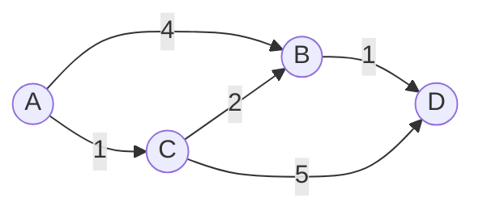

# 最短路径的逐轮确定

> [!info] 承接
> 上一篇已经先把图论三类题分开。本篇只解决一个问题：**边权非负时，从指定起点到其他点的最短距离怎样逐轮确定。**

> [!summary]- 快速复习卡片（20～40 秒）
> - **适用前提：** 本篇演示 Dijkstra，边权要求非负。
> - **核心动作：** 暂定距离 → 选最小未确定点 → 用它更新邻居 → 重复。
> - **第一动作：** 起点距离写 0，其余先写 ∞。
> - **陷阱：** “当前最短”只有在该点被选为本轮最小未确定点后才最终确定。

## 具体问题

边权如下：A-B=4，A-C=1，C-B=2，B-D=1，C-D=5。求 A 到 D 的最短路径。

## 第 0 步：初始化

- A=0，因为从 A 到自己不花代价。
- B=∞，C=∞，D=∞，因为还没找到路线。

从 A 的直接边更新：

- B=min(∞, 0+4)=4
- C=min(∞, 0+1)=1

现在暂定距离：A=0，C=1，B=4，D=∞。

## 第 1 轮：为什么先确定 C

未确定节点里 C 的暂定距离 1 最小。由于所有边权都非负，之后绕更远的未确定点再回来，不可能把 1 降得更低，所以 C 可确定。

用 C 更新邻居：

- 到 B：A→C→B = 1+2=3，比原来的 4 小，所以 B 改成 3。
- 到 D：A→C→D = 1+5=6，所以 D 改成 6。

## 第 2 轮：确定 B

未确定节点里 B=3 最小。用 B 更新 D：

$$
3+1=4<6
$$

所以 D 从 6 更新为 4。

## 第 3 轮：确定 D

D=4 成为最小未确定距离，得到最短距离 **4**。

回溯前驱：D←B←C←A，所以最短路径是：

**A → C → B → D**。

## 为什么每轮都选最小暂定距离

Dijkstra 的关键依赖“非负边权”。已走到某个当前最小节点后，再经过其他未确定节点只会增加非负代价，因此不会出现“先走远再突然变得更短”。若题目出现负权边，不要机械套本篇过程。

## 考试动作

1. 看清是否是“指定起点到目标最省”且边权非负。
2. 起点写 0，其余写 ∞。
3. 每轮确定最小暂定节点。
4. 用 `起点到当前点距离 + 当前边权` 尝试更新邻居。
5. 目标点被确定后回溯前驱得到路径。

## 导航

- [章内] 上一站：[[04_最短路径最小生成树与最大流的题型识别]]
- [章内] 下一站：[[06_最小生成树的选边过程]]
- [索引] 返回：[[应用数学-章节索引]]