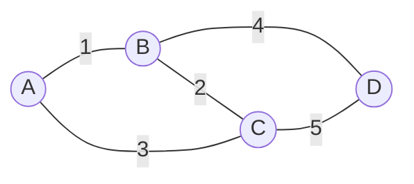

# 最小生成树的选边过程

> [!info] 承接
> 最短路径只关心“从一个点到另一个点最省”。本篇换成另一个目标：**所有节点都要连通，而且选中的边权总和最小。**

> [!summary]- 快速复习卡片（20～40 秒）
> - **题眼：** 全部站点连通 + 总建设成本最小。
> - **Kruskal：** 边从小到大看；会成环就跳过；选到 `n-1` 条边停止。
> - **Prim：** 从一个点长出一棵树，每次选连接“树内—树外”的最小边。
> - **陷阱：** 不是求某两点最短路径。

## 具体问题

四个节点 A、B、C、D，边权：AB=1，BC=2，AC=3，BD=4，CD=5。怎样以最小总成本让四个节点全部连通？

## 用 Kruskal 一步一步选

### 第 1 步：边排序

从小到大：AB(1)、BC(2)、AC(3)、BD(4)、CD(5)。

### 第 2 步：选 AB(1)

当前没有环，选入。已连接 A、B。

### 第 3 步：选 BC(2)

仍不会形成环，选入。A、B、C 已连在一起。

### 第 4 步：为什么跳过 AC(3)

A 和 C 已经通过 A-B-C 连通。再加 AC 会形成 A-B-C-A 的环。

生成树不需要环；这个环只增加成本，不增加新的节点连通性，所以跳过。

### 第 5 步：选 BD(4)

D 尚未接入，BD 能把 D 接入且不成环，因此选入。

现在四个节点全部连通，已选 3 条边，正好是 `n-1=4-1=3` 条，停止。

总成本：

$$
1+2+4=7
$$

## Prim 和 Kruskal到底差在哪

- **Prim：** 始终维护“一棵正在长大的树”，每轮从树内连向树外选最小边。
- **Kruskal：** 从全局最小边开始，可先出现多个小连通块，再逐步合并；核心检查是不能成环。

二者目标相同：得到最小生成树。考试如果指定算法，就按指定过程；未指定时，小图常用顺手的方法即可。

## 考试动作

1. 先确认是“全部节点连通 + 总边权最小”。
2. 若按 Kruskal，先把边按权值升序。
3. 每次试选一条边；若形成环就跳过。
4. 选到 `n-1` 条边且全部连通时停止。
5. 最后把所选边权求和，不要把被跳过的边算进去。

## 自测（自编练习，非真题）

1. 四个节点的边权为 $AB=1$、$AC=2$、$BC=3$、$CD=4$、$BD=5$。按 Kruskal 依次选哪些边？哪条边因成环被跳过？总权是多少？

> [!answer]- 第 1 题答案与解析
> **答案**：选 $AB,AC,CD$，跳过 $BC$；总权为 $7$。
> **解析**：升序检查：$AB(1)$、$AC(2)$ 先入树；$BC(3)$ 会让 $A,B,C$ 构成环，跳过；$CD(4)$ 接入最后的 $D$。已选 $4-1=3$ 条边，总权 $1+2+4=7$。

## 导航

- [章内] 上一站：[[05_最短路径的逐轮确定]]
- [章内] 下一站：[[07_最大流的增广过程]]
- [索引] 返回：[[应用数学-章节索引]]
