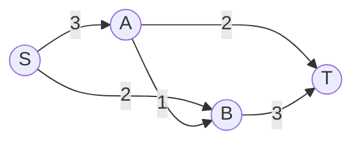
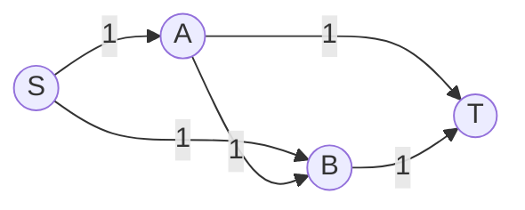

# 最大流的增广过程

> [!info] 承接
> 生成树解决“用最小总成本连通全部节点”。最大流完全换了目标：边上写的是**容量上限**，要问源点到汇点合计最多能通过多少流量。

> [!summary]- 快速复习卡片（20～40 秒）
> - **核心链：** 在残量网络找增广路 → 找路径瓶颈 → 按正向/反向边调整流量 → 重复。
> - **瓶颈：** 一条路径能增加多少流，取决于该路径最小剩余容量。
> - **停止：** 在残量网络中，源点到汇点已经找不到增广路。
> - **陷阱：** 最大流不是“挑一条容量最大的路径”。

## 具体网络

例如，S 是仓库、T 是目的地，A 和 B 是中转站；边上的数是每小时最多能运出的箱数。题目要问的不是某一条路能运多少，而是整个网络从 S 到 T 最多能送多少。

容量：S→A=3，S→B=2，A→B=1，A→T=2，B→T=3。

## 第一次增广：S → A → T

路径容量分别是 3、2。

瓶颈是：

$$
\min(3,2)=2
$$

所以这条路径最多先送 **2**。累计流量=2。

更新后：S→A 还剩 1，A→T 已用满为 0。

## 第二次增广：S → B → T

剩余容量是 2、3，瓶颈为 2。

再送 **2**，累计流量：

$$
2+2=4
$$

更新后：S→B 已无剩余容量，B→T 还剩 1。

## 第三次增广：S → A → B → T

剩余容量分别是 1、1、1，瓶颈为 1。

再送 **1**，累计流量：

$$
4+1=5
$$

此时 S 发出的两条边 S→A 与 S→B 的总容量本来就是 `3+2=5`，已经全部用满，因此不可能再超过 5。

所以最大流是 **5**。

## 为什么每次取最小剩余容量

一条串联路径上，只要某一条边只能再过 1，那么整条路径这次最多也只能增加 1。这个最小值就是“瓶颈”。

正文前面的 5 单位例子不需要改道。更复杂的网络可能需要撤销先前选路的一部分流量，再把它送到更合适的路径；这时要在**残量网络**中继续找增广路。残量网络同时记录两种可操作空间：原边还能增加多少流，以及反向边最多能撤回多少已送流量。

### 反向残量边怎样把流量改道

以下是一个独立的教学例子，每条边容量均为 1：

如果第一次选 `S→A→B→T`，送出 1 单位后，`A→B` 已被占满，`B→T` 也已被占满。此时只看原图剩余正向容量，会误以为没有路了。但之前选择 `A→B` 是一种可撤销的安排：残量网络为它增加反向边 `B→A`，容量为已送的 1。

于是仍可找到残量路径 `S→B→A→T`：`S→B` 增加 1，沿反向边 `B→A` 撤销原来 `A→B` 的 1，再让 `A→T` 增加 1。

| 原图边 | 第一次送流后 | 沿第二条残量路径调整后 |
| --- | --- | --- |
| `S→A` | 已送 1 | 仍送 1 |
| `S→B` | 已送 0 | 增至 1 |
| `A→B` | 已送 1 | 减为 0（被反向边撤回） |
| `A→T` | 已送 0 | 增至 1 |
| `B→T` | 已送 1 | 仍送 1 |

总流量从 1 增至 2，最终相当于两条路 `S→A→T` 和 `S→B→T` 各送 1。源点总出容量是 `1+1=2`，因此 2 也是上界。这个例子说明，反向残量边不是现实中把已经送达的货物倒运回去，而是算法撤销先前分配的流量，为整体方案改道。

### 最大流的停止条件

每次在当前残量网络中找从 S 到 T 的增广路，按路径上最小残量容量增流，并更新正向余量与可撤销流量。**只有残量网络中不存在任何 S 到 T 的增广路时，才能判定当前流已达到最大值。**“原图剩余正向边看起来断开”不够，因为反向残量边可能仍连出改道路径。

## 考试动作

1. 在当前残量网络中找一条 S 到 T 的增广路。
2. 取该路径最小剩余容量作为本次增广量。
3. 沿原网络正向边增加流量；沿反向残量边撤回对应原边的流量，并同步更新残量容量。
4. 继续找下一条可增广路径。
5. 在残量网络中找不到增广路时停止；源点总出容量等上界可用于交叉验算，但不能代替停止判据。

## 自测（自编练习，非真题）

1. 沿用正文网络：前两次沿 $S\to A\to T$ 和 $S\to B\to T$ 分别送出 $2$ 单位流后，剩余 $S\to A=1$、$A\to B=1$、$B\to T=1$。下一次可增加多少？怎样用源点出边容量验算最终总流？

> [!answer]- 第 1 题答案与解析
> **答案**：再增加 $1$，累计最大流为 $5$。
> **解析**：路径 $S\to A\to B\to T$ 的最小剩余容量是 $1$，所以总流从 $4$ 增至 $5$；源点两条出边总容量为 $3+2=5$，已达到上界。本题是无需反向边改道的简单网络，不能把这一步当成复杂残量网络的通用模板。

2. 在改道例子中，`B→A` 为什么能出现在路径上？它是否表示运输网本来就有这条反向边？

> [!answer]- 第 2 题答案与解析
> **答案**：`B→A` 是由已有流量 `A→B=1` 产生的反向残量边，不代表原运输网真的有这条边。
> **解析**：沿它增广相当于撤销 1 单位 `A→B` 流量，重新安排线路；它的容量最多等于当前 `A→B` 上已送的流量。

3. 原图没有剩余正向 S 到 T 路径，但残量网络仍有增广路时，可以宣布达到最大流吗？

> [!answer]- 第 3 题答案与解析
> **答案**：不可以。
> **解析**：反向残量边可能让流量改道；必须等残量网络也找不到增广路，才满足停止条件。

## 导航

- [章内] 上一站：[[06_最小生成树的选边过程]]
- [章内] 下一站：[[08_排列组合与计数模型选择]]
- [索引] 返回：[[应用数学-章节索引]]

## 依据与范围

- 32 小时通关资料 PDF pp.210–212 的运输网例子说明沿路径取瓶颈、扣减已使用容量并重复到无路可走；本篇前半段的 5 单位演算沿用这一简化解题过程。
- 残量网络中的反向边、沿反向边减少原边已有流量，以及“残量网络无增广路才停止”的完整算法机制，作为扩展理解参照 [MIT 6.046J Lecture 13: Network flow](https://ocw.mit.edu/courses/6-046j-design-and-analysis-of-algorithms-spring-2012/7c2927794e61bd70c14c07728fa54375_MIT6_046JS12_lec13.pdf) pp.2–4。它用于解释复杂网络的改道机制，不表示 32 小时通关资料中的简化例题本身展示了反向边步骤。
