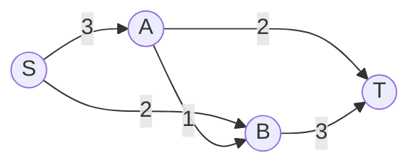

# 最大流的增广过程

> [!info] 承接
> 生成树解决“用最小总成本连通全部节点”。最大流完全换了目标：边上写的是**容量上限**，要问源点到汇点合计最多能通过多少流量。

> [!summary]- 快速复习卡片（20～40 秒）
> - **核心链：** 找可行路径 → 找路径瓶颈 → 增加这部分流量 → 更新剩余容量 → 重复。
> - **瓶颈：** 一条路径能增加多少流，取决于该路径最小剩余容量。
> - **停止：** 源点到汇点已经找不到剩余容量大于 0 的可行路径。
> - **陷阱：** 最大流不是“挑一条容量最大的路径”。

## 具体网络

容量：S→A=3，S→B=2，A→B=1，A→T=2，B→T=3。

## 第一次增广：S → A → T

路径容量分别是 3、2。

瓶颈是：

$$
\min(3,2)=2
$$

所以这条路径最多先送 **2**。累计流量=2。

更新后：S→A 还剩 1，A→T 已用满为 0。

## 第二次增广：S → B → T

剩余容量是 2、3，瓶颈为 2。

再送 **2**，累计流量：

$$
2+2=4
$$

更新后：S→B 已无剩余容量，B→T 还剩 1。

## 第三次增广：S → A → B → T

剩余容量分别是 1、1、1，瓶颈为 1。

再送 **1**，累计流量：

$$
4+1=5
$$

此时 S 发出的两条边 S→A 与 S→B 的总容量本来就是 `3+2=5`，已经全部用满，因此不可能再超过 5。

所以最大流是 **5**。

## 为什么每次取最小剩余容量

一条串联路径上，只要某一条边只能再过 1，那么整条路径这次最多也只能增加 1。这个最小值就是“瓶颈”。

完整最大流算法还涉及残量网络与反向边，用来撤销/改道已有流量；本轮首次建设只要求建立考试最小动作。题目若给出需要改道的复杂网络，应按残量网络规则继续，而不能只做一次贪心选路。

## 考试动作

1. 找一条 S 到 T、每条边都有剩余容量的路径。
2. 取该路径最小剩余容量作为本次增广量。
3. 累加总流量，并扣减路径上的剩余容量。
4. 继续找下一条可增广路径。
5. 没有增广路径时停止，并检查源点总出容量等上界是否能帮助验算。

## 自测（自编练习，非真题）

1. 沿用正文网络：前两次沿 $S\to A\to T$ 和 $S\to B\to T$ 分别送出 $2$ 单位流后，剩余 $S\to A=1$、$A\to B=1$、$B\to T=1$。下一次可增加多少？怎样用源点出边容量验算最终总流？

> [!answer]- 第 1 题答案与解析
> **答案**：再增加 $1$，累计最大流为 $5$。
> **解析**：路径 $S\to A\to B\to T$ 的最小剩余容量是 $1$，所以总流从 $4$ 增至 $5$；源点两条出边总容量为 $3+2=5$，已达到上界。本题是无需反向边改道的简单网络，不能把这一步当成复杂残量网络的通用模板。

## 导航

- [章内] 上一站：[[06_最小生成树的选边过程]]
- [章内] 下一站：[[08_排列组合与计数模型选择]]
- [索引] 返回：[[应用数学-章节索引]]
