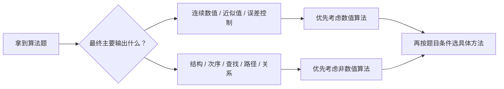

# 数值算法与非数值算法选择

> [!info] 承接
> 前面已经见过图算法和组合计算。大纲这里真正要求的是“算法的选择与应用”，所以考试第一动作应是先认清问题输出，而不是看到熟悉算法名就套。

> [!summary]- 快速复习卡片（20～40 秒）
> - **数值算法：** 主要目标是得到数值结果，常涉及方程、近似、误差、迭代等。
> - **非数值算法：** 主要处理结构、顺序、关系、查找、路径等离散对象。
> - **第一动作：** 先问最终答案是“一个数值近似”还是“一个结构/次序/路径/关系”。
> - **陷阱：** 分类是为了选方法，不代表两类永远完全没有数值运算。

## 三个场景先判断

有人看见最短路径题里也有数字，就把它叫作数值算法；又把求方程近似根当成“搜索路径”。判断前先看处理对象是连续量的近似值，还是记录、图等离散结构。

| 场景 | 更接近哪类 | 为什么 |
|---|---|---|
| 求方程某个根的近似值 | 数值算法 | 目标是连续数值近似 |
| 对记录排序 | 非数值算法 | 目标是元素次序 |
| 在图上找 A 到 D 的最短路径 | 非数值算法 | 核心对象是图结构和路径，虽然会比较边权数字 |

## 为什么“看有没有数字”会判断错

最短路径里有大量加法和比较，但问题本质仍是“在离散图结构中选择路径”。反过来，数值算法也可能包含条件判断和循环。

因此分类时看的是**问题模型和输出目标**，不是代码里有没有加减乘除。

## 本轮边界

辅导资料中会出现动态规划等具体算法，但大纲此处只明确“数值算法、非数值算法的选择与应用”。首次建设不把所有算法教材搬进来，也不凭记忆新增算法 Atom；已有图论算法作为“选择方法后怎么做”的具体例子。

## 考试动作

1. 写出输入对象是什么。
2. 写出题目最终要求输出什么。
3. 判断偏数值近似还是离散结构处理。
4. 再依据约束条件选择具体算法；不要反过来先猜算法名。

## 自测（自编练习，非真题）

1. 两道题分别要求：① 求某方程根的近似值并控制误差；② 在带权站点图中输出 $A$ 到 $D$ 的一条最短路线。各优先归为哪类算法？图题也要算边权，为什么仍不按“有数字”分类？

> [!answer]- 第 1 题答案与解析
> **答案**：① 偏数值算法；② 偏非数值算法。
> **解析**：第一题的主要产物是连续数值近似；第二题的主要产物是离散图结构中的路径。图题虽比较数字，但分类依据是问题模型和最终输出，而非是否出现加减法。

## 导航

- [章内] 上一站：[[08_排列组合与计数模型选择]]
- [章内] 下一站：[[10_网络计划与关键路径]]
- [索引] 返回：[[应用数学-章节索引]]
