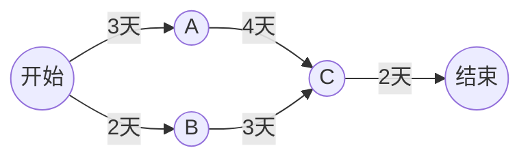

# 网络计划与关键路径

> [!info] 承接
> 图论让你在网络上找路径或结构。网络计划把“边/活动”换成真实任务和工期，要找的是**哪些任务链真正决定整个项目最早何时完成**。

> [!summary]- 快速复习卡片（20～40 秒）
> - **正推最早时间：** 一个节点有多个前驱时，取“前驱最早时间 + 活动工期”的最大值。
> - **关键路径：** 决定总工期、没有可用机动时间的任务链；简单确定型网络中常表现为总工期最长的起点—终点路径。
> - **第一动作：** 先画依赖，再从起点 0 正推。
> - **陷阱：** 关键路径不是最短路径；路径越长反而越可能决定工期。

## 具体网络

任务关系：S→A 用 3 天，S→B 用 2 天，A→C 用 4 天，B→C 用 3 天，C→T 用 2 天。

## 第一步：从开始正推最早时间

开始 S 的最早时间=0。

- A：`0+3=3`
- B：`0+2=2`

C 必须等待 A、B 两条前置链都满足，所以取较晚者：

$$
E_C=\max(3+4,\ 2+3)=\max(7,5)=7
$$

T：

$$
E_T=7+2=9
$$

因此最早总工期为 **9 天**。

## 第二步：比较两条完整路径

- S→A→C→T：3+4+2=9 天
- S→B→C→T：2+3+2=7 天

第一条链决定了 C 最早只能在第 7 天到达，因此 **S→A→C→T 是关键路径**。

B 这条链即使晚 2 天到 C，也不会推迟 C 当前的最早 7 天，这就是非关键活动存在机动余量的直觉。

## 为什么汇合点要取最大值

如果 C 的工作要等 A、B 两路前置都完成，那么 5 天时即使 B 已经完成，A 还没完成，C 仍不能开始。必须等最慢的前置链，所以正推取最大值。

## 考试动作

1. 把依赖关系画成网络，不要只盯工期数字。
2. 起点最早时间写 0，向后正推。
3. 汇合节点取多个前驱计算结果的最大值。
4. 终点最早时间就是项目最早工期。
5. 回看哪条链真正形成这个最大值；需要时再结合最迟时间/时差验证关键活动。

## 自测（自编练习，非真题）

1. 任务工期为 $S\to A=2$ 天、$S\to B=4$ 天、$A\to C=3$ 天、$B\to C=1$ 天、$C\to T=2$ 天。最早总工期是多少？哪条是关键路径？

> [!answer]- 第 1 题答案与解析
> **答案**：最早总工期为 $7$ 天；两条完整路径都是关键路径。
> **解析**：汇合点 $C$ 的最早时间为 $\max(2+3,4+1)=5$ 天，终点为 $5+2=7$ 天。$S\to A\to C\to T$ 和 $S\to B\to C\to T$ 均为 $7$ 天；两路并列决定工期，不能只任选一路称为唯一关键路径。

## 导航

- [章内] 上一站：[[09_数值算法与非数值算法选择]]
- [章内] 下一站：[[11_线性规划的建模与最优判断]]
- [索引] 返回：[[应用数学-章节索引]]
