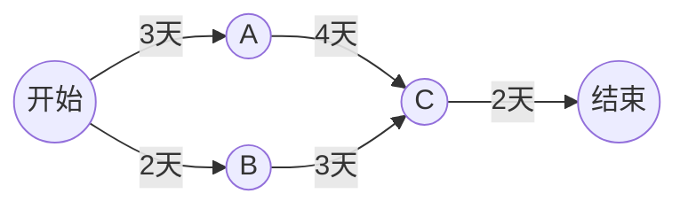

# 网络计划与关键路径

> [!info] 承接
> 图论让你在网络上找路径或结构。网络计划把“边/活动”换成真实任务和工期，要找的是**哪些任务链真正决定整个项目最早何时完成**。

> [!summary]- 快速复习卡片（20～40 秒）
> - **正推最早时间：** 一个节点有多个前驱时，取“前驱最早时间 + 活动工期”的最大值。
> - **关键路径：** 决定总工期、没有可用机动时间的任务链；简单确定型网络中常表现为总工期最长的起点—终点路径。
> - **三点估算：** 工期给乐观/最可能/悲观三个估计时，先折成期望工期 $E=(O+4M+P)/6$，再按期望工期做网络计划。
> - **总时差：** 不影响总工期的最大可拖延天数，等于“最迟开始 − 最早开始”；关键活动的总时差为 0。
> - **第一动作：** 先画依赖，再从起点 0 正推。
> - **陷阱：** 关键路径不是最短路径；路径越长反而越可能决定工期；三点估算的 $E$ 不是“最可能值”。

## 具体网络

任务关系：S→A 用 3 天，S→B 用 2 天，A→C 用 4 天，B→C 用 3 天，C→T 用 2 天。

## 第一步：从开始正推最早时间

开始 S 的最早时间=0。

- A：`0+3=3`
- B：`0+2=2`

C 必须等待 A、B 两条前置链都满足，所以取较晚者：

$$
E_C=\max(3+4,\ 2+3)=\max(7,5)=7
$$

T：

$$
E_T=7+2=9
$$

因此最早总工期为 **9 天**。

## 第二步：比较两条完整路径

- S→A→C→T：3+4+2=9 天
- S→B→C→T：2+3+2=7 天

第一条链决定了 C 最早只能在第 7 天到达，因此 **S→A→C→T 是关键路径**。

B 这条链即使晚 2 天到 C，也不会推迟 C 当前的最早 7 天，这就是非关键活动存在机动余量的直觉。

## 为什么汇合点要取最大值

如果 C 的工作要等 A、B 两路前置都完成，那么 5 天时即使 B 已经完成，A 还没完成，C 仍不能开始。必须等最慢的前置链，所以正推取最大值。

## 三点估算：工期给三个估计时先折成一个

题干如果对同一个作业给出**乐观、最可能、悲观**三个工期，不要直接拿“最可能”当工期用，先用三点估算折成期望工期：

$$
E=\frac{O+4M+P}{6}
$$

| 符号 | 含义 | 单位与取值 |
| --- | --- | --- |
| $O$ | 乐观估计（一切顺利时最短工期） | 与 $M$、$P$ 同单位（通常为天） |
| $M$ | 最可能估计（正常情况下最可能出现） | 同上 |
| $P$ | 悲观估计（最不利情况下的最长工期） | 同上，且 $O\le M\le P$ |
| $E$ | 期望工期 | 同上；**不是** $M$，也不一定是三个数的简单平均 |

适用条件：只在这类“三点估计”题里用；题干直接给单一工期时不要套这个公式。算出 $E$ 后，**用 $E$ 代替该作业工期**，再回到前面的正推／逆推流程。

> [!warning] 一处来源异文
> 仓库存档的 2021 年下半年资料版第 70 题在“悲观估计”处 OCR 为 **7 天**，与同目录解析给出的期望 **13 天**不一致：$(5+4\times14+P)/6=13$ 反推出 $P=17$。作答以解析口径为准（悲观 17 天），并保留这条 OCR 异文记录，不把它当作已核原卷数值。

## 总时差：非关键活动到底能拖几天

正推得到“最早时间”，从终点反向再做一次**逆推**就得到“最迟时间”：终点最迟时间先等于它的最早时间，往前每一步减去对应活动工期，遇到分叉时取**最小值**（再晚就会拖到总工期）。

$$
\text{总时差}=\text{最迟开始}-\text{最早开始}=\text{最迟完成}-\text{最早完成}
$$

判据：

- 总时差 $=0$ 的活动在关键路径上，不能拖；
- 总时差 $>0$ 的活动可以在总时差范围内推迟，不影响总工期；
- 题目问“最多能拖延几天／可拖延几天”，问的就是**总时差**；问“最晚什么时候必须完成”，要回到**最迟完成时间**。

## 两道真题怎么用这两样

**2019 年下半年第 70 题（总时差）**：关键路径 ABE，总工期 $5+7+2=14$ 天；作业 D 与 B、E 可并行，只要在 $7+2=9$ 天内完成就不影响总工期，所以 D 最多可延迟 **2 天**。该题选项在抽取文本里 OCR 有缺损，这里只复述解析结论，不复述选项字母。

**2021 年下半年第 70 题（三点估算 + 总时差）**：作业 C 的乐观 5 天、最可能 14 天、悲观 17 天，

$$
E_C=\frac{5+4\times14+17}{6}=\frac{78}{6}=13\ \text{天}
$$

把 13 天代入网络后，C 的**总时差为 2 天**，所以“比期望时间最多可拖延 2 天”（答案 D）。这道题两步都不能省：先用三点估算把工期折成一个数，再用总时差判断能拖多久。

## 考试动作

1. 把依赖关系画成网络，不要只盯工期数字。
2. 起点最早时间写 0，向后正推。
3. 汇合节点取多个前驱计算结果的最大值。
4. 终点最早时间就是项目最早工期。
5. 回看哪条链真正形成这个最大值；需要时从终点逆推最迟时间，用总时差验证哪些活动不能拖。
6. 工期给乐观／最可能／悲观三个数时，先用 $E=(O+4M+P)/6$ 折成期望工期，再走第 1～5 步。
7. 问“最多能拖延几天”就是问总时差；问“是否必须在期望时间内完成”要先算 $E$、再算时差。

## 自测（自编练习，非真题）

1. 任务工期为 $S\to A=2$ 天、$S\to B=4$ 天、$A\to C=3$ 天、$B\to C=1$ 天、$C\to T=2$ 天。最早总工期是多少？哪条是关键路径？

> [!answer]- 第 1 题答案与解析
> **答案**：最早总工期为 $7$ 天；两条完整路径都是关键路径。
> **解析**：汇合点 $C$ 的最早时间为 $\max(2+3,4+1)=5$ 天，终点为 $5+2=7$ 天。$S\to A\to C\to T$ 和 $S\to B\to C\to T$ 均为 $7$ 天；两路并列决定工期，不能只任选一路称为唯一关键路径。

2. 某作业乐观 4 天、最可能 6 天、悲观 14 天，它的期望工期是多少？能否直接答“6 天”？

> [!answer]- 第 2 题答案与解析
> **答案**：期望工期为 $7$ 天；不能答“6 天”。
> **解析**：$E=(4+4\times6+14)/6=42/6=7$ 天。三点估算里最可能值 $M$ 只占权重 4，还被乐观和悲观拉平，所以 $E$ 一般不等于 $M$；只有三个估计相等时才有 $E=M$。

3. 某网络总工期 14 天，作业 D 的最早开始是第 7 天、最早完成是第 9 天、最迟完成是第 11 天。D 的总时差是多少？它最多能拖几天而不影响总工期？

> [!answer]- 第 3 题答案与解析
> **答案**：总时差为 $2$ 天，最多可拖 $2$ 天。
> **解析**：用“最迟完成 − 最早完成”算更直接：$11-9=2$ 天（用“最迟开始 − 最早开始”也一样：最迟开始 $=11-(9-7)=9$，$9-7=2$）。总时差大于 0 说明 D 不在关键路径上，可以推迟到总时差用完为止。

## 导航

- [章内] 上一站：[[09_数值算法与非数值算法选择]]
- [章内] 下一站：[[11_线性规划的建模与最优判断]]
- [索引] 返回：[[应用数学-章节索引]]
