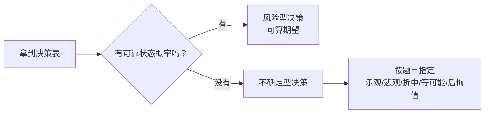

# 不确定型决策准则

> [!info] 承接
> 预测试图估计未来值；不确定型决策更极端：知道可能出现哪些自然状态和各方案结果，但**没有可靠概率**。此时不同决策态度会产生不同选择。

> [!summary]- 快速复习卡片（20～40 秒）
> - **乐观：** 每个方案先看最好，再“大中取大”。
> - **悲观：** 每个方案先看最差，再“小中取大”（收益表）。
> - **等可能：** 各状态同等权重，比较平均收益。
> - **后悔值：** 每个状态先找本可得到的最好结果，再算“错过多少”，最后让最大后悔最小。
> - **陷阱：** 收益表和损失表的“大/小”方向会变化，先认表的含义。

## 一张收益表贯穿全部方法

企业要在 A、B、C 三个方案中选一个，但未来市场会落在哪种状态尚不清楚，也没有可信的状态概率。此时不能直接算期望收益；不同决策准则会在同一张收益表上给出不同选择。

| 方案 | 状态 S1 收益 | 状态 S2 收益 |
|---|---:|---:|
| A | 80 | 20 |
| B | 50 | 45 |
| C | 30 | 60 |

这里数字越大越好，是**收益表**。

## 1. 乐观准则：我看每个方案最好能多好

每行最大收益：

- A：80
- B：50
- C：60

再从这些最大值里取最大：**A=80**，所以选 A。

口诀是“大中取大”，但必须知道它表示非常乐观的决策态度。

## 2. 悲观准则：我先看最坏会坏到哪里

每行最小收益：

- A：20
- B：45
- C：30

再从最坏结果中选相对最好者：**B=45**，所以选 B。

对收益表是“小中取大”。

## 3. 折中准则：最好和最坏都看

若题目给乐观系数 `α=0.6`，可按：

$$
折中值=\alpha\times最好收益+(1-\alpha)\times最坏收益
$$

- A：0.6×80+0.4×20=56
- B：0.6×50+0.4×45=48
- C：0.6×60+0.4×30=48

选 A。

`α` 越大，越偏重最好结果。题目若使用不同定义口径，以题目说明为准。

## 4. 等可能准则：没有概率，就先视为同等可能

- A：(80+20)/2=50
- B：(50+45)/2=47.5
- C：(30+60)/2=45

平均收益最高，选 A。

## 5. 最小最大后悔值：如果状态真的发生，我会后悔多少

先按每个状态找“本来能拿到的最好收益”：

- S1 最好=80
- S2 最好=60

后悔值=该状态最好收益−本方案收益：

| 方案 | S1 后悔 | S2 后悔 | 最大后悔 |
|---|---:|---:|---:|
| A | 0 | 40 | 40 |
| B | 30 | 15 | 30 |
| C | 50 | 0 | 50 |

让“最大后悔”最小，选 **B**。

## 考试动作

1. 先判断表中数字是收益还是损失。
2. 再看是否给状态概率；没给可靠概率才进入本篇不确定型准则。
3. 题目指定哪种准则，就按该准则逐行计算，不混用决策态度。
4. 后悔值一定先按“每个状态”找最好结果，再反向计算差额。

## 自测（自编练习，非真题）

1. 某收益表（数字越大越好）给出 A 在状态 $S_1,S_2$ 下收益为 $8,2$，B 为 $6,5$，C 为 $4,7$，且没有可靠状态概率。按**最小最大后悔值**准则选哪个方案？

> [!answer]- 第 1 题答案与解析
> **答案**：选 B，最大后悔值为 $2$。
> **解析**：先按列找本可取得的最佳收益：$S_1$ 为 $8$、$S_2$ 为 $7$。A 的后悔值为 $(0,5)$，B 为 $(2,2)$，C 为 $(4,0)$；各行最大值是 $5,2,4$，再取其中最小的 $2$。不能直接按原收益表求每行最大。

## 导航

- [章内] 上一站：[[12_预测方法的基础应用]]
- [章内] 下一站：[[14_库存管理的基本权衡]]
- [索引] 返回：[[应用数学-章节索引]]
