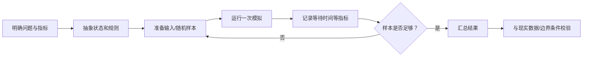

# 模拟方法的基本流程

> [!info] 承接
> 库存管理仍可能直接比较几个方案。现实系统更复杂时，排队、故障、随机到达、资源竞争会叠加，解析公式可能很难直接给出结果，这时可以用模拟观察系统在一组假设下如何运行。

> [!summary]- 快速复习卡片（20～40 秒）
> - **什么时候用：** 系统规则能描述、可以重复运行，但直接求解析解困难。
> - **核心链：** 建模型 → 给输入 → 重复运行 → 汇总指标 → 与现实/边界校验。
> - **第一动作：** 先确定要观察什么指标，不要先随机生成一堆数据。
> - **陷阱：** 模拟给的是模型条件下的近似观察，不自动等于现实真值，也不自动保证最优。

## 具体场景

要评估一个服务台在随机请求到达时的平均等待时间。真实系统试错成本高，而到达、服务、排队规则可以被描述。

这时可建立简化模拟：

- 输入：请求到达间隔、服务时间、服务台数量；
- 状态：当前队列长度、服务台是否空闲；
- 输出：平均等待时间、最大队列长度等。

## 一个最小数字例子

假设做 10 次独立场景运行，其中 2 次出现“等待超过阈值”。在这 10 次样本下，超阈值比例估计为：

$$
\frac{2}{10}=20\%
$$

这只是**当前 10 次模拟的估计**。样本少时波动可能很大，不能把 20% 当成永远精确的真实概率。

## 模拟与直接计算怎么区分

- 能用明确公式直接得到精确结果时，通常先直接计算。
- 规则复杂、随机因素多、状态随时间变化时，模拟更有价值。
- 模拟可比较方案，但“某次模拟最好”不等于理论全局最优；还要看重复运行和评价指标。

## 考试动作

1. 明确要回答的问题和输出指标。
2. 把现实系统压缩成必要状态、规则和输入。
3. 运行多次并记录结果。
4. 汇总平均值、比例或其他题目要求指标。
5. 检查模型假设是否让结果失真。

## 导航

- [章内] 上一站：[[14_库存管理的基本权衡]]
- [章内] 下一站：[[16_从现实问题到数学模型]]
- [索引] 返回：[[应用数学-章节索引]]