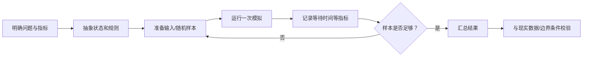

# 模拟方法的基本流程

> [!info] 承接
> 库存管理仍可能直接比较几个方案。现实系统更复杂时，排队、故障、随机到达、资源竞争会叠加，解析公式可能很难直接给出结果，这时可以用模拟观察系统在一组假设下如何运行。

> [!summary]- 快速复习卡片（20～40 秒）
> - **什么时候用：** 系统规则能描述、可以重复运行，但直接求解析解困难。
> - **核心链：** 建模型 → 给输入 → 重复运行 → 汇总指标 → 与现实/边界校验。
> - **第一动作：** 先确定要观察什么指标，不要先随机生成一堆数据。
> - **陷阱：** 模拟给的是模型条件下的近似观察，不自动等于现实真值，也不自动保证最优。

## 具体场景

要评估一个服务台在随机请求到达时的平均等待时间。真实系统试错成本高，而到达、服务、排队规则可以被描述。

这时可建立简化模拟：

- 输入：请求到达间隔、服务时间、服务台数量；
- 状态：当前队列长度、服务台是否空闲；
- 输出：平均等待时间、最大队列长度等。

## 亲手运行一次队列状态

先用**自编的确定性输入**练状态更新，暂不掺入随机抽样：只有 1 个服务台，按到达先后服务，每个请求服务 2 分钟；3 个请求分别在第 0、1、3 分钟到达。开始时服务台空闲、队列为空。到达时若服务台忙，就入队；轮到自己时才开始服务。

| 请求 | 到达时刻（分） | 开始服务（分） | 完成（分） | 等待（分） | 状态变化 |
| --- | ---: | ---: | ---: | ---: | --- |
| 1 | 0 | 0 | 2 | 0 | 空闲 → 服务请求 1 |
| 2 | 1 | 2 | 4 | 1 | 第 1 分钟入队；第 2 分钟请求 1 完成后出队 |
| 3 | 3 | 4 | 6 | 1 | 第 3 分钟入队；第 4 分钟请求 2 完成后出队 |

每行都按“开始服务时刻 = 到达时刻与上一请求完成时刻的较晚者”更新。例如请求 3 到达于第 3 分钟，但请求 2 要到第 4 分钟才完成，所以请求 3 从第 4 分钟开始，等了 $4-3=1$ 分钟。本次运行的平均等待时间为：

$$
\frac{0+1+1}{3}=\frac{2}{3}\text{ 分钟}
$$

验算：每个“完成 − 开始服务”都是 2 分钟，等待时间均不为负。真实模拟再按设定的到达/服务分布生成输入，重复这轮状态更新，才统计多次运行的结果；这 3 个固定输入不代表随机系统的真实均值。

## 多次运行后怎样汇总另一指标

除平均等待时间外，也可以观察“等待是否超过某个阈值”。假设做 10 次独立场景运行，其中 2 次出现超阈值；在这 10 次样本下，超阈值比例估计为：

$$
\frac{2}{10}=20\%
$$

这只是**当前 10 次模拟的估计**。样本少时波动可能很大，不能把 20% 当成永远精确的真实概率。

## 模拟与直接计算怎么区分

- 能用明确公式直接得到精确结果时，通常先直接计算。
- 规则复杂、随机因素多、状态随时间变化时，模拟更有价值。
- 模拟可比较方案，但“某次模拟最好”不等于理论全局最优；还要看重复运行和评价指标。

## 考试动作

1. 明确要回答的问题和输出指标。
2. 把现实系统压缩成必要状态、规则和输入。
3. 运行多次并记录结果。
4. 汇总平均值、比例或其他题目要求指标。
5. 检查模型假设是否让结果失真。

## 自测（自编练习，非真题）

1. 一台服务台按到达顺序服务，每个请求耗时 $2$ 分钟。三次到达时刻为第 $0,1,4$ 分钟，初始空闲。逐次模拟后，三人的等待时间和平均等待时间分别是多少？

> [!answer]- 第 1 题答案与解析
> **答案**：等待时间依次为 $0,1,0$ 分钟，平均为 $1/3$ 分钟。
> **解析**：请求 1 在 $0$ 分钟开始、$2$ 分钟完成；请求 2 于 $1$ 分钟到达，等到 $2$ 分钟服务，$4$ 分钟完成；请求 3 于 $4$ 分钟到达即可开始。按状态逐步更新后求 $(0+1+0)/3=1/3$ 分钟；这只是给定输入的一轮结果，不是随机系统的真实长期均值。

## 导航

- [章内] 上一站：[[14_库存管理的基本权衡]]
- [章内] 下一站：[[16_从现实问题到数学模型]]
- [索引] 返回：[[应用数学-章节索引]]
