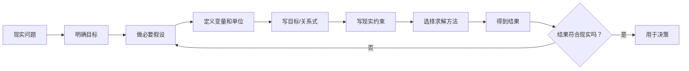

# 从现实问题到数学模型

> [!info] 承接
> 前面的概率、图论、运筹方法都是“已经选好模型后怎么做”。数学建模站得更高一层：面对现实描述时，先把复杂问题翻译成可计算的变量、目标和约束，再选择求解方法。

> [!summary]- 快速复习卡片（20～40 秒）
> - **建模不是求解算法。** 建模先回答“现实里的什么量对应数学里的什么”。
> - **主线：** 明确问题 → 假设 → 变量 → 目标/关系 → 约束 → 求解 → 验证 → 必要时修正。
> - **第一动作：** 写清“我们到底要决定什么”。
> - **陷阱：** 数学上算得漂亮，但遗漏现实约束，模型仍可能不可用。

## 一个资源配置场景

某平台有两类计算资源，要决定分别开多少实例，使成本尽量低，同时满足 CPU、内存和最低吞吐量要求。

现实语言里有：

- 两类实例的单价；
- 每类实例提供的 CPU、内存、吞吐量；
- 最低业务需求；
- 实例数量必须非负，甚至可能要求整数。

建模时可以：

- 用 `x、y` 表示两类实例数量；
- 用成本表达式作为目标；
- 把 CPU、内存、吞吐量需求分别翻译成约束；
- 再根据模型性质选择线性规划、整数规划或其他合适方法。

本篇重点是**翻译过程**，不是继续扩展新的求解算法。

**把同一场景真正翻译一次（以下数字仅为自编教学输入）：**A 类实例每台每小时 4 元，提供 2 vCPU、4 GiB 内存和 100 次/秒吞吐量；B 类每台每小时 7 元，提供 4 vCPU、8 GiB 和 180 次/秒。需求是总容量至少 6 vCPU、12 GiB、280 次/秒，并且实例只能整台开通。

设 $x$ 为 A 类实例台数、$y$ 为 B 类实例台数。要决定的是台数，不是 CPU 数或费用；目标是让每小时成本 $C$ 最小：

$$
\min C=4x+7y\quad(\text{元/小时})
$$

把三句“至少”分别写成容量下界，系数的单位依次是每台实例提供的 vCPU、GiB、次/秒：

$$
2x+4y\ge6\quad(\text{vCPU}),\qquad
4x+8y\ge12\quad(\text{GiB}),\qquad
100x+180y\ge280\quad(\text{次/秒})
$$

还须写 $x,y\in\mathbb{Z}_{\ge0}$，表示两种实例都只能开非负整数台；否则数学上可能算出无法开通的“半台实例”。例如试代 $x=1$、$y=1$：CPU 为 $2+4=6\text{ vCPU}$、内存为 $4+8=12\text{ GiB}$、吞吐量为 $100+180=280\text{ 次/秒}$，成本为 $4+7=11\text{ 元/小时}$。它满足全部已列约束，所以是**可行方案**；只代入一个方案还不能证明它成本最低。求最优留给相应规划方法，本篇先练“现实要求 → 数学式 → 回代核验”。

## 为什么“验证”不能省

假设模型算出 `x=2.4` 台服务器，如果现实只能购买整台设备，这个解就不能直接落地。问题不一定是算法算错，而可能是模型漏掉“整数约束”。

再如模型只最小化成本，却遗漏 SLA 要求，也可能得到便宜但不可用的方案。

## 模型、算法、答案三者别混

- **模型：** 把现实问题抽象成数学对象和关系。
- **算法：** 在这个模型上寻找解的方法。
- **答案：** 算法得到并经过现实验证后，可用于决策的结果。

前面的线性规划是一类模型/方法组合；最短路径则是图模型上的具体优化问题。数学建模负责在更前面把“现实”翻译成这些可求解问题。

## 考试动作

1. 写出决策目标：最大什么或最小什么，还是只求某个指标。
2. 定义变量、单位和必要假设。
3. 一条现实限制对应一条约束，检查是否漏条件。
4. 根据模型结构选择方法，而不是先挑算法再硬套现实。
5. 求解后回到现实检查单位、取值范围、整数性和业务可行性。

## 自测（自编练习，非真题）

1. 沿用正文自编平台场景：A 类每台提供 $2$ vCPU、$4$ GiB、$100$ 次/秒，B 类每台提供 $4$ vCPU、$8$ GiB、$180$ 次/秒，需求至少为 $6$ vCPU、$12$ GiB、$280$ 次/秒。若只开 $2$ 台 A、不开 B，这个方案是否可行？首先应写清哪些决策变量条件？

> [!answer]- 第 1 题答案与解析
> **答案**：不可行；先设 $x,y$ 为两类实例台数，并限定 $x,y$ 为非负整数。
> **解析**：代入 $x=2,y=0$，总容量仅 $4$ vCPU、$8$ GiB、$200$ 次/秒，三项均低于下界。一个方案成本低也不能越过现实约束；这里是在检验模型可行性，不是在求最优解。

## 导航

- [章内] 上一站：[[15_模拟方法的基本流程]]
- [章后] 下一站：回到 [[应用数学-学习路线]] 的复习与错题循环；专业英语已退出后续施工计划，不作为本章必经下一站。
- [索引] 返回：[[应用数学-章节索引]]
