# 综合知识 01～13 总学习路线

> [!important] 主线
> 先建立“计算机系统与信息系统为什么这样工作”，再进入“如何工程化构建软件与架构”，最后补齐“如何评估、保证、演化，以及考试中的法规、数学和英语工具”。

```mermaid
flowchart LR
  A[01 计算机系统基础] --> B[02 信息系统基础]
  B --> C[03 信息安全技术]
  C --> D[04 软件工程基础]
  D --> E[05 数据库设计基础]
  E --> F[06 软件架构设计]
  F --> G[07 质量属性与架构评估]
  G --> H[08 软件可靠性技术]
  H --> I[09 架构演化和维护]
  I --> J[10 未来信息综合技术]
  J --> K[11 标准化与知识产权]
  K --> L[12 应用数学]
  L --> M[13 专业英语]
```

## 第一段：系统底座——01～03

### 01 计算机系统基础知识

先回答：CPU、存储、操作系统、网络、语言等底层机制为什么这样工作。它是后续所有信息系统和软件架构知识的物理/运行基础。

当前工程口径：用户已经完成本章学习，并明确跳过顶层稳定 Atom coverage audit。状态是 `study_complete / user_accepted / coverage_audit_skipped`，这不影响正常复习和维护，也不把它伪写成 `coverage_complete`。

**下一站：02 信息系统基础知识**——底层能力如何组合成面向组织业务的信息系统。

### 02 信息系统基础知识

重点建立 TPS、MIS、DSS、ES、OAS、ERP 等系统的定位、结构、关系和适用场景。

**下一站：03 信息安全技术**——信息系统建起来后，如何保证机密性、完整性、可用性和可信访问。

### 03 信息安全技术

从安全目标进入密码、密钥、访问控制、数字签名、抗攻击与安全保障评估。

**下一站：04 软件工程基础知识**——有了运行环境和安全约束，软件如何被系统化地需求、设计、开发、测试与管理。

## 第二段：工程与架构——04～07

### 04 软件工程基础知识

掌握过程模型、需求、分析设计、测试、CBSE、项目管理等工程生命周期。

**下一站：05 数据库设计基础知识**——业务数据如何建立稳定的数据模型、关系结构和访问接口。

### 05 数据库设计基础知识

从数据库概念、关系模型、规范化与设计，进入标准访问接口和 NoSQL。当前 34/34 coverage satisfied，后续只做正常维护和统一质量提升。

**下一站：06 软件架构设计**——当系统规模扩大，如何从模块级设计提升到架构级决策。

### 06 软件架构设计

掌握架构概念、ABSD、架构风格、复用与 DSSA，形成“约束—结构—决策—复用”的架构思维。

**下一站：07 系统质量属性与架构评估**——架构方案不能只画出来，还要判断它能否满足质量目标。

### 07 系统质量属性与架构评估

围绕质量属性、架构评估和 ATAM，把“设计方案”转成“可验证的架构决策”。当前稳定契约为 `QA-A001 ~ QA-A029`，29/29 covered；质量细化统一留给后续 QUALITY-HARDENING。

**下一站：08 软件可靠性技术**——质量属性中的可靠性如何进一步工程化、量化与验证。

## 第三段：可靠性、演化与新技术——08～10

### 08 软件可靠性技术

学习可靠性概念、建模、管理、设计、测试与评估，回答“软件怎样持续正确地提供服务”。

**下一站：09 软件架构的演化和维护**——系统上线后如何在变化中保持架构可持续。

### 09 软件架构的演化和维护

掌握演化过程、分类、原则、评估方法与架构维护，理解“变化不是一次修改，而是受约束的持续演进”。

**下一站：10 未来信息综合技术**——成熟架构如何承接 CPS、AI、机器人、边缘计算、数字孪生、云计算和大数据等新技术。

### 10 未来信息综合技术

重点不是背名词，而是区分各技术解决的问题、位置、数据流和典型组合关系。

**下一站：11 标准化与知识产权**——技术落地还要受标准、法律与知识产权边界约束。

## 第四段：考试工具与约束——11～13

### 11 标准化与知识产权

掌握标准分类与作用，以及著作权、专利、商标、商业秘密等常见边界和考试判断动作。

**下一站：12 应用数学**——用概率、运筹、图论等工具解决架构师考试中的定量分析问题。

### 12 应用数学

按“识别题型 → 建模 → 选择最小必要方法 → 计算/判断”处理数学题，不追求脱离考试的复杂推导。

**下一站：13 专业英语**——将前 12 章概念映射到英文术语和阅读结构，完成英文题快速定位。

### 13 专业英语

核心是术语识别、长句拆解、逻辑连接词、上下文推断和架构/软件工程常见英文表达，不是泛化英语学习。

**下一站：回到薄弱章与真题反扫**——以错题和覆盖矩阵反向检查 01～13。

## 当前建设路线与学习路线不要混淆

学习顺序仍按 01→13 走；仓库当前施工顺序已经改为：

> **`G4-COVERAGE-FINAL-RERUN` → `QUALITY-HARDENING` → G5/G6/G7。**

`G2-IS-REVIEW-CLOSE` 属于非阻塞 REVIEW/QUALITY 债，可在覆盖最终重跑后收口；`G3-CS-CONTRACT` 已由用户明确取消。

## 导航

- [[综合知识01-13总索引]]
- [[全库覆盖审计矩阵]]
- [[全库补全总控计划]]