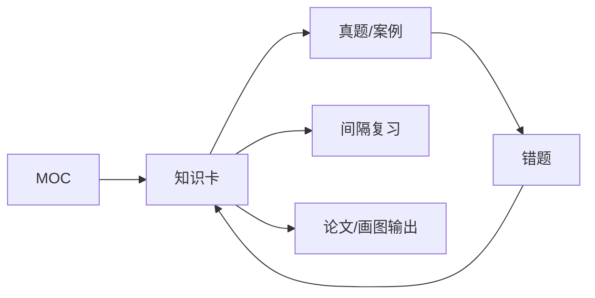

# 综合知识索引

> 本页是 `01_综合知识` 的目录级入口。顶层导航使用 [[知识库首页]]，综合知识的学习导航使用 [[软考架构设计师索引]]。

## 模块入口

| 模块 | 主入口 | 学习重点 |
| --- | --- | --- |
| 计算机系统基础 | [[计算机系统基础知识地图]] | 数据、CPU、存储、I/O、OS、网络、性能 |
| 系统工程与信息系统基础 | [[系统工程与信息系统基础索引]] | 系统工程、生命周期、开发方法、企业信息化 |
| 信息安全技术 | [[信息安全技术索引]] | 密码、认证、访问控制、网络与应用安全 |

## 推荐学习方式

1. 初学计算机系统：[[计算机系统基础知识地图]] → [[学习路线]] → 原子知识卡。
2. 每个领域先读 MOC，再进入知识卡，不直接从文件夹随机阅读。
3. 做题后从 [[真题错题索引]] 反链回知识卡，补“为什么错”。
4. 能用于案例、论文、画图的知识，继续沉淀到对应模块。
5. 每日通过 [[软考每日复习]] 回收未掌握知识。

## 知识卡维护要求

- 一张卡解决一个核心问题。
- 保留并补齐 `type`、`subject`、`chapter`、`topic`、`status`、`difficulty`、`source`、`tags`。
- 新卡优先建立“上级 MOC → 当前卡 → 下一站”关系。
- 大知识树放 Markdown MOC；Canvas 只保留领域、模块和关键链路，避免文字拥挤。
- 详细规则见 [[知识库设计规范]]。

## 学习闭环

## 下一站

→ [[软考架构设计师索引]]
