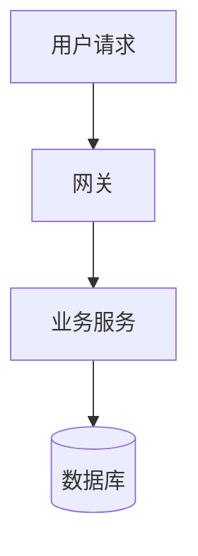

# 软考画图规范

> 软考架构设计师涉及大量图：软件架构风格图、DFD、UML、部署图、网络拓扑和资源关系图。工具按图的结构选择，不追求所有图都用同一种语法。

## 图类型选择

| 场景 | 推荐工具 | 保存位置 |
| --- | --- | --- |
| 简单流程图、时序图、类图 | Mermaid | `05_画图素材/Mermaid/` |
| 多节点关系、环形依赖、资源分配、网络拓扑 | Graphviz DOT | 代码块直接写入笔记；导出文件放到 `05_画图素材/Graphviz/` |
| 复杂架构图、论文图、DFD、UML | Excalidraw | `05_画图素材/Excalidraw/` |
| 知识地图、章节总览、论文素材地图 | Canvas | `05_画图素材/Canvas/` |

## 工具选择顺序

一张图只回答一个问题：简单流程、时序、类图和 ER 图用 Mermaid；环形依赖、资源分配、多节点关系和网络拓扑用 Graphviz DOT；自由排版的论文展示图用 Excalidraw；知识地图和章节总览用 Canvas。所有图以方便阅读优先：小图紧凑呈现，不要为了填满页面而放大；Graphviz 小图必须设置明确的 `size="宽,高!"` 画布上限，并检查输出 SVG 的实际尺寸；图例以最少信息解释符号，不能反过来撑大图。Graphviz 插件默认调用 `dot`；`circo` 需要用终端导出 SVG。

## Mermaid 写法规范

````markdown

````

注意事项：

- Mermaid 代码块中不要使用中文标点导致语法错误。
- 节点文本尽量简短。
- 需要换行时使用 `<br/>`。
- 避免在节点 ID 中使用小数点。
- 复杂图不要硬塞进 Mermaid，改画 Excalidraw。

## Excalidraw 命名规范

推荐格式：

```text
日期-主题.excalidraw
```

示例：

```text
20260826-微服务架构图.excalidraw
20260826-数据库分层架构.excalidraw
20260826-论文项目总体架构.excalidraw
```

## 嵌入方式

```markdown
![[20260826-微服务架构图]]
```

如果导出图片：

```markdown
![[20260826-微服务架构图.png]]
```

## 常见软考图

| 图 | 适用场景 |
| --- | --- |
| 软件架构风格图 | 分层、C/S、B/S、微服务、事件驱动 |
| DFD 数据流图 | 案例分析、需求建模 |
| ER 图 | 数据库设计 |
| 状态图 | 对象状态变化 |
| 活动图 | 业务流程 |
| 时序图 | 对象交互 |
| 部署图 | 系统部署、网络拓扑 |
| 质量属性场景图 | 可靠性、可用性、性能、安全性分析 |

## 画图复习要求

每画一张图，都要回答：

1. 这张图对应哪个知识点？
2. 题干出现什么关键词会用到它？
3. 这张图能支撑哪个论文论点？
4. 我能否不看原图复述出来？
