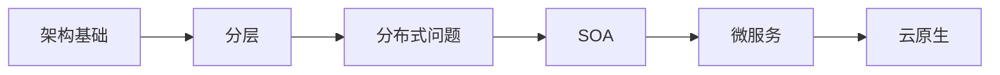
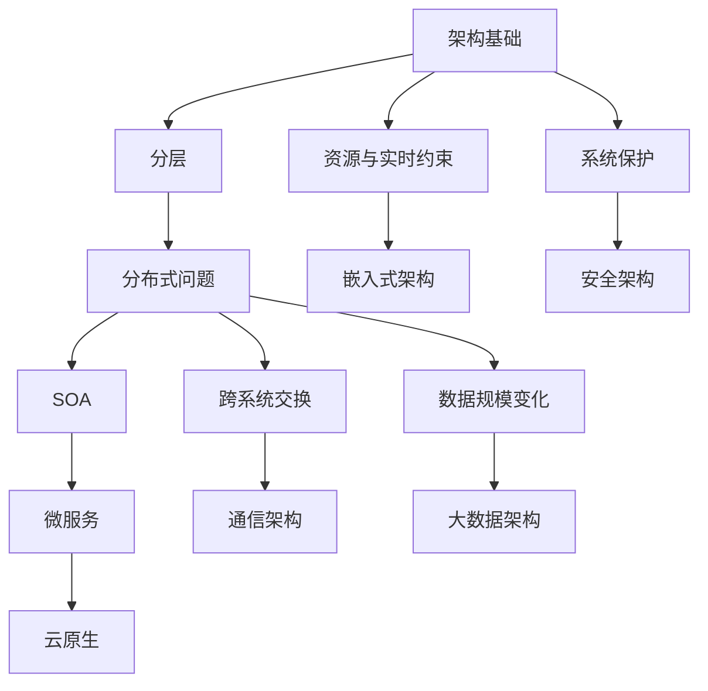
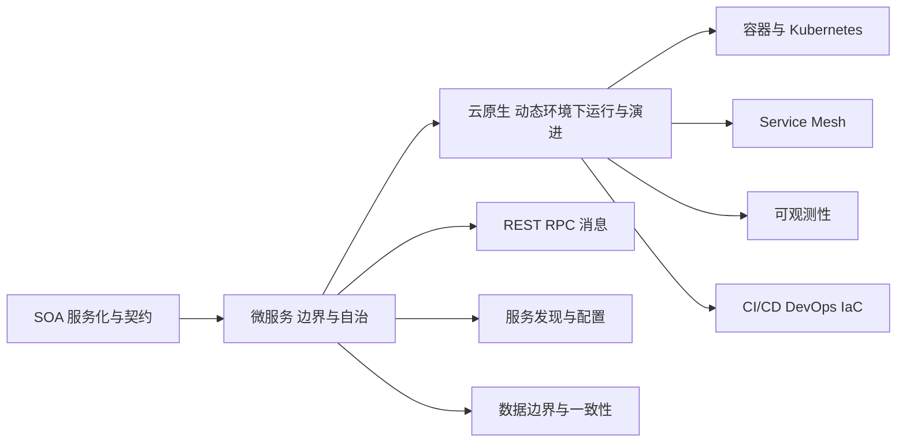

# 架构设计总览与八域学习路线

> [!important] 先看问题链，再进八域
> 这页只负责“为什么先学这个、为什么下一步学那个、不同概念属于什么层级、案例从哪里进入”。八域正文的定义、机制、边界和取舍仍以 [[ARCH-架构设计理论与实践覆盖契约矩阵|124 Atom 最终覆盖契约]] 及后续真实正文为主事实源。本页不产生新的 covered/link_only，也不提前创建八域正文目录。

## 一、第一次打开这里时，先抓住一条主线

主学习线：

`架构基础 → 分层 → 分布式问题 → SOA → 微服务 → 云原生`

这里的“分布式问题”是**问题空间桥梁**，不是第九个架构域；它把单体/分层之后出现的跨进程通信、远程调用、服务发现、配置、一致性、故障传播和观测问题集中起来，再解释为什么会继续走向 SOA、微服务和云原生。

> [!note] 大纲顺序不等于零基础学习顺序
> 八域物理编号继续按既有契约保留；教学上先完成 SOA，再进入微服务与云原生。这样不会把“云原生目录排在 SOA 前”误读成知识依赖也在前。

## 二、主线为什么这样走

1. **架构基础**先回答“什么问题需要上升到系统级组织方式”，并复用 [[01_综合知识/06_软件架构设计/软件架构设计索引|综合知识的软件架构基础]]。
2. **分层**先学最直观的职责切分：把表示、业务、数据访问等责任分开，建立“边界”和“依赖”的感觉。
3. 系统一旦跨进程、跨主机、跨系统，问题从“代码怎么分层”扩大为**分布式问题**：远程通信、状态、一致性、发现、配置、故障与观测开始成为架构约束。
4. **SOA**用服务、契约、注册、编排和集成来组织跨系统能力，解决企业级异构系统复用与整合。
5. **微服务**继续强化服务边界、自治和独立部署，但同时放大服务发现、调用治理、数据边界、韧性和运维复杂度。完整主事实源锁定在 `ARCH-CN-A003` 及其拆分 Atom；SOA 只负责演化边界。
6. **云原生**再回答：大量独立服务如何面向动态云环境运行、交付、治理和演进；容器、Kubernetes、Service Mesh、可观测性等在这里承担运行支撑，但它们都不等于云原生本身。

## 三、主线与四条支线

主线之外，遇到四类约束时转入对应支线：

- **资源与实时约束 → 嵌入式架构**：CPU、存储、能耗、实时性、可靠性等约束会改变普通软件架构的设计自由度。
- **跨系统交换 → 通信架构**：当问题落到网络、链路、路由、冗余、IPv4/IPv6、5G、网络安全组合时，进入通信架构。
- **系统保护 → 安全架构**：当问题从单个安全技术升级为“如何把控制组合成整体防护体系”时，进入安全架构。
- **数据规模变化 → 大数据架构**：当低延迟、吞吐、容错、重放和批流处理成为系统级组织问题时，进入 Lambda/Kappa 等大数据架构。

## 四、概念层级必须分开

这张表只规定本知识库的**学习层级**，避免把工具、协议和架构混成同一级；具体技术定义仍回到各自唯一主事实源。

| 层级 | 本路线中的概念 | 判断口径 |
| --- | --- | --- |
| 架构范式/组织方式 | 分层、SOA、微服务、云原生 | 回答系统整体如何组织、边界如何划分、组件怎样协作 |
| 设计思想 | DDD | 帮助识别业务边界与模型，不等于微服务，也不是第九架构域 |
| 通信方式 | REST、RPC、消息 | 回答组件/服务之间怎样交换请求、响应或事件；通信方式不能反推整体架构 |
| 运行机制 | 容器、Kubernetes、服务发现、配置管理、Service Mesh、可观测性 | 回答大量服务怎样运行、定位、配置、治理和被观察；机制不等于架构范式 |
| 工程实践 | CI/CD、DevOps、Infrastructure as Code | 回答架构怎样持续构建、交付、运维和基础设施化；工程实践不是运行时组件 |

还要额外记住：

- “分布式问题”是问题空间，不是架构范式；
- REST 在其原始理论中有架构风格含义，但在本八域学习导航里只把它放进“服务通信/接口约束”这一学习层，不把它与 SOA、微服务并列成八域；
- DDD 可以帮助微服务边界设计，但 **DDD ≠ 微服务**；
- 容器和 Kubernetes 可以支撑微服务/云原生运行，但 **容器 ≠ Kubernetes ≠ 微服务 ≠ 云原生**；
- Service Mesh、服务发现、配置管理、可观测性都是分布式运行治理能力，不是新的顶级架构域；
- CI/CD、DevOps、IaC 解决工程交付与运维方式，不替代架构设计本身。

## 五、SOA → 微服务 → 云原生到底是什么关系

这不是“旧技术被新技术完全淘汰”的时间线。SOA、微服务与云原生可以在不同系统中并存；这里表达的是**教学依赖和问题继续增加时的认知路线**。

## 六、八域零基础导航

> [!tip] “第一次学习应打开哪个 Atom”是学习起点，不是目录号排序
> 八个知识域的章节正文与章节级联合验收现已完成；正式 coverage 仍只以 [[ARCH-架构设计理论与实践覆盖契约矩阵#三、124 个 stable Atom|124 Atom 契约矩阵]] 为事实源。本页接下来只承担跨章学习路线和入口导航。

| 域 | 为什么需要 / 解决什么 | 必须先学 | 主要概念关系 | 学完下一站 | 案例入口 | 第一次学习 Atom |
| --- | --- | --- | --- | --- | --- | --- |
| 信息系统架构 | 把“业务价值、信息化建设、应用和基础设施”放回同一整体框架，解决只会看单个应用、不会看企业全局的问题 | 信息系统基础；[[软件架构设计索引|软件架构基础]] | 总体框架 → 常用模型 → TOGAF/ADM → 信息化规划/生命周期/约束 | 层次式架构；跨系统整合时进入 SOA | [[ARCH-八域案例入口与理论Atom映射|CASE-IS-01～03]] | `ARCH-IS-A001` |
| 层次式架构 | 先建立职责分离、依赖方向和层边界，作为后续服务化比较的基线 | 软件架构风格；数据库与软件工程基础 | 分层原则 → 表现层 → 业务层 → 数据访问层 → 数据架构；物联网三层是特定分层 | 分布式问题 → SOA | [[ARCH-八域案例入口与理论Atom映射|CASE-LAY-01～02]] | `ARCH-LAY-A001` |
| 面向服务架构 SOA | 异构系统需要通过服务契约、注册、编排和 ESB 进行复用与整合 | 分层；EAI；架构风格；分布式基本问题 | 服务/契约 → WSDL/SOAP/REST → 注册发现 → 编排/BPEL → ESB → QoS/实施 → SOA 与微服务边界 | 微服务 | [[ARCH-八域案例入口与理论Atom映射|CASE-IS-02、CASE-IS-03、CASE-CN-05]] | `ARCH-SOA-A001` |
| 云原生架构 | 服务规模和变化速度上升后，需要面向动态云环境解决弹性、交付、治理、韧性与可观测问题 | SOA；分布式问题；云计算基础；质量属性 | 微服务 → 调用/发现/韧性/数据边界 → 容器与 Kubernetes → Mesh / Serverless / 可观测 / 事件驱动 → 云原生模式与反模式 | 主线收口；再按场景转安全/数据/通信等支线 | [[ARCH-八域案例入口与理论Atom映射|CASE-CN-01～05]] | `ARCH-CN-A001`；SOA 后进入微服务时先定位 `ARCH-CN-A003` |
| 嵌入式系统架构 | 资源受限、实时性和硬件耦合使普通应用架构方法不足 | 计算机组成；OS；实时/可靠性；ABSD | 系统与硬件约束 → 嵌入式软件架构 → OS/数据库/中间件 → 交叉开发 → ABSD/ADD/DARTS | 回到质量属性与实时架构取舍；案例训练 | [[ARCH-八域案例入口与理论Atom映射|CASE-EMB-01～03]] | `ARCH-EMB-A011`（定义与特点） |
| 通信系统架构 | 单个协议知识不足以完成网络架构设计，需要把协议、冗余、路由、接入与安全组合成系统方案 | 计算机网络；可靠性；安全基础 | 需求分析 → LAN/WAN/移动/存储网络 → 协议组合与高可用 → IPv4/IPv6/SDN → 网络安全部署 | 安全架构或具体网络案例 | [[ARCH-八域案例入口与理论Atom映射|CASE-COM-01～03]] | `ARCH-COM-A009`（先做需求分析） |
| 安全架构 | 加密、认证、防火墙等零散技术不能自动形成整体安全，需要从威胁到控制体系进行架构化组合 | 信息安全技术；质量属性；网络基础 | 威胁输入 → 安全模型/规划 → WPDRRC/分层体系 → OSI 安全框架 → 数据库与脆弱性 → 典型架构脆弱性 | 安全案例；再回到其他架构做横切约束 | [[ARCH-八域案例入口与理论Atom映射|CASE-SEC-01～02]] | `ARCH-SEC-A001` |
| 大数据架构 | 数据规模、速度、容错和重放需求改变后，传统单一路径处理不足 | 大数据基础；数据库；分布式系统基础 | 大数据挑战/架构特征 → Lambda → Kappa → Kappa+ 等变形 → 设计选择 | 大数据案例与架构选型 | [[ARCH-八域案例入口与理论Atom映射|CASE-BIG-01～04]] | `ARCH-BIG-A001` |

> [!note] 八域目录仍按契约编号
> 教学路线中 SOA 先于云原生，不改变计划目录 `03_云原生架构`、`04_面向服务架构_SOA` 的物理编号；只有真实正文开工时才创建这些目录。

## 七、22 个案例入口：从知识点切换到设计判断

所有案例继续保持 `mapped / content_pending`。这里仅提供导航和训练目标；点击任一 Case ID 都回到 [[ARCH-八域案例入口与理论Atom映射|案例登记表]]，不提前生成案例正文。

| Case ID | 域 | 训练的设计判断 |
| --- | --- | --- |
| [[ARCH-八域案例入口与理论Atom映射|CASE-IS-01]] | 信息系统 | 从业务价值定位总体架构决策 |
| [[ARCH-八域案例入口与理论Atom映射|CASE-IS-02]] | 信息系统 / SOA | 识别标准接口、消息与集成职责 |
| [[ARCH-八域案例入口与理论Atom映射|CASE-IS-03]] | 信息系统 / SOA | 从信息孤岛选择服务化与 ESB |
| [[ARCH-八域案例入口与理论Atom映射|CASE-LAY-01]] | 层次式 | 把表示、业务、访问和数据职责分层 |
| [[ARCH-八域案例入口与理论Atom映射|CASE-LAY-02]] | 层次式 | 识别物联网三层与应用分层关系 |
| [[ARCH-八域案例入口与理论Atom映射|CASE-CN-01]] | 云原生 | 从单体痛点选择服务化、容器与自动化 |
| [[ARCH-八域案例入口与理论Atom映射|CASE-CN-02]] | 云原生 | 用云原生原则组织转型能力 |
| [[ARCH-八域案例入口与理论Atom映射|CASE-CN-03]] | 云原生 | 处理拆分、一致性与观测代价 |
| [[ARCH-八域案例入口与理论Atom映射|CASE-CN-04]] | 云原生 | 按流量和事件场景选择模式 |
| [[ARCH-八域案例入口与理论Atom映射|CASE-CN-05]] | 云原生 / SOA | 识别服务边界、复用与实施路径 |
| [[ARCH-八域案例入口与理论Atom映射|CASE-EMB-01]] | 嵌入式 | 识别分层、OS 架构与资源约束 |
| [[ARCH-八域案例入口与理论Atom映射|CASE-EMB-02]] | 嵌入式 | 用质量属性和实时约束驱动架构 |
| [[ARCH-八域案例入口与理论Atom映射|CASE-EMB-03]] | 嵌入式 | 连接设备 OS 与物联网层次 |
| [[ARCH-八域案例入口与理论Atom映射|CASE-COM-01]] | 通信 | 找单点并组合冗余、检测和切换 |
| [[ARCH-八域案例入口与理论Atom映射|CASE-COM-02]] | 通信 | 按需求选择双栈、隧道或翻译 |
| [[ARCH-八域案例入口与理论Atom映射|CASE-COM-03]] | 通信 | 定位 5GS、DN 与边缘能力 |
| [[ARCH-八域案例入口与理论Atom映射|CASE-SEC-01]] | 安全 | 从威胁形成分层控制与动态闭环 |
| [[ARCH-八域案例入口与理论Atom映射|CASE-SEC-02]] | 安全 | 识别云、工业边界与架构脆弱性 |
| [[ARCH-八域案例入口与理论Atom映射|CASE-BIG-01]] | 大数据 | 按实时与准确视图选择 Lambda |
| [[ARCH-八域案例入口与理论Atom映射|CASE-BIG-02]] | 大数据 | 比较流批路径与演进成本 |
| [[ARCH-八域案例入口与理论Atom映射|CASE-BIG-03]] | 大数据 | 按低延迟、容错和一致视图选型 |
| [[ARCH-八域案例入口与理论Atom映射|CASE-BIG-04]] | 大数据 | 按实时决策与重放需求选型 |

## 八、唯一主事实源边界

- 124 Atom 范围、状态和复用结论只维护在 [[ARCH-架构设计理论与实践覆盖契约矩阵]]；本页不复制 coverage 判定。
- 22 个案例的正式映射只维护在 [[ARCH-八域案例入口与理论Atom映射]]；本页只做入口和设计判断摘要。
- 跨域“为什么下一站出现”的关系只维护在 [[ARCH-架构关系矩阵]]；本页把它组织成零基础学习路线。
- 综合知识继续负责既有基础事实：[[软件架构设计索引|软件架构基础]]、信息安全、网络、数据库、云计算和大数据基础等；八域只新增架构层组织、边界、权衡、选型与案例判断。
- 微服务完整主事实源继续归 `ARCH-CN-A003` 及其拆分 Atom；SOA 只写边界与回链。

## 九、这一轮之后怎么学

1. 首次进入架构主干仍从本页开始，按“架构基础 → 分层 → 分布式问题 → SOA → 微服务 → 云原生”走主线。
2. 遇到资源实时、通信、安全、数据规模问题，再切到对应支线。
3. 八域章节级 coverage 已无 `partial / unmapped`；`ARCH-CROSS-LINK` 已验证核心导航 Wikilink、3 个 legal link_only 与 22 个案例承接。
4. 当前工程唯一下一批是 `ARCH-COVERAGE-FINAL`，只做最终 coverage gate，不再重复建设八域正文。
5. FINAL gate PASS 后恢复 G5 案例建设；论文继续后置。
