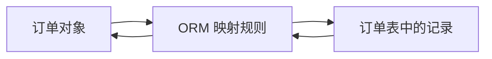

# ORM与Hibernate：怎样让程序主要操作对象而不是表记录

> [!summary]- 快速复习卡片（学完再看）
> **ORM**：在程序对象和关系数据库记录之间建立映射。
> **直接价值**：减少重复的数据访问代码，让开发者更多面对对象。
> **Hibernate**：教材列举的 Java ORM 框架，提供对象与表的映射及持久化服务。
> **CMP 2.0**：本节标题列出的旧技术语境名词；教材抽取正文未展开其机制，复习时先识别其与持久化相关的定位。

## 为什么“保存一个订单”常常会写出很多重复代码

程序里通常按“订单对象”处理数据：有订单号、商品、金额和状态；关系数据库里却按表、行和字段保存。若每次保存、读取、删除对象都手写相似的数据访问代码，业务开发很容易被重复的细节淹没。

**ORM 的直接答案是：建立对象和关系数据库记录之间的对应关系，让程序主要按对象操作，框架负责完成必要的数据转换。**

ORM 是 Object-Relation Mapping 的缩写。它不是不要数据库，也不是完全不需要理解数据；它解决的是对象表示和关系表示之间的转换工作。

## 保存和读取怎样经过映射

当程序保存订单时，ORM 根据映射规则把对象属性转换为表中的记录；读取时再把记录恢复为程序可操作的对象。教材将这种转换描述为“对象到关系数据库记录”以及反向转换。

因此，ORM 的重点不是把 SQL 这个词藏起来，而是把重复的持久化细节交给映射层，使业务代码能更集中于业务功能。

## Hibernate 在这里是什么

教材把 Hibernate 作为开放源代码的对象关系映射框架示例：它对 JDBC 做对象层面的封装，提供 Java 类与数据表的映射，以及数据查询和恢复机制。

第一次学习不必背它的配置文件或 API。做题时只要能判断：

- 对象和表之间映射 → ORM；
- 题干点名 Java、Hibernate、JDBC 的对象封装 → Hibernate 是 ORM 框架示例；
- 业务层不想重复编写大量 CRUD 访问代码 → ORM 解决的正是这种重复。

## CMP 2.0 怎样理解才不越界

主教材的本节标题将 “ORM、Hibernate 与 CMP 2.0” 并列，但当前可解析正文详细展开的是 ORM 和 Hibernate，没有给出 CMP 2.0 的可核验运行机制。

因此，本卡只保留安全的考试定位：**CMP 2.0 是该教材持久化/对象与数据保存语境下需要识别的旧技术名词。**不把未在本节正文中展开的流程、接口或版本细节写成必背结论。

## ORM 也有边界

ORM 可以减少重复代码和隔离一部分存储细节，但不代表所有性能、查询设计或数据建模问题会自动消失。教材也指出，Hibernate 虽灵活，体系结构会较复杂，并有不同运行方式。

所以题干若强调“对象与表的映射、减少重复持久化代码”，选 ORM；若只是问“数据库连接怎么创建”，应回到工厂或其他数据访问设计，而不是泛选 ORM。

## 考试怎样判断

先抓两个词：

- **对象 ↔ 关系数据库记录** → ORM；
- **Java 对象封装、Hibernate、JDBC 映射** → Hibernate。

若仅出现 CMP 2.0 且题干没有给出其机制，不应擅自把它等同于任何现代框架特性；按教材语境将其定位为持久化相关的旧技术名词即可。

## 自测

1. 程序对订单对象进行保存，框架把对象属性转换成订单表记录。这体现了什么？

> [!answer]- 第 1 题答案与解析
> **答案**：ORM。
> **解析**：ORM 的核心是程序对象与关系数据库记录之间的映射和相互转换。

2. Hibernate 在教材本节中主要作为哪一类技术的例子？

> [!answer]- 第 2 题答案与解析
> **答案**：对象关系映射框架。
> **解析**：教材说明它提供 Java 类与数据表之间的映射，并提供数据持久化相关能力。

## 下一站

本批先完成了数据访问的五种模式、实现选择和对象映射。后续再单独处理 XML Schema、事务与连接对象管理，避免把不同问题塞进同一篇。
