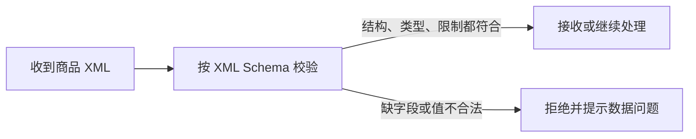

# XML Schema：怎样先写清数据长什么样再让系统接收它

> [!summary]- 快速复习卡片（学完再看）
> **XML Schema**：给 XML 文档写一份“数据规则说明书”，规定允许有哪些元素、属性、数据类型和限制。
> **直接价值**：在接收或保存 XML 前先验证其结构和数据是否合规。
> **别混淆**：XML 是实际装数据的文档；XML Schema 是检查这份文档该怎么写的规则。

## 为什么不能只看 XML “长得像不像”

假设系统接收一份商品 XML：商品名必须有，价格必须是数字，库存不能写成一段文字。只要标签拼对，XML 依然可能“格式良好”，却不一定符合系统需要的数据规则。

**XML Schema 的直接答案是：把数据结构、字段类型和约束先写成规则，再用这套规则验证传来的 XML。**

教材指出，XML Schema 用来描述 XML 文档的合法结构、内容和限制。第一次学习时，可以把它理解为“数据表字段设计”在 XML 世界中的对应规则：它不保存商品本身，而是规定商品资料应该包含什么、可以写成什么样。

## 一次校验怎样发生

例如，Schema 可以规定 `price` 是数字、`productName` 必须出现、`stock` 不能是负数。这里的关键词不是死记标签写法，而是明白三层约束：

- **结构**：有哪些元素，谁包含谁；
- **类型**：值是文本、整数、日期还是其他类型；
- **限制**：哪些字段必填、取值应满足什么条件。

教材还强调 XML Schema 有丰富数据类型，支持用户定义类型、继承和复用，并与命名空间紧密关联。考试中若题干强调“定义 XML 的合法结构、内容和数据类型”，优先想到 XML Schema。

## 它在数据访问层解决什么

当 XML 被用作数据交换、配置或存储载体时，数据访问层需要先判断数据能不能安全进入后续处理。Schema 位于“数据进入系统前的规则检查”这一位置：它帮助统一不同发送方提交的数据形状，减少因缺字段或类型不对而造成的后续错误。

但它不等于数据库，也不自动完成数据持久化：

- XML Schema 负责**描述与验证 XML 数据规则**；
- [[ORM与Hibernate：怎样让程序主要操作对象而不是表记录|ORM]] 负责对象与关系数据库记录之间的转换；
- [[五种数据访问模式：数据怎样在业务层和数据源之间来回|DAO 等访问模式]] 负责组织程序怎样取用数据源。

## XML Schema 和 DTD 怎么区分

教材把 DTD 作为传统的 XML 结构描述机制，并说明 XML Schema 扩展了它的能力。做基础判断时可抓住：

| 题干关注点 | 更接近的答案 |
| --- | --- |
| 描述 XML 的结构，但类型表达能力较传统 | DTD |
| 丰富数据类型、可自定义类型、命名空间 | XML Schema |
| 一份具体商品或订单数据 | XML 文档 |

不必把“XML Schema 会逐步替代 DTD”的教材表述理解为所有现实系统都已不用 DTD；考试应按题干给出的能力特征判断。

## 考试怎样判断

看到“合法结构、元素、属性、数据类型、约束、验证 XML”这一组词，就先选 XML Schema。

若题干问的是“某条订单数据怎样提交或回滚”，转到[[事务处理：多步修改失败时怎样回到原状|事务处理]]；若问“怎样减少频繁建立数据库连接”，转到[[数据库连接池：连接用完为什么通常要归还而不是关闭|连接对象管理]]。

## 自测

1. 系统要求订单 XML 必须有订单号，金额必须是数字。应该用什么来表达并校验这套规则？

> [!answer]- 第 1 题答案与解析
> **答案**：XML Schema。
> **解析**：它描述 XML 的合法结构、内容、数据类型和限制，可用于验证订单 XML 是否符合约定。

2. XML Schema 本身是在保存订单数据，还是在规定订单 XML 可以怎样写？

> [!answer]- 第 2 题答案与解析
> **答案**：规定订单 XML 可以怎样写。
> **解析**：具体订单信息在 XML 文档中；Schema 是验证该文档结构和内容的规则。

## 下一站

数据格式合规只是第一步。接下来要处理的是：一项业务需要连续修改多处数据时，怎样保证它要么全部成功、要么恢复原状。
