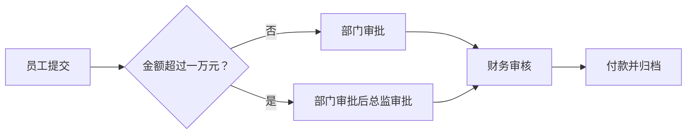

# 业务逻辑工作流：怎样让一件事按规则流转

> [!summary]- 快速复习卡片（学完再看）
> **工作流**：让文档、信息或任务按预先规定的过程规则流转。
> **关键价值**：把“具体功能做什么”和“先后顺序怎样走”分开。
> **结果**：改流程模型时，尽量不必改每个具体功能。
> **题眼**：任务流转、过程规则、工作流引擎、过程逻辑与应用逻辑分离。

## 报销流程变了，为什么不该重写每个功能

一笔报销可能依次经历“员工提交 → 部门审批 → 财务审核 → 付款”。若每个功能都自己写死下一步，改成“金额超过一万元再加总监审批”时，提交、审批、财务等功能都可能要改。

**工作流的直接答案是：把任务怎样流转写成过程规则，再让系统按规则推进任务。**

教材把工作流定义为业务流程的全部或部分自动化：文档、信息或任务按照过程规则流转，协调参与者，共同达成业务目标。

## 一笔报销怎样流转

这张图中的每个动作，例如“部门审批”或“付款”，可以由相应的业务组件完成；工作流负责的是决定下一步轮到谁、满足什么条件才能往下走、任务当前处于什么状态。

因此，流程规则改变时，优先调整的是过程模型，而不是把每个功能的具体实现推倒重来。

## 工作流不是一个大页面跳转器

UIP 也会处理页面之间的导航和用户任务状态，但它关注的是用户界面的交互过程。业务逻辑层工作流关注的是业务本身的过程规则，例如审批、分派、审核和归档。

| 看到的线索 | 优先判断 |
| --- | --- |
| 下一页、表单状态、用户中断后继续 | [[UIP：为什么页面跳转和任务状态不能都写在界面里|UIP]] |
| 审批链、任务分派、跨角色流转、过程规则 | 业务逻辑层工作流 |

## 它为什么有用

教材强调，用工作流组织业务逻辑，能把应用逻辑和过程逻辑分开。这样既能通过调整过程模型改变系统功能，也能把人、信息和应用工具组织到同一业务目标下。

这并不表示所有业务都必须上复杂的工作流引擎。只有存在明确步骤、多角色协作、分支或持续变化的过程时，工作流的价值才明显。

## 考试怎样判断

题干出现“多个参与者按预定义规则传递任务”“调整审批顺序而不改具体功能”“工作流引擎推进任务”，先定位到业务逻辑层工作流。

第一步不要急着背接口编号；先判断题目问的是**过程怎么走**，还是某个功能内部怎么实现。

## 自测

1. 报销金额超过一万元时增加总监审批，最应优先修改什么？

> [!answer]- 第 1 题答案与解析
> **答案**：报销的过程规则或过程模型。
> **解析**：新增的是任务流转条件和审批顺序，不是“提交报销”这个具体功能本身。

2. 工作流把哪两类逻辑分开？

> [!answer]- 第 2 题答案与解析
> **答案**：应用逻辑与过程逻辑。
> **解析**：前者完成具体业务动作，后者决定动作和任务按什么顺序、条件流转。

## 下一站

流程在推进时，需要有一份能携带订单、申请单等业务数据和当前状态的对象。下一篇说明这类[[业务逻辑实体：为什么业务数据不能直接等同于数据库表|业务逻辑层实体]]。
