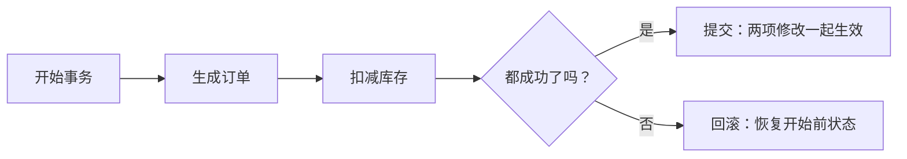
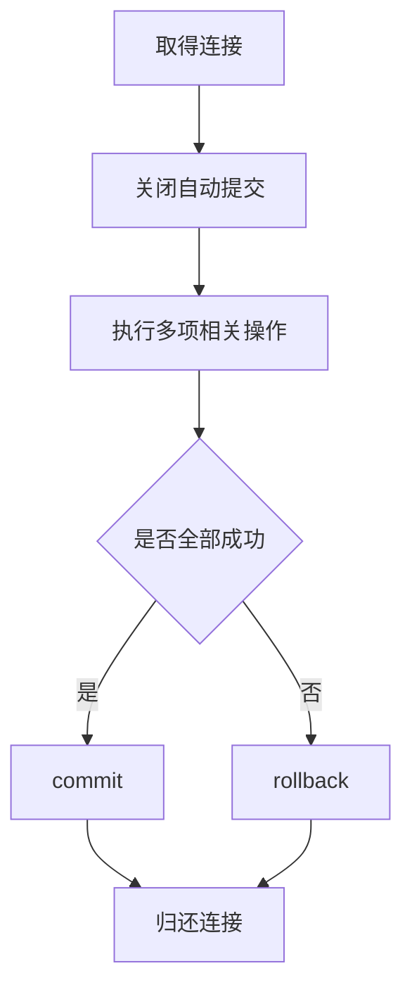

# 事务处理：多步修改失败时怎样回到原状

> [!summary]- 快速复习卡片（学完再看）
> **事务**：一组必须作为整体完成的处理步骤；要么全部提交，要么全部回滚。
> **提交（commit）**：确认本次修改生效。
> **回滚（rollback）**：发生失败时撤销本次事务已做的修改，回到开始前的状态。
> **一致性 C**：成功提交后，数据仍满足数据库约束和业务不变量；失败时恢复到之前有效状态主要由原子性与回滚保证。
> **ACID**：原子性、一致性、隔离性、持久性。

## 为什么“扣库存”和“生成订单”不能各做各的

用户购买最后一件商品时，系统至少要做两步：生成订单、扣减库存。若订单已生成，扣库存却失败，就会出现“卖出了商品但库存没有变化”的不一致状态。

**事务的直接答案是：把这类必须一起成功的步骤圈成一个整体；全部完成才提交，任何一步失败就回滚。**

教材将“要么全部发生、要么一步也不执行”的处理步骤定义为事务。这里的关键不是“执行过多少条 SQL”，而是这些操作是否共同维护同一件业务事的正确结果。

## ACID 到底在保护什么

| 名称 | 用下单场景理解 |
| --- | --- |
| **原子性 A** | 订单和扣库存不能只成一半；任一步失败，已经做的修改失效。 |
| **一致性 C** | 事务开始前数据满足约束，成功后仍满足约束，例如库存不能小于零；业务规则必须由事务逻辑和数据库约束共同落实。 |
| **隔离性 I** | 并发事务按数据库选定的隔离级别相互隔离。未提交数据能否被其他事务读到，取决于隔离级别；不能一概说所有级别都禁止脏读。 |
| **持久性 D** | 一旦提交，已确认的数据状态在后续故障中仍应正确保留。 |

“原子性”和“一致性”容易混：前者强调这组步骤不能拆开半做；后者强调成功后的数据仍符合约束。教程在 ACID 的概述段还把失败后的状态恢复放在“一致性”说明中；做题时要抓住功能分工：回滚撤销部分修改是原子性保证，一致性是事务守住有效状态和业务规则。

## 提交和回滚怎样落在一次访问里

教材以 JDBC 为例说明：连接对象默认可能处于自动提交模式，每条 SQL 都各自确认。若要把多条 SQL 当成一个事务，就需要关闭自动提交，在所有步骤成功后调用提交；任何步骤出错则回滚。

这是机制示意，不要求背某种语言的具体 API。考试中的第一判断是：多项数据库修改能否被当作一件业务事来提交或撤销。

## 两条容易失分的设计原则

教材给出两项明确提醒：

- 不要在同一段处理里随意混用、嵌套不同事务类型；
- 事务应尽量短，不要把同一事务拆散到不同方法中长期悬着。

直观原因是：事务未结束时，资源与数据状态会被占用；越长、越杂，越难判断谁负责提交或回滚。这里不是说“所有方法只能写一个事务”，而是一次完整业务事务要有清楚、集中的边界和负责人。

## 它与连接池不是同一个问题

事务处理回答“**这几步数据修改怎样一起成或一起败**”；[[数据库连接池：连接用完为什么通常要归还而不是关闭|连接对象管理]]回答“**怎样高效取得和归还访问数据库的连接**”。

一个事务可能使用一条从连接池借来的连接，但不能因有连接池就自动拥有正确的提交和回滚策略。

## 考试怎样判断

- “全部成功或全部不做”“提交/回滚” → 事务；
- “ACID、并发事务互不干扰” → 事务特性；若题目问未提交修改可否被读，要看隔离级别；
- “频繁创建连接开销大、空闲连接复用” → 连接池；
- “对象和表记录互转” → ORM。

## 自测

1. 转账时已从甲账户扣款，但给乙账户入账失败。应怎样处理？

> [!answer]- 第 1 题答案与解析
> **答案**：回滚本次事务，使扣款也不生效。
> **解析**：扣款和入账属于必须共同完成的一件业务事，不能只成功一半。

2. 题目说并发事务之间的可见性和相互干扰受控制，属于 ACID 的哪一项？所有隔离级别都绝对禁止读取未提交修改吗？

> [!answer]- 第 2 题答案与解析
> **答案**：隔离性；不是所有隔离级别都绝对禁止。
> **解析**：隔离级别决定并发事务能观察到哪些状态。阅读题干时既要认出“隔离性”，也要留意具体级别，不能把一种常见配置写成普遍规律。

## 下一站

事务定义了数据修改的成败边界。还要有一套办法，让访问数据库所需的连接不用每次都从零创建。
