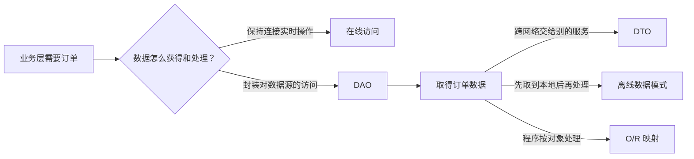

# 五种数据访问模式：数据怎样在业务层和数据源之间来回

> [!summary]- 快速复习卡片（学完再看）
> **在线访问**：保持连接，操作时不断和数据源交互。
> **DAO**：把底层访问操作与高层业务逻辑分开。
> **DTO**：跨进程或网络边界传递的一组数据容器，不装具体业务规则。
> **离线数据**：先取数据，再脱离连接独立操作；**O/R 映射**：在对象和关系记录间转换。

## 数据要用的时候，不能让业务层自己钻进数据库

上一批的业务逻辑层负责“订单是否能提交”。但它还需要读取库存、保存订单、把结果交给别的程序。如果业务规则、数据库连接和数据传递全混在一起，换数据源或调整调用方式时，业务代码就会被牵连。

**数据访问模式的直接答案是：按不同的取数、传数和保存需求，为业务层与数据源之间安排合适的分工方式。**

教材在这里列出五种模式。它们不是五个互相排斥的数据库产品，而是从“是否一直连着数据源、怎样隔开访问代码、怎样跨边界传数据、怎样把对象转成记录”这几个角度解决问题。

## 五种模式各在解决什么

| 模式 | 一句话理解 | 题干线索 |
| --- | --- | --- |
| 在线访问 | 操作期间保持连接，随时与后台数据源交互 | 占用连接、实时读写 |
| DAO（数据访问对象） | 用专门对象封装对某一数据源的访问 | 访问操作与业务逻辑分离 |
| DTO（数据传输对象） | 把需要传走的一组数据装进容器 | 跨进程、跨网络边界传数据 |
| 离线数据模式 | 先把数据取到本地结构，再不依赖当前连接地操作 | 断开连接、预定义结构、离线处理 |
| O/R 映射 | 让程序对象与关系数据库记录相互转换 | 对象与表记录转换、持久化 |

## 用一次“查看并修改订单”串起来

例如，订单服务可以经 DAO 读取数据；若要把订单摘要交给远端服务，可用 DTO 承载要传的数据；若员工在无网络时先修改订单草稿，数据取回后可按离线数据模式处理；若程序以“订单对象”工作而数据库存的是行和表，O/R 映射负责两种表示之间的转换。

这是一张帮助理解的关系图，不表示五种模式必须在同一次请求中同时出现。

## 三个最容易混的地方

| 容易混淆 | 正确区分 |
| --- | --- |
| DAO 与 DTO | DAO 是“谁去访问数据源”；DTO 是“要传走的数据装什么里”。 |
| 在线与离线 | 在线时每次操作继续依赖连接；离线时先取数，之后的操作不依赖当前连接或事务。 |
| DAO 与 O/R 映射 | DAO 强调访问职责的封装；O/R 映射强调对象与关系记录的转换。 |

教材指出，DTO 内一般不放具体业务逻辑，最多保留内部一致性检查和基本验证。不要因为它名字里有“对象”，就把订单审批、优惠计算等业务规则塞进去。

## 考试怎样判断

先看题干到底在问哪一个动作：

- “一直占用连接、实时交互” → 在线访问；
- “把数据访问和业务逻辑分开” → DAO；
- “跨进程或网络传递数据容器” → DTO；
- “脱离连接后继续处理数据” → 离线数据；
- “对象与关系数据库记录互转” → O/R 映射。

## 自测

1. 一个对象专门负责向数据库查询客户资料，让业务组件不直接写访问代码。这属于哪种模式？

> [!answer]- 第 1 题答案与解析
> **答案**：DAO 模式。
> **解析**：DAO 的职责是把底层数据访问操作与上层业务逻辑分离。

2. 某服务把客户编号、姓名和地址打包后跨网络发送，包内不处理优惠计算。这更像 DAO 还是 DTO？

> [!answer]- 第 2 题答案与解析
> **答案**：DTO。
> **解析**：题眼是跨网络边界传递的一组数据，且不承载具体业务逻辑。

## 下一站

知道了访问代码要与业务层分开后，还会遇到“数据库从一种换成另一种，调用方为什么不想重写”的问题。下一篇用[[数据访问层工厂模式：换数据库时为什么调用方不用改一片|工厂模式]]回答它。
