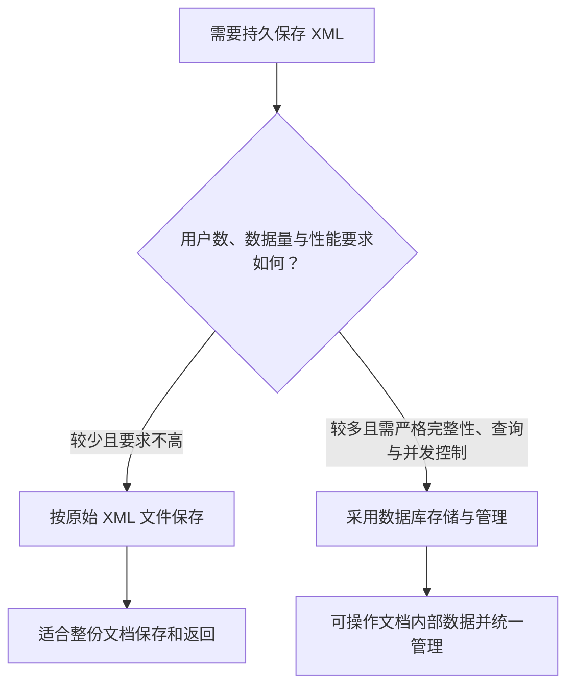
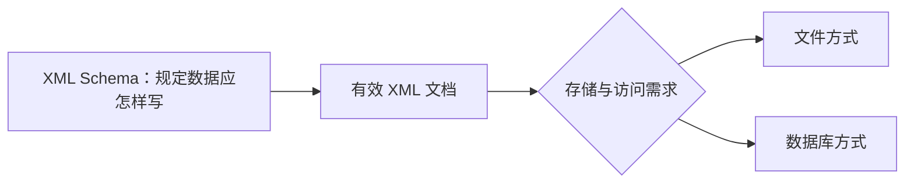

# 数据库设计与XML设计融合：XML数据该存成文件还是交给数据库管理

> [!summary]- 快速复习卡片（学完再看）
> **核心问题**：XML 文档需要长期保存时，按原文作为文件保存，还是把它交给数据库存取和管理？
> **直接判断**：少量、低性能要求时可用 XML 文档；用户多、完整性和性能要求严格时，优先考虑数据库方式。
> **别混淆**：XML Schema 规定 XML 是否合规；XML 存储设计决定合规数据放在哪里、怎样查询和管理。

## 为什么 XML 不是“写成文件就结束了”

例如，平台每天接收许多 XML 格式的申报单。若只把每份 XML 原样放进文件夹，开始时很简单；但当需要按某个字段查询、修改文档内部一项数据、处理多人同时访问时，单纯文件方式会越来越难管理。

**数据库设计与 XML 设计融合的直接答案是：先看 XML 文档的内容类型、数量、查询和并发要求，再选择文件存储或数据库存储，并让 XML 的结构规则与存储管理方式配合。**

教材将 XML 文档分为两类：

- **以数据为中心**：结构较规则、内容同构、混合内容和嵌套较少，通常关注其中的数据，常用于存储和传输 Web 数据；
- **以文档为中心**：结构较不规则、描述性内容较多，元素顺序可能有意义，例如产品介绍、网页描述信息和邮件信息。

分类不是为了背定义，而是帮助判断：你更常需要“拿到整份文档”，还是“按文档内部的数据查询、修改和控制”。

## 两种保存方式怎样选择

教材列出两种 XML 存储方式：

| 方式 | 适合与特点 |
| --- | --- |
| **基于文件** | 原始文本形式保存，可放在文件系统、文档管理系统或传统数据库的大对象字段中；查询往往以整份原始文档返回，处理内部结构化数据较弱。 |
| **数据库存储** | 可管理结构化和半结构化数据，可操作文档内部数据，并获得多用户、并发控制、一致性约束等数据库能力。 |

教材也提醒：在数据量和操作用户较少、性能要求不高时，XML 文档可作为数据库使用；用户多且要求严格完整性、性能时，则不宜只采用 XML 文档方式。

## XML Schema 在这里扮演什么角色

[[XML Schema：怎样先写清数据长什么样再让系统接收它|XML Schema]] 规定 XML 元素、属性、类型与限制。教材还说明，XML 数据库中的文档应有效，即符合某一模式；一组文档也可以基于多个 `.xsd` 模式文件。

可以这样分工：

Schema 解决“数据格式是否符合规则”，存储设计解决“数据怎样保存、检索、控制与管理”。两者配合，但不是同一个问题。

## 不要把 XML 直接当成完整数据库替身

教材指出，XML 及其相关技术可提供存储、模式、查询语言和编程接口等类似数据库的特征；但与传统数据库相比，在存储、索引、安全、多用户访问和事务管理方面仍可能不足。

所以题干若强调海量用户、严格一致性、并发控制或频繁查询文档内部字段，不能只因“XML 能描述数据”就选纯文件方案。反过来，若只需保存少量完整文档，也不能不看成本地把所有内容拆成复杂数据库结构。

## 考试怎样判断

- “原样保存 XML、只返回整份文档、内部查询弱” → 基于文件的存储；
- “操作文档内部数据、并发控制、一致性约束、多用户” → 数据库存储；
- “元素、属性、类型、合法结构” → XML Schema；
- “对象和数据库记录相互转换” → ORM。

## 自测

1. 大量用户要按 XML 文档内的字段查询，并要求并发控制与一致性约束，优先采用哪类存储？

> [!answer]- 第 1 题答案与解析
> **答案**：数据库存储方式。
> **解析**：教材列出它可操作文档内部数据，并具有多用户、并发控制和一致性约束等能力。

2. XML Schema 与 XML 数据库存储分别回答什么问题？

> [!answer]- 第 2 题答案与解析
> **答案**：Schema 回答 XML 是否符合结构和类型规则；存储设计回答 XML 放在哪里、怎样管理和访问。
> **解析**：一个是规则与校验，一个是持久化与数据管理。

## 下一站

数据访问层与数据架构规划已经完成。最后再回到层次式架构在物联网中的三层划分，完成本章的收口。
