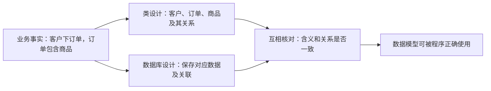

# 数据库设计与类设计融合：怎样让业务对象和存储结构不互相打架

> [!summary]- 快速复习卡片（学完再看）
> **融合不是硬凑成一份图**：业务类和数据库结构从同一业务事实出发，彼此核对，避免一个说法一套、存法又一套。
> **直接目标**：识别正确的类及类间关系，得到能长期适应变化的数据模型。
> **考试动作**：先找业务对象和关系，再判断数据模型是否能支持变化与全生命周期成本。

## 为什么“页面上有订单，库里却不知道它和客户的关系”会出问题

做订单系统时，业务人员会说“一个客户可以下多个订单，订单里还有多个商品”。若程序里的类只写出 `Order`，数据库里又只建出一张随意拼字段的表，后续就很难正确查询订单属于谁、商品如何关联，也难以应对业务变化。

**数据库设计与类设计融合的直接答案是：先把业务中的对象和关系识别清楚，再让程序中的类设计和数据库的数据模型围绕同一组事实协同设计。**

教材强调，正确识别类以及类之间的关系，是数据模型的关键。这里的“类”可先理解为业务中稳定存在的对象，例如客户、订单、商品；“关系”则是它们之间的联系，例如“客户下订单”“订单包含商品”。

## 用一次下单把两种设计对齐

融合的重点不是要求“一个类永远等于一张表”。不同系统会因查询、约束、性能等要求作不同安排。它真正要避免的是：业务对象的含义已改变，而存储结构仍按旧理解保存，或两边对同一关系给出互相矛盾的解释。

## 先做哪三个判断

1. **有哪些业务对象**：不要从字段名开始猜；先从业务动作中找稳定名词，例如客户、订单、商品。
2. **对象间是什么关系**：谁属于谁、谁包含谁、是否会有多个关联对象。
3. **数据模型能否随变化演进**：教材指出，好模型要考虑系统随时间可能发生的变化，并以整个工程生命周期的成本为目标，而非只追求眼前开发最快。

因此，遇到“类设计与数据库设计融合”的题目，重点是识别、描述并核对对象与关系，而不是机械把全部类名改成表名。

## 为什么不存在唯一的“正确表结构”

教材明确说，复杂情况下不存在唯一正确的数据模型，但会有更好的模型。原因很简单：同一业务还要考虑查询方式、数据约束、后续变化和维护成本。

这给考试的启示是：题干若声称某个复杂业务模型只有唯一画法，应保持警惕；更合理的判断是看它是否忠实表达业务关系、是否能适应合理变化、是否降低全生命周期成本。

## 它和 ORM、XML 的边界

- [[ORM与Hibernate：怎样让程序主要操作对象而不是表记录|ORM]] 处理“已确定的对象和关系数据库记录怎样转换”；
- 本文处理“业务类和数据模型怎样围绕同一业务事实设计”；
- [[数据库设计与XML设计融合：XML数据该存成文件还是交给数据库管理|数据库与 XML 设计融合]] 处理 XML 文档的类型和存储选择。

所以，ORM 不是替代数据建模的按钮；如果对象关系本身没想清楚，映射工具也无法自动决定正确的数据模型。

## 考试怎样判断

- “识别类及类间关系”“数据模型”“生命周期变化” → 数据库设计与类设计融合；
- “对象属性和表记录如何相互转换” → ORM；
- “XML 文档以文件还是数据库方式保存” → 数据库与 XML 设计融合。

## 自测

1. 订单系统中，客户可以下多个订单。设计时先应关注什么？

> [!answer]- 第 1 题答案与解析
> **答案**：识别客户、订单等业务类及它们之间的关系，并让数据模型反映这组关系。
> **解析**：教材把正确识别类和类间关系视为数据模型的关键。

2. 为什么不能只选“开发时最省事”的数据模型？

> [!answer]- 第 2 题答案与解析
> **答案**：好模型还要考虑系统变化和整个工程生命周期的花费。
> **解析**：短期开发成本低不代表长期维护、演进成本低。

## 下一站

除了对象和数据库结构需要对齐，系统还可能把 XML 作为数据交换或保存格式。接下来讨论 XML 文档怎样选择合适的存储与管理方式。
