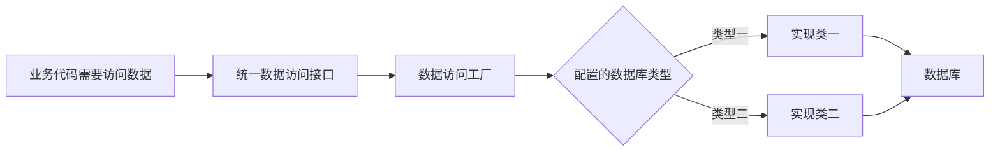

# 数据访问层工厂模式：换数据库时为什么调用方不用改一片

> [!summary]- 快速复习卡片（学完再看）
> **问题**：不同数据库常有不同访问实现，业务代码若直接创建具体类，换库会连锁修改。
> **做法**：先约定统一访问接口，再由工厂按数据库类型创建合适的实现。
> **结果**：调用方只面对接口和工厂，不直接依赖某个数据库实现。
> **边界**：前提是不使用某个数据库独有的功能。

## 换了数据库，为什么业务代码也会跟着疼

假设订单系统原来使用一种数据库，后来需要迁到另一种。若业务代码里到处直接创建“某数据库访问类”，每个调用点都知道具体数据库是谁；一旦更换，修改范围就会迅速扩散。

**工厂模式的直接答案是：把“要访问数据库”与“这次到底创建哪一种数据库访问实现”分开。**

调用方只说“给我一个能访问数据的对象”；工厂根据配置的数据库类型，返回对应的具体实现。

## 一次创建怎样发生

1. 先定义统一的数据访问接口，例如都能打开连接、查询和关闭；
2. 为不同数据库准备实现该接口的具体类；
3. 工厂读取数据库类型等配置；
4. 工厂返回合适的具体类，但对业务代码仍表现为统一接口；
5. 业务代码通过接口完成访问，不直接写死某一种实现。

教材用不同数据库访问类举例，并说明工厂会根据数据库类型返回适当的操作类。

## 它带来的好处和前提

好处是封装：数据库实现变化时，主要修改配置和工厂/实现层，调用方不必逐处了解变化。教材指出，客户端不会感觉到变化的前提是程序没有使用某一种数据库的专有功能。

因此，“用了工厂就一定能无痛换数据库”是错误的。若业务代码依赖某数据库的专用函数或特有语法，统一接口也无法把这种差异完全抹平。

## 它和 DAO 的关系

DAO 负责把具体的数据访问操作与业务逻辑分开；工厂模式解决的是“要用哪个 DAO 或数据访问实现”这一创建问题。

| 问题 | 优先想到 |
| --- | --- |
| 谁封装查询、保存等数据操作 | DAO |
| 哪个具体访问实现应该被创建 | 工厂模式 |

## 考试怎样判断

题干出现“定义统一数据库访问接口”“根据数据库类型返回实现类”“替换数据库而调用方少改”，第一反应是数据访问层的工厂模式。

看到“由子类决定实例化哪一个类”也是工厂方法的经典表述；在本章语境中，要把它落到数据库访问实现的选择上。

## 自测

1. 调用方只依赖 `DataAccess` 接口，工厂依据配置返回不同数据库的实现。这样做主要在隔离什么？

> [!answer]- 第 1 题答案与解析
> **答案**：调用方与具体数据库访问实现的依赖。
> **解析**：调用方不直接创建某种数据库类，而通过工厂和统一接口取得访问能力。

2. 已使用某数据库的专有函数时，能否保证换库不改业务代码？

> [!answer]- 第 2 题答案与解析
> **答案**：不能保证。
> **解析**：专有功能已经让上层依赖具体数据库，统一接口无法完全隐藏这种差异。

## 下一站

工厂解决“选择哪个访问实现”。如果希望业务代码主要操作订单、客户等对象，而不是手写大量增删改查，下一篇再看[[ORM与Hibernate：怎样让程序主要操作对象而不是表记录|ORM]]。
