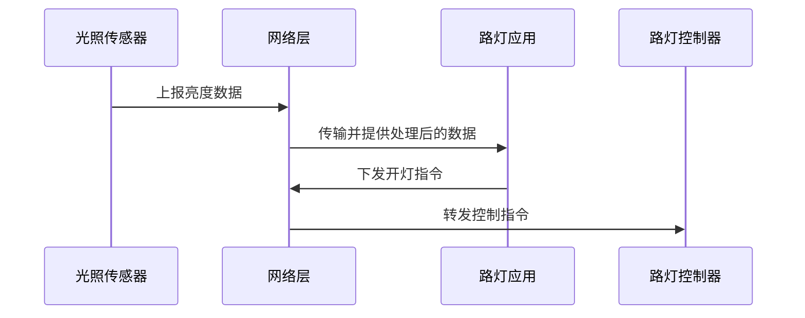

# 物联网三层架构：一条设备数据怎样变成面向人的服务

> [!summary]- 快速复习卡片（学完再看）
> **感知层**：识别对象、采集物理世界的数据。
> **网络层**：传递并处理感知数据。
> **应用层**：结合行业需求，利用处理后的数据提供服务、控制和人机交互。
> **记忆动作**：先采集 → 再传输处理 → 最后服务于人和行业。

## 一盏路灯为什么需要三层配合

智慧路灯想根据环境亮度自动开关：传感器先读到光线强弱，数据再传到系统，系统按规则决定开灯并把状态展示给管理人员。若把这三件事混成一层，就很难判断设备、通信和业务系统各自出了什么问题。

**物联网三层架构的直接答案是：把“获得现实世界的数据”“传递和处理数据”“用数据提供行业服务”分到感知层、网络层和应用层。**

这是一条解释性数据流：数据通常由下往上传递，控制命令也可能从应用层经网络层下发给设备。不要把“层”的顺序误解为只能单向通信。

## 三层分别解决什么问题

| 层次 | 主要职责 | 常见教材例子 | 题干关键词 |
| --- | --- | --- | --- |
| **感知层** | 识别对象、采集信息，把物理世界的数据拿进来 | 传感器、二维码、RFID、摄像头、GPS、读写器 | 采集、识别、标签、传感器、短距离传输 |
| **网络层** | 传递和预处理感知数据，连接设备与信息系统 | 移动通信网、互联网、企业网、网络管理与信息处理中心 | 传输、接入、通信网、上传、预处理 |
| **应用层** | 根据行业需求处理数据、提供服务并与人交互 | 智能交通、物流监控、远程抄表、智能家居 | 行业应用、监控、查询、控制、服务 |

教材把感知层比作人的皮肤和五官：它负责感受与获取；把网络层比作神经中枢和大脑：它负责把数据传递、汇聚和处理；应用层则把处理后的数据变成面向具体行业和人的服务。

## 用路灯场景走一遍

- 传感器测到亮度，属于**感知层**；
- 把数据通过通信网络送到平台，并作必要传递、处理，属于**网络层**；
- 按亮度和时间规则决定开灯、展示告警或统计，属于**应用层**。

题目若给出“刷卡设备采集 RFID 信息，上传后做后台鉴权，再从银行划账”，也应按同样办法先拆动作：采集是感知，传递和后台网络处理是网络，面向支付业务的服务则落到应用语境中。

## 两个最容易混的边界

### 感知层不是“所有网络设备”

感知层的核心是**面向物体识别与数据获取**。传感器、二维码和 RFID 读写器与它直接相关；把采集到的数据送到远处系统的通信网络，主要属于网络层。

### 网络层不是“用户看到的 App”

网络层解决数据传输和预处理问题；应用层才结合交通、医疗、物流等行业需求提供监控、查询、控制等具体服务。云计算平台可作为海量感知数据的存储、分析基础，是网络层的重要组成部分，也为应用层提供支撑；不要因此把所有云端业务界面都直接归入网络层。

## 考试怎样判断

按动词判断最快：

- **识别、采集、读取标签、测量环境** → 感知层；
- **传输、接入、上传、网络处理** → 网络层；
- **监控、查询、智能控制、面向行业提供服务** → 应用层。

若一道题描述的是从设备到行业服务的完整过程，应按“感知 → 网络 → 应用”排序，而不是只看它有没有提到互联网或云计算。

## 自测

1. RFID 读写器读取货物标签信息，属于哪一层？

> [!answer]- 第 1 题答案与解析
> **答案**：感知层。
> **解析**：它在识别对象、采集物理世界的信息。

2. 物流系统利用处理后的定位数据给调度员展示车辆轨迹并生成调度建议，主要属于哪一层？

> [!answer]- 第 2 题答案与解析
> **答案**：应用层。
> **解析**：它已结合物流行业需求，为人提供具体服务；此前的数据传递和预处理属于网络层。

## 下一站

层次式架构的 18 个 Atom 已各有正文落点。下一步进行一次联合验收，核对覆盖、教材证据、索引和学习主线后再进入下一知识域。
