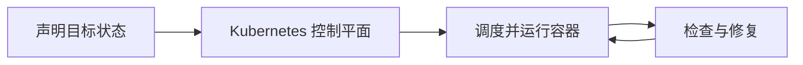

# Kubernetes容器编排：谁来让大量容器持续处于目标状态

> [!summary]- 快速复习卡片（学完再看）
> Kubernetes 是容器编排的事实标准，用声明式目标自动部署、调度、修复、发现和扩缩容容器化应用。

## 容器多了以后，谁来盯着每一个是否正常

少量容器可以手工启动；大量容器跨多台机器运行时，节点故障、版本回滚、服务发现和资源不足都会让人工操作不可持续。

**直接答案是：Kubernetes 让你声明应用希望处于什么状态，再由平台持续调度和修复，使实际状态尽量回到目标状态。**

教材列出 Kubernetes 的核心能力：按 CPU、内存或 GPU 调度资源；自动发布、回滚和配置/存储卷管理；节点或应用故障后的自动修复；基于 Service、DNS 和负载均衡的服务发现；根据负载自动弹性伸缩。控制平面主要包括 API Server、Controller、Scheduler 和 etcd。

它管理的是容器化应用的运行目标，并不替代应用的业务逻辑。不同工作负载可通过 Deployment、StatefulSet、Job 等资源表达，帮助平台理解应用需要的运行方式。

## 自测

1. 节点故障后自动迁移应用，体现 Kubernetes 的哪项能力？

> [!answer]- 第 1 题答案与解析
> **答案**：自动修复。
> **解析**：资源调度决定放在哪里运行，自动修复负责故障后恢复目标状态。
