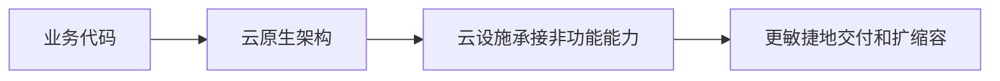

# 云原生架构：为什么不只是把程序搬到云服务器

> [!summary]- 快速复习卡片（学完再看）
> 云原生是面向云环境设计应用，让云设施承担更多弹性、韧性、安全和可观测等非功能能力。

## 把旧程序放进云服务器，为什么仍可能不好扩容

程序虽然运行在云上，但若每次扩容仍靠人工配机器、故障信息仍散在多台主机、发布仍逐台操作，它只是“部署在云上”，还没有充分利用云的分布式和弹性优势。

**直接答案是：云原生架构不是换一台云服务器，而是把应用按云的弹性、自动化和分布式特性来设计。**

教材将云原生定义为一组架构原则和设计模式的集合：尽量从云应用中剥离非业务代码，让云设施承接弹性、韧性、安全、可观测性和灰度等能力。业务代码仍负责业务价值；云平台不是替代业务设计，而是减少开发者重复处理通用运行问题。

## 七项原则先记住各自防什么

- 服务化：按不同生命周期拆分模块，用接口组织协作；
- 弹性：随业务量自动伸缩，避免固定资源长期闲置或突发不足；
- 可观测：关联分布式信息，回答故障、影响和变更后果；
- 韧性：面对故障、流量或灾难仍尽力持续服务；
- 所有过程自动化：让部署、配置、运行和变更可重复执行；
- 零信任：默认不因为“在内网”就信任人、设备或系统；
- 架构持续演进：技术和业务变化时持续评估与调整。

## 考试怎样判断

“让云设施接管弹性、韧性、可观测等非功能能力” → 云原生；“只是把单体程序迁到云主机，人工维护一切” → 不能据此判断已经云原生。下一站用[[云原生架构模式导航：面对不同问题该先看哪一种模式|模式导航]]把这些原则落到具体选择。

## 自测

1. 云原生架构把所有代码都交给云平台吗？

> [!answer]- 第 1 题答案与解析
> **答案**：不是。
> **解析**：业务代码仍实现业务价值，云设施主要承接可抽离的非功能能力。
